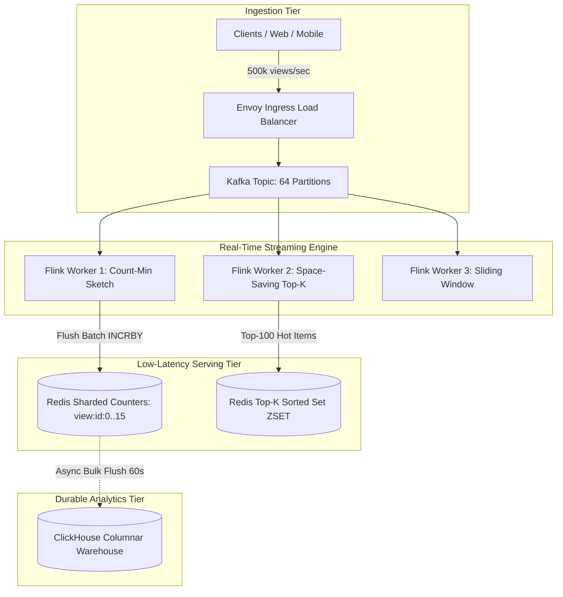

# Distributed Counters, Heavy Hitters and Top-K Streaming

## Learning Objectives
```
╔════════════════════════════════════════════════════════════════╗
║   AFTER THIS MODULE, YOU WILL BE ABLE TO:                      ║
╟────────────────────────────────────────────────────────────────╢
║                                                                ║
║   1. Design extreme-scale distributed counting systems         ║
║      (YouTube view counts, Twitter impressions, ad telemetry)  ║
║      absorbing 500,000+ writes/second                          ║
║                                                                ║
║   2. Mathematically master Count-Min Sketch: error bound       ║
║      derivations (epsilon, delta), optimal array width/depth,  ║
║      and pairwise independent universal hashing                ║
║                                                                ║
║   3. Implement streaming Heavy Hitters and Top-K algorithms:   ║
║      Space-Saving algorithm, Stream-Summary doubly linked      ║
║      min-heaps, and exponentially decaying sliding windows     ║
║                                                                ║
║   4. Solve the hot-key lock contention crisis on viral events  ║
║      via Sharded In-Memory Counters and batch write-back flush ║
║                                                                ║
║   5. Architect high-throughput real-time trend ingestion       ║
║      pipelines combining Kafka, Apache Flink, and ClickHouse   ║
║                                                                ║
║   6. Diagnose and mitigate P0 production outages: hash skew    ║
║      poisoning on heavy-tail items, Redis CPU thread lock,     ║
║      and tumbling window state memory leaks                    ║
╚════════════════════════════════════════════════════════════════╝
```

---

## Wrong Mental Models (Destroy These First)

```
╔════════════════════════════════════════════════════════════════════╗
║   MENTAL MODEL #1: "Just execute UPDATE table SET count = count + 1║
║   WHERE id = ? on every click"                                     ║
╟────────────────────────────────────────────────────────────────────╢
║   WRONG. A single viral event generating 100,000 views/sec forces  ║
║   100,000 exclusive row write locks per second on the exact same   ║
║   row. Transaction queues backlog instantly, database CPU hits     ║
║   100%, and connection pools exhaust across the entire platform.   ║
╠════════════════════════════════════════════════════════════════════╣
║   MENTAL MODEL #2: "A single Redis INCR command can scale to       ║
║   unlimited writes for a viral event"                              ║
╟────────────────────────────────────────────────────────────────────╢
║   WRONG. Redis is single-threaded for command execution. A single  ║
║   Redis key cannot exceed ~80,000 - 100,000 ops/sec. When traffic  ║
║   spikes past 200,000 writes/sec on a viral key, Redis CPU maxes   ║
║   out on that core, blocking all other keys on that shard.         ║
╠════════════════════════════════════════════════════════════════════╣
║   MENTAL MODEL #3: "Count-Min Sketch can return exact count values ║
║   if we make the matrix large enough"                              ║
╟────────────────────────────────────────────────────────────────────╢
║   WRONG. Count-Min Sketch is an inherently probabilistic data      ║
║   structure. It guarantees NO UNDER-ESTIMATION, but due to hash    ║
║   collisions, it ALWAYS over-estimates. Exact counts require       ║
║   deterministic write logging, not streaming sketch approximations.║
╠════════════════════════════════════════════════════════════════════╣
║   MENTAL MODEL #4: "Finding the Top-10 trending items requires     ║
║   sorting the entire database of 100M items"                       ║
╟────────────────────────────────────────────────────────────────────╢
║   WRONG. Sorting 100M rows in real time is O(N log N) and takes    ║
║   seconds to minutes. Streaming Heavy Hitters algorithms           ║
║   (Space-Saving, Lossy Counting) identify the Top-K items in       ║
║   continuous O(1) processing time and O(K) bounded memory.         ║
╠════════════════════════════════════════════════════════════════════╣
║   MENTAL MODEL #5: "Count-Min Sketch handles decrements cleanly"   ║
╟────────────────────────────────────────────────────────────────────╢
║   WRONG. If you decrement counters in a standard Count-Min Sketch, ║
║   hash collisions on other items cause destructive interference,   ║
║   destroying the fundamental over-estimation invariant. Symmetric  ║
║   decrement requires Count-Mean-Min or Spectral Bloom Filters.     ║
╠════════════════════════════════════════════════════════════════════╣
║   MENTAL MODEL #6: "HyperLogLog and Count-Min Sketch are           ║
║   interchangeable"                                                 ║
╟────────────────────────────────────────────────────────────────────╢
║   WRONG. HyperLogLog counts DISTINCT items (Cardinality, e.g.      ║
║   unique daily visitors). Count-Min Sketch counts the FREQUENCY of ║
║   individual item occurrences (e.g. how many times video #42 was   ║
║   viewed). They solve fundamentally different mathematical problems║
╚════════════════════════════════════════════════════════════════════╝
```

---

## Core Teaching

### 1. Requirements & Quantitative Capacity Sizing

#### Functional Requirements
1. **High-Throughput Ingestion**: Ingest and count video views, ad impressions, and search query frequencies exceeding 500,000 events/sec.
2. **Real-Time Top-K (Heavy Hitters)**: Return the Top-100 most viewed items or trending hashtags over the last 1-hour and 24-hour sliding windows.
3. **Frequency Estimation**: Given an arbitrary item ID, estimate its count with mathematical error bounded within $\epsilon \cdot N$ with probability $1 - \delta$.
4. **Asynchronous Durability**: Persist finalized counter totals to durable OLTP/OLAP databases without blocking streaming ingest.

#### Non-Functional Requirements & SLA Targets
- **Throughput**: 500,000 events/sec peak; 100,000 events/sec average.
- **Accuracy**: $\pm 0.1\%$ error margin for frequency queries on heavy hitters.
- **Latency**: Write ingest latency < 10ms; Top-K query latency < 50ms.
- **Memory Bound**: Entire real-time sketch memory constrained to < 2 GB RAM.

#### Quantitative Hardware & Sizing Estimations

```
CAPACITY ESTIMATION:
  - Daily Ingestion Volume:
    → 500,000 events/sec peak × 86,400s ≈ 15 Billion events / day
  
  - The Single Hot Key Viral Problem:
    → A World Cup goal or viral video generates 100,000 views/sec on ONE key
    → Standard Redis single-key limit: ~80k QPS (Saturates single CPU core)
    → Solution: Sharded Counters (N = 16 sub-keys per video)
    → Per sub-key throughput = 100,000 / 16 = 6,250 QPS (Safe!)

  - Count-Min Sketch Memory Sizing Math:
    → Error bound: epsilon = 0.001 (0.1% error of total count N)
    → Failure probability: delta = 0.01 (99% confidence)
    
    Formula:
      Width  w = ceil(e / epsilon) = ceil(2.71828 / 0.001) = 2,719 columns
      Depth  d = ceil(ln(1 / delta)) = ceil(ln(100)) = ceil(4.605) = 5 rows
    
    → Total 32-bit counter slots: 2,719 × 5 = 13,595 counters
    → Memory Footprint = 13,595 × 4 bytes ≈ 54.4 Kilobytes!
    → A 54 KB sketch can track frequency across Billions of events!

  - Top-K Space-Saving Sizing (K = 1,000 items):
    → Maintain K elements in a min-heap + hash map
    → Each entry: item_id (64 bits) + count (64 bits) + error (64 bits) ≈ 24 bytes
    → Memory for Top-1,000: 1,000 × 24 bytes ≈ 24 KB RAM
```

---

### 2. High-Level Design (HLD) Box-and-Arrow Architecture

```
                                [ Client Applications ]
                                           │
                         500k Events/sec   │ HTTP / gRPC Ingestion
                                           ▼
                             ┌───────────────────────────┐
                             │   Envoy Ingress Gateway   │
                             │  (Buffered TCP Sockets)   │
                             └─────────────┬─────────────┘
                                           │
                                           ▼
                             ┌───────────────────────────┐
                             │  Kafka Ingestion Cluster  │
                             │   (Topic: item_views)     │
                             │   (64 Partitions)         │
                             └─────────────┬─────────────┘
                                           │
                     ┌─────────────────────┴─────────────────────┐
                     │ Parallel Partition Streaming              │
                     ▼                                           ▼
      ┌─────────────────────────────┐             ┌─────────────────────────────┐
      │  Stream Aggregation Worker  │             │  Stream Aggregation Worker  │
      │  (Apache Flink TaskManager) │             │  (Apache Flink TaskManager) │
      │  - In-Memory Count-Min      │             │  - In-Memory Count-Min      │
      │  - Space-Saving Min-Heap    │             │  - Space-Saving Min-Heap    │
      └──────────────┬──────────────┘             └──────────────┬──────────────┘
                     │                                           │
                     │ Periodic 10s Window Flush                 │ Periodic 10s Window Flush
                     ▼                                           ▼
      ┌─────────────────────────────────────────────────────────────────────────┐
      │                      Redis Cluster (Sharded Counters)                   │
      │   Keys: "view:{item_id}:{0..15}" (Aggregates high-throughput writes)    │
      └────────────────────────────────────┬────────────────────────────────────┘
                                           │
                                           │ Asynchronous Sync (Every 60s)
                                           ▼
      ┌─────────────────────────────────────────────────────────────────────────┐
      │                Durable Columnar Store (ClickHouse / OLAP)               │
      │   Hourly & Daily Partition Rollups for Historical Analytics             │
      └─────────────────────────────────────────────────────────────────────────┘
```

#### Native Mermaid Architecture Schematic



---

### 3. Deep Dive into Count-Min Sketch & Space-Saving

#### Subsystem A: Count-Min Sketch Mathematical Mechanics

Count-Min Sketch consists of a 2D array of counters with $d$ rows (depth) and $w$ columns (width), combined with $d$ independent pairwise hash functions $h_1, h_2, \dots, h_d$:

```
COUNT-MIN SKETCH MATRIX:

Row 0:  [ 0 ][ 4 ][ 1 ][ 9 ][ 0 ] ... [ 2 ]  <-- Hash h_0(x) % w
Row 1:  [ 1 ][ 0 ][ 8 ][ 3 ][ 2 ] ... [ 5 ]  <-- Hash h_1(x) % w
Row 2:  [ 0 ][ 7 ][ 2 ][ 0 ][ 4 ] ... [ 1 ]  <-- Hash h_2(x) % w
Row 3:  [ 5 ][ 1 ][ 0 ][ 6 ][ 0 ] ... [ 8 ]  <-- Hash h_3(x) % w
Row 4:  [ 2 ][ 0 ][ 3 ][ 1 ][ 7 ] ... [ 0 ]  <-- Hash h_4(x) % w
        Col 0 Col 1 ...                Col w-1

UPDATE OPERATION (Add event x with count c):
  For each row i from 0 to d-1:
    index = h_i(x) % w
    matrix[i][index] += c

QUERY OPERATION (Estimate count of x):
  estimate = MIN( matrix[0][h_0(x)], matrix[1][h_1(x)], ..., matrix[d-1][h_d(x)] )
```

#### Why the Minimum ($\min$)?
Because counters only increment, collisions can only **inflate** counter values, never reduce them. Taking the minimum across all rows yields the counter with the **least amount of collision noise**, providing the tightest upper bound on the true frequency!

#### Subsystem B: Sharded Counters in Go with Redis Pipeline

```go
package counter

import (
	"context"
	"fmt"
	"hash/fnv"
	"math/rand"
	"time"

	"github.com/redis/go-redis/v9"
)

type ShardedCounter struct {
	rdb        *redis.Client
	shardCount int
}

func NewShardedCounter(rdb *redis.Client, shards int) *ShardedCounter {
	return &ShardedCounter{
		rdb:        rdb,
		shardCount: shards,
	}
}

// Increment adds count to a random shard of the item to distribute write lock contention
func (sc *ShardedCounter) Increment(ctx context.Context, itemID string, delta int64) error {
	shardID := rand.Intn(sc.shardCount)
	key := fmt.Sprintf("counter:%s:%d", itemID, shardID)
	return sc.rdb.IncrBy(ctx, key, delta).Err()
}

// GetTotal aggregates across all sub-shards to return the actual total count
func (sc *ShardedCounter) GetTotal(ctx context.Context, itemID string) (int64, error) {
	pipe := sc.rdb.Pipeline()
	cmds := make([]*redis.StringCmd, sc.shardCount)

	for i := 0; i < sc.shardCount; i++ {
		key := fmt.Sprintf("counter:%s:%d", itemID, i)
		cmds[i] = pipe.Get(ctx, key)
	}

	_, err := pipe.Exec(ctx)
	if err != nil && err != redis.Nil {
		return 0, err
	}

	var total int64
	for _, cmd := range cmds {
		val, err := cmd.Int64()
		if err == nil {
			total += val
		}
	}
	return total, nil
}
```

---

### 4. Storage Schemas & Database Models

#### ClickHouse Columnar Rollup Schema (`schema.sql`)

```sql
-- Raw Aggregated Ingestion Table (Engine: SummingMergeTree)
CREATE TABLE item_views_hourly (
    item_id UUID,
    event_hour DateTime,
    total_views UInt64,
    unique_viewers_hll AggregateFunction(uniq, UUID)
) ENGINE = SummingMergeTree(total_views)
PARTITION BY toYYYYMM(event_hour)
ORDER BY (event_hour, item_id);

-- Real-Time Top-K Query on ClickHouse:
SELECT 
    item_id, 
    sum(total_views) AS views
FROM item_views_hourly
WHERE event_hour >= now() - INTERVAL 24 HOUR
GROUP BY item_id
ORDER BY views DESC
LIMIT 100;
```

---

## SRE Diagnostic Toolkit

### 1. Prometheus Telemetry & Alerts

```promql
# Alert: Stream Aggregation Consumer Lag (> 500,000 unconsumed records)
sum(kafka_consumergroup_lag{topic="item_views"}) > 500000

# Alert: Redis Shard Hotspot (Single core CPU > 85%)
redis_cpu_sys_seconds_total / redis_cpu_user_seconds_total > 0.85

# Alert: Count-Min Sketch Hash Collision Rate Spike (> 15% estimated variance)
sketch_estimated_error_margin > 0.0015
```

### 2. Linux Kernel Socket & Network Buffer Tuning

```ini
# /etc/sysctl.d/99-streaming-counters.conf
# Maximize socket memory buffers for high-volume stream ingestion
net.core.rmem_max = 67108864
net.core.wmem_max = 67108864
net.ipv4.tcp_rmem = 4096 87380 67108864
net.ipv4.tcp_wmem = 4096 65536 67108864

# Increase netdev queue budget for multi-gigabit NIC frame bursts
net.core.netdev_budget = 600
net.core.netdev_max_backlog = 10000
```

---

## Decision Framework

| Ingestion Volume | Recommended Pattern | Rejected Alternative | Engineering Tradeoff Rationale |
| :--- | :--- | :--- | :--- |
| **Normal Item (< 1k writes/sec)** | `Direct Redis INCR` | `Synchronous Database Write` | Database transactions create unnecessary disk I/O overhead for ephemeral counting. Redis INCR easily handles 1k writes/sec. |
| **Viral Hot Key (> 50k writes/sec)** | `Sharded Counters (16 sub-keys)` | `Single Central Redis Key` | A single Redis key bottleneck exhausts single-threaded CPU cycles. Sharding writes distributes load across Redis cores. |
| **Streaming Top-K (> 100k writes/sec)** | `Space-Saving + Count-Min Sketch` | `Sorting Full RDBMS Table` | Full sorting is $O(N \log N)$ and takes seconds. Space-Saving maintains Top-$K$ in $O(1)$ time in memory. |
| **Unique User Counts (Cardinality)** | `HyperLogLog (12 KB fixed RAM)` | `Redis Set (SADD user_id)` | Storing 100M UUIDs in a Redis Set consumes ~3.2 GB RAM. HyperLogLog computes cardinality in 12 KB with 0.81% error. |

---

## Failure Modes

### Failure Mode 1: Hash Collision Poisoning on Long-Tail Items
- **Failure Trigger**: An obscure, low-view item (10 views) hashes into the identical Count-Min Sketch buckets as a viral World Cup broadcast (10M views).
- **Cascading Impact**: The obscure item is reported as having 10M views, skewing monetization payouts and recommendation algorithms.
- **SRE Containment**:
  1. Implement **Conservative Update Heuristic**: When incrementing, only increment counters that currently match the minimum value across the rows.
  2. Implement **Count-Mean-Min Sketch**: Subtract average noise across row buckets to cancel out skew on heavy tails.

### Failure Mode 2: Flink Tumbling Window OOM Memory Explosion
- **Failure Trigger**: A network partition between Flink and Redis prevents window flushes. Flink state buffers 30 minutes of 500,000 events/sec in RocksDB state memory.
- **Cascading Impact**: JVM heap exhausts, Linux OOM-killer terminates TaskManager pods, triggering infinite restart crash loops.
- **SRE Containment**:
  1. Set strict **RocksDB Memory Ceilings**: `state.backend.rocksdb.memory.managed = true` capped at 70% container RAM.
  2. Implement **Upstream Ingress Rate Limiting**: Push backpressure to Envoy/Kafka when consumer lag exceeds threshold.

---

## 🛑 SOCRATIC CHECK

### Question 1:
Why does the Count-Min Sketch take the MINIMUM across all $d$ hash rows to estimate frequency rather than taking the AVERAGE?

### Question 2:
How does the Space-Saving algorithm guarantee that true Heavy Hitters are never evicted from the Top-$K$ summary?

### Question 3:
If you use Sharded Counters in Redis (`counter:item:0` through `counter:item:15`), how do you handle atomic reset or deletion when an item is archived?
