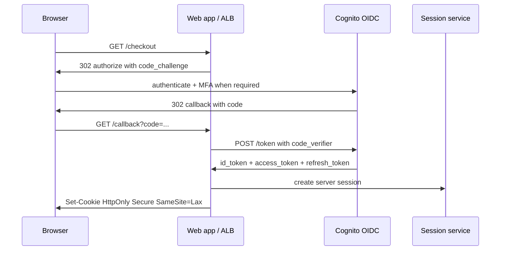

# AuthN AuthZ OAuth mTLS and Secrets

Northstar Commerce uses Cognito for buyer identity, an
internal session service for web checkout, IAM and STS
for AWS control-plane authority, Secrets Manager for
credential rotation, and mTLS for east-west service
identity. The point of this module is not to memorize
product names. The point is to separate identity,
delegation, authorization, service identity, and secret
material so that design reviews and incidents name the
correct layer.

## Learning objectives

1. Separate authentication, authorization, federation,
   delegation, session management, service identity, and
   secrets management in diagrams and incidents.
2. Explain OAuth authorization code with PKCE, OIDC ID
   tokens, access tokens, refresh-token rotation, client
   credentials, and why implicit flow is legacy risk.
3. Validate JWTs safely: issuer, audience, signature,
   algorithm, expiration, not-before, key ID, JWKS
   cache, token type, and claim-to-policy mapping.
4. Choose between server sessions, browser cookies,
   bearer tokens, proof-of-possession tokens, IAM role
   sessions, and mTLS-bound service identity.
5. Design mTLS trust with certificate chains, SAN/SPIFFE
   identity, short-lived leaf certificates, trust-bundle
   rollout, and per-method policy.
6. Rotate secrets as a distributed protocol involving
   version labels, clients, pools, retries, rollback,
   audit, and emergency revocation.
7. Diagnose token replay, confused deputy, stale JWKS
   cache, leaked long-lived keys, wildcard redirect URI
   abuse, clock skew, and policy drift.
8. Build telemetry packs that show deny reasons,
   key-cache behavior, cert expiry, KMS decrypt
   anomalies, secret rotation state, and privileged
   actions.
9. Use AWS examples accurately: Cognito authenticates
   users, IAM authorizes AWS API calls, STS issues short
   role sessions, and Secrets Manager stores/rotates
   secrets.
10. Write strict runbooks that restore availability
    without weakening verification, tenant checks, or
    audit evidence.

## Wrong mental models

| Wrong model | Correction | Why it hurts |
| --- | --- | --- |
| Authentication is authorization | Identity proof only says who; policy says what on which resource. | A valid seller user can still be forbidden from another seller order. |
| OAuth is login | OAuth delegates access; OIDC adds identity semantics. | Access tokens get treated as ID tokens and accepted by the wrong API. |
| JWT means stateless and safe | JWT shifts state into key distribution, TTL, audience, and revocation choices. | A stolen token works until expiry unless replay controls exist. |
| mTLS replaces AuthZ | mTLS authenticates workload peers; business authorization remains separate. | Any authenticated service can call privileged methods if policy is absent. |
| Secrets rotation is changing a password | Rotation is a rollout through clients, caches, pools, target systems, and rollback. | Half the fleet uses the old credential while new connections fail. |
| JWKS cache is an implementation detail | JWKS cache behavior is on the request path for every JWT verifier. | A key rotation becomes a login-loop outage or stale-key exposure. |
| Scopes are enough | Scopes are coarse; resource owner, tenant, risk, and context still need checks. | seller:write becomes cross-tenant write. |
| Long-lived keys are convenient | Long-lived keys make compromise durable. Automation should create short sessions. | A leaked IAM access key remains useful after the commit is reverted. |
| Cookies are obsolete | HttpOnly SameSite cookies are often safer for browser sessions than localStorage tokens. | XSS steals bearer tokens from the SPA. |
| CloudTrail proves no secret use | CloudTrail covers AWS API activity, not every DB or partner API login. | Blast radius after a password leak is underestimated. |

## Core mechanism

### Foundation

### Principal, credential, authority

A principal is the actor: buyer, seller admin, support
agent, service account, workload, Lambda function, CI
job, or external partner. A credential is what the actor
presents: password, cookie, bearer token, client
certificate, signed request, AWS SigV4 signature, or
hardware-backed assertion. Authority is the permission
granted after verification and policy evaluation. Most
severe trust incidents happen when a system treats one
of these nouns as another.

Authentication proves a claim about the principal.
Authorization evaluates an action on a resource in a
context. Federation lets Northstar rely on another
identity provider. Delegation lets a user or service
grant limited authority to a client without giving away
the original credential. Session management remembers a
completed authentication event. Service identity proves
which workload is speaking. Secrets management protects
material that can impersonate a principal or decrypt
data.

### OAuth and OIDC flows

Northstar buyer login uses OIDC authorization code flow
with PKCE. The browser is redirected to Cognito with a
code challenge, the user authenticates, Cognito
redirects back with an authorization code, and the
backend exchanges the code plus verifier for tokens. The
server then creates an internal session cookie. The ID
token answers who the user is for the client. The access
token is for an API audience. The refresh token is a
controlled minting credential and should not be sprayed
across services.



PKCE protects clients that cannot keep a static secret.
The client creates a random code_verifier and sends a
derived code_challenge during authorization. The token
endpoint later requires the verifier. A stolen
authorization code is not enough because the attacker
lacks the verifier. State protects the redirect from
CSRF. Nonce binds ID-token replay. Exact redirect URI
matching prevents open redirect abuse.

Client credentials flow has no human subject. A workload
acts as itself for a specific audience and scope. It is
correct for external service clients or a
machine-to-machine API, but it is wrong for carrying
buyer authority. For AWS-to-AWS calls, IAM roles and STS
sessions are often better than OAuth because they
provide native resource policies, condition keys,
session tags, and CloudTrail attribution.

Refresh-token rotation detects replay. Every refresh
returns a new token and invalidates the previous token
after a short grace window. If an old token is reused,
the provider can revoke the token family. Rotation needs
idempotent client behavior, bounded retry, and support
tooling that can distinguish compromise from flaky
network retries.

| Flow | Use when | Primary risk |
| --- | --- | --- |
| Authorization code + PKCE | Browser or mobile login where the client cannot keep a static secret. | Redirect interception, missing state/nonce, wrong audience. |
| Confidential authorization code | Server app can keep a client secret. | Leaked client secret or broad redirect allowlist. |
| Client credentials | Workload acts as itself against a narrow API. | Machine token reused as user proof. |
| Device code | CLI/TV/constrained device login. | Phishing fake verification page or slow revocation. |
| Implicit | Legacy only. | Token exposed in browser URL fragment and poor replay controls. |
| SAML federation | Enterprise workforce SSO contracts. | Attribute mapping drift and brittle XML signature validation. |

### JWT validation

### Staff

JWT validation is a verifier protocol, not a JSON parse.
A safe verifier checks the issuer, expected audience,
allowed algorithm, signature, key ID, expiration,
not-before, token type, clock skew, revocation point,
and policy mapping before any claim influences
authorization. The verifier must never choose algorithms
from the untrusted token without an allowlist.

```python
EXPECTED_ISSUER = "https://cognito-idp.us-east-1.amazonaws.com/us-east-1_prod"
EXPECTED_AUDIENCE = "northstar-checkout-api"
ALLOWED_ALGS = {"RS256"}
MAX_SKEW_SECONDS = 60

def validate_access_token(token, jwks_cache, now):
    header = parse_untrusted_header(token)
    if header.alg not in ALLOWED_ALGS:
        raise AuthError("unsupported_algorithm")
    key = jwks_cache.get_key(EXPECTED_ISSUER, header.kid)
    claims = verify_signature_and_decode(token, key)
    require_equal(claims["iss"], EXPECTED_ISSUER)
    require_contains_audience(claims["aud"], EXPECTED_AUDIENCE)
    require_time_window(claims["nbf"], claims["exp"], now, MAX_SKEW_SECONDS)
    if claims.get("token_use") != "access":
        raise AuthError("wrong_token_type")
    return claims
```

JWKS caching is a latency and safety tradeoff. Fetching
keys on every request turns identity-provider latency
into API latency and lets attackers flood verifiers with
random key IDs. Caching forever accepts keys after
compromise. Production verifiers need positive cache,
short negative cache, background refresh, single-flight
fetches, issuer-scoped keys, stale-if-error for
non-compromised keys, and an emergency denied-kid path.

| JWKS behavior | Reason | Failure if absent |
| --- | --- | --- |
| Positive cache by issuer and kid | Avoid IdP call on hot path. | Every request depends on Cognito latency. |
| Single-flight refresh | One miss triggers one fetch. | New kid stampedes JWKS endpoint. |
| Negative cache | Random kid attacks do not refetch constantly. | Attacker creates outbound HTTP flood. |
| Background refresh | Refresh before blocking user traffic. | First request after TTL pays fetch latency. |
| Emergency deny list | Compromised key must stop before TTL. | Leaked signer remains trusted. |
| Issuer partitioning | kid is not globally unique. | Test issuer key accepted in prod. |

### Session versus token

A server-side session stores authority in a
server-controlled record and gives the browser an opaque
cookie. It supports immediate revocation, central risk
signals, and policy changes, but costs a lookup and
shared session capacity. A self-contained bearer token
stores authority inside the token. It validates locally
but is hard to revoke before expiry. The design question
is where revocation, latency, replay resistance, and
ownership belong.

| Boundary | Prefer | Why |
| --- | --- | --- |
| Browser checkout | HttpOnly Secure SameSite cookie plus server session. | Mitigates XSS token theft and allows immediate revocation. |
| Mobile API | Short access token plus rotated refresh token. | Mobile needs renewal without long bearer TTL. |
| Service mesh | mTLS identity plus per-method policy. | Workload identity belongs to runtime, not copied strings. |
| AWS service call | IAM role and STS. | Native audit, condition keys, and no static runtime key. |
| Partner API | OAuth client credentials or signed requests. | External parties cannot assume internal roles. |

Cookie sessions still require CSRF controls on
state-changing routes. SameSite=Lax helps but is not a
complete authorization decision. Cookie scope must be
narrow; a cookie scoped to an entire parent domain
expands the trust boundary to every subdomain. Session
IDs must be random, rotated on privilege changes, and
invalidated on logout, credential reset, and high-risk
device changes.

Bearer tokens are portable by design. Anyone with the
string can use it unless the token is
sender-constrained. Proof-of-possession and mTLS-bound
tokens reduce replay by requiring the caller to prove
possession of a private key. They are appropriate for
high-value partner or internal service calls where
implementation complexity is justified.

### mTLS service identity

Mutual TLS authenticates both ends of a connection. In a
mesh, each workload receives a short-lived certificate
rooted in a platform trust anchor. The leaf certificate
carries the workload identity in SAN, often a URI such
as spiffe://northstar/prod/checkout-api. The server
verifies chain, expiry, trust domain, and SAN, then
evaluates authorization separately: can this workload
call this method for this tenant and resource?

```yaml
apiVersion: security.istio.io/v1
kind: AuthorizationPolicy
metadata:
  name: pay-ledger-capture
spec:
  selector:
    matchLabels:
      app: pay-ledger
  action: ALLOW
  rules:
  - from:
    - source:
        principals:
        - "cluster.local/ns/checkout/sa/checkout-api"
    to:
    - operation:
        methods: ["POST"]
        paths: ["/v1/captures"]
```

Certificate rotation should be quiet. Short-lived leaf
certs limit compromise windows but require automation
that refreshes before expiry, hot-reloads certificates,
and alerts on the tail of expiry distribution. A 24-hour
leaf certificate should page before any workload has
less than a few hours remaining, not after the average
certificate age looks bad.

mTLS failures are often misread as network incidents.
They surface as TLS alerts, gRPC UNAVAILABLE, HTTP 503
from a sidecar, or load balancer target failures. Logs
need peer SAN, trust domain, certificate serial, expiry,
issuer, trust bundle version, and policy decision.
Without those fields, teams restart pods while the real
fault is a trust-bundle rollout split.

### Secrets rotation

A secret is any value whose disclosure grants authority
or decrypts data: database password, API key, OAuth
client secret, signing private key, webhook secret, KMS
data key, or recovery token. Secrets Manager and KMS
protect storage and audit retrieval, but applications
still need reload behavior, connection-pool draining,
version overlap, rollback, and emergency revocation.

```yaml
secret_id: prod/checkout/postgres/app
stages:
  AWSCURRENT: version accepted by normal clients
  AWSPENDING: candidate generated by rotation function
  AWSPREVIOUS: bounded rollback candidate
rotation_steps:
  createSecret: generate candidate
  setSecret: set target database credential
  testSecret: open fresh app-path connection through PgBouncer
  finishSecret: promote AWSPENDING to AWSCURRENT
client_contract:
  cache_ttl_seconds: 300
  max_connection_lifetime_seconds: 600
  rollback_window_minutes: 30
```

Signing-key rotation differs from password rotation.
Verifiers need the new public key before issuers sign
with the new private key. Old public keys must remain
available until old tokens expire. If the private key is
compromised, the verifier needs an emergency deny list
and the business may need forced logout. Planned
rotation optimizes continuity; emergency rotation
optimizes containment.

## Production anatomy

### Metrics

| Metric | Useful dimensions | Avoid | Purpose |
| --- | --- | --- | --- |
| authn_login_attempts_total | provider, client_id, result, reason | email, user_id | Credential stuffing, IdP failure, MFA regressions. |
| token_validation_failures_total | issuer, audience, reason, service | raw token, subject | Separates expired, unknown kid, wrong audience, bad signature. |
| jwks_fetch_duration_seconds | issuer, result | attacker-controlled kid | Shows dependency latency and cache miss storms. |
| jwks_cache_entries | issuer, state | full URL variants | Proves loaded, stale, denied, or missing keys. |
| session_store_latency_seconds | operation, region, result | session_id | Distinguishes login from session storage. |
| authz_decisions_total | service, action, resource_type, decision, reason | resource_id, user_id | Shows policy behavior and deny reasons. |
| mtls_handshake_failures_total | source, destination, reason, trust_domain | cert body | Finds expiry, unknown authority, SAN mismatch. |
| workload_cert_seconds_until_expiry | namespace, service, issuer | pod UID at high volume | Catches certificate expiry cliffs. |
| secrets_rotation_step_total | secret_class, step, result | secret value | Shows failed rotation step. |
| kms_decrypt_total | key_alias, caller, result | PII context | Detects anomalous decrypt patterns. |

### Logs and audit

Good Auth logs are structured, sparse, and safe. They
include request ID, principal class, subject hash,
issuer, audience, client ID, policy version, decision,
reason, source risk class, service identity, tenant, and
resource type. They never include raw tokens, passwords,
private keys, full cookies, or secret values. A line
that says only 403 forbidden is not enough for incident
command.

```json
{
  "event": "authz_decision",
  "request_id": "req-91b7",
  "service": "seller-admin-api",
  "principal_type": "seller_user",
  "subject_hash": "sha256:7c0...",
  "tenant_id": "seller_4812",
  "action": "refund.create",
  "resource_type": "order",
  "decision": "deny",
  "reason": "missing_scope_and_role",
  "policy_version": "2026-07-08.3",
  "token_audience": "northstar-seller-admin",
  "mtls_peer": "spiffe://northstar/prod/seller-admin-api"
}
```

### Dashboard pack

- Auth user impact: login conversion, callback errors,
  session creation failures, authenticated checkout
  success, and support contacts tagged login or
  forbidden.
- Token validation: failures by reason, JWKS cache age,
  JWKS outbound health, algorithm rejections, wrong
  audience, expired tokens, and new kid rate.
- Authorization: deny rate by service/action/reason,
  policy bundle version, resource-owner mismatch, tenant
  mismatch, and policy engine latency.
- Service identity: mTLS handshake failures by
  source/destination/reason, certificate expiry
  distribution, trust bundle rollout version, and gRPC
  UNAVAILABLE by downstream.
- Secrets: rotation state, AWSPENDING age, client cache
  age, KMS decrypt spikes, Secrets Manager throttling,
  and new database authentication failures.
- Security response: refresh-token family reuse, risky
  session revocations, break-glass role use, impossible
  travel, and denied-kid hits.

## Failure catalog

### Token replay

Trigger: Bearer token stolen from logs, localStorage,
proxy, or device. Amplifier: Long TTL, no binding, broad
audience. Blast radius: All APIs accepting that audience
until expiry. First safe move: Revoke token family,
block device, inspect logs for leakage.

### Confused deputy

Trigger: API accepts token meant for another audience or
tenant. Amplifier: Shared signing keys, missing
aud/resource checks. Blast radius: Cross-service or
cross-tenant action. First safe move: Enforce audience
and resource checks before policy.

### JWKS stampede

Trigger: New kid or random-kid attack causes cache
misses. Amplifier: No negative cache or single-flight.
Blast radius: Verifiers flood IdP and reject users.
First safe move: Push known key set, add single-flight
and negative cache.

### Stale JWKS after compromise

Trigger: Retired signing key remains cached. Amplifier:
No emergency denied-kid path. Blast radius: Compromised
signer remains trusted. First safe move: Push deny list
and force token refresh when approved.

### Leaked IAM key

Trigger: Static access key committed to repo or CI log.
Amplifier: Broad permissions and no access-key alarm.
Blast radius: AWS resources allowed by key policy. First
safe move: Deactivate key, inspect CloudTrail, rotate
dependent secrets.

### mTLS trust split

Trigger: New trust bundle reaches only part of fleet.
Amplifier: No version-skew alert. Blast radius: Specific
source/destination pairs fail. First safe move: Pause
rollout and pin known-good bundle.

### Cert expiry cliff

Trigger: CSR automation stuck for namespace. Amplifier:
All pods share issuance time and TTL. Blast radius:
Workloads fail together. First safe move: Renew or
extend certs and fix issuance queue.

### Redirect wildcard

Trigger: OAuth client allows broad redirect pattern.
Amplifier: Attacker controls matching subdomain. Blast
radius: Authorization code sent to attacker. First safe
move: Exact allowlist and rotate client secret.

### Missing state nonce

Trigger: Login flow omits redirect binding. Amplifier:
Ambient browser redirects. Blast radius: Login CSRF or
token replay. First safe move: Require state/nonce and
invalidate suspect sessions.

### Session fixation

Trigger: Session ID not rotated after login. Amplifier:
Attacker pre-seeds session. Blast radius: Victim
authenticates into known session. First safe move:
Rotate on auth and privilege changes.

### CSRF on cookie session

Trigger: State-changing route trusts cookie alone.
Amplifier: Browser sends cookie cross-site. Blast
radius: Unauthorized user action. First safe move:
Require CSRF token and origin checks.

### Overbroad scope

Trigger: Client gets seller:admin instead of
seller:read. Amplifier: Scopes copied between apps.
Blast radius: Compromise grants excessive action. First
safe move: Narrow scopes and object policy.

### Clock skew

Trigger: Nodes drift beyond token leeway. Amplifier: NTP
issue in one AZ. Blast radius: Valid tokens rejected or
expired tokens accepted. First safe move: Fix time sync
and keep leeway bounded.

### Rotation outage

Trigger: AWSCURRENT promoted before target accepts
candidate. Amplifier: Clients refresh quickly. Blast
radius: New DB/API connections fail. First safe move:
Rollback label or restore old credential if safe.

### Secret logged

Trigger: Debug logs print env/config. Amplifier: Central
log retention and broad access. Blast radius: Operators
can use credential. First safe move: Redact, revoke,
rotate, restrict historical logs.

### Policy drift

Trigger: Service expects claim missing in old policy
bundle. Amplifier: Canary tested only allow path. Blast
radius: Legitimate users denied or unauthorized allowed.
First safe move: Pin compatible service/policy versions.

### External ID omitted

Trigger: Partner cross-account role lacks unique
external ID. Amplifier: Partner confused deputy
possible. Blast radius: Another customer can access
Northstar role. First safe move: Add condition, rotate
role, audit AssumeRole.

### ALB OIDC cookie overflow

Trigger: Claims grow beyond cookie/header limits.
Amplifier: Group claim includes hundreds of entries.
Blast radius: Enterprise tenants cannot login. First
safe move: Trim claims and move roles to lookup.

### Break-glass overuse

Trigger: Emergency role used for routine support.
Amplifier: No JIT approval or audit. Blast radius:
Privileged actions bypass controls. First safe move:
Disable standing access and require review.

### Global webhook secret

Trigger: All sellers share one HMAC secret. Amplifier:
One seller leak validates all events. Blast radius:
Global event forgery risk. First safe move: Per-tenant
secrets and rotation.

### Unsigned user header

Trigger: Downstream trusts x-user-id from caller.
Amplifier: No mTLS/token binding to header. Blast
radius: Caller can impersonate users. First safe move:
Use signed context or downstream token exchange.

### Refresh token family theft

Trigger: Old refresh token reused after rotation.
Amplifier: Grace too long or alerts ignored. Blast
radius: Long-lived session takeover. First safe move:
Revoke family and require reauth.

### KMS decrypt spike

Trigger: Compromised role bulk decrypts data. Amplifier:
No per-role anomaly alert. Blast radius: Data exposure
beyond one service. First safe move: Disable role
session and audit encryption context.

### Local dev issuer trusted

Trigger: Prod accepts tokens from test issuer.
Amplifier: Issuer allowlist pattern too broad. Blast
radius: Test users enter prod APIs. First safe move:
Exact issuer allowlist per environment.

## Decision framework

### Boundary-first design

Start every trust design by drawing boundaries. Browser
boundaries are hostile because JavaScript, extensions,
and CSRF exist. Public APIs treat every token as
attacker-controlled input. Service-mesh boundaries are
semi-trusted because workloads can be buggy or
compromised. AWS control planes are privileged and
audited. Data boundaries are where tenant and object
authorization must still be enforced even if upstream
checks passed.

| Decision | Prefer first option when | Prefer second option when | Guardrail |
| --- | --- | --- | --- |
| Session vs token | Immediate revocation and browser safety matter. | Offline/mobile local validation matters. | Do not store long-lived bearer tokens in localStorage. |
| OAuth/OIDC vs IAM | External users or delegated API clients are involved. | AWS workloads call AWS resources. | Avoid static IAM users for runtime. |
| mTLS-only vs mTLS plus token | Policy depends only on source workload. | User, tenant, or delegated authority must flow. | Do not trust unsigned user headers. |
| Short TTL vs revocation list | Replay risk is acceptable for minutes. | High-risk privilege needs immediate kill switch. | Revocation cache must be bounded and observable. |
| Shared key vs per-tenant key | Low-risk internal simplicity dominates. | External tenants or blast-radius limits matter. | Key IDs must be issuer-scoped and rotated. |
| Polling vs push secret reload | Five-minute stale window is acceptable. | Emergency rotation must converge fast. | Pool lifetime must be shorter than overlap. |

### Threat review checklist

1. What is the principal class: human, workload, CI job,
   external partner, or support operator?
2. What credential proves the principal, and where can
   it be stolen or replayed?
3. What audience is the credential for, and which
   services reject the wrong audience?
4. Which resource ownership check prevents cross-tenant
   access?
5. What is the maximum useful authority lifetime?
6. How is the credential rotated, revoked, audited, and
   denied in emergency?
7. What telemetry proves a deny was intentional rather
   than an outage?
8. What is the blast radius if issuer, verifier, policy
   store, or secret store is down?
9. Which bad fix restores traffic by weakening
   verification?
10. What is pre-authorized for incident command, and
    what needs security approval?

## Key takeaways

- AuthN proves identity; AuthZ grants authority; OAuth
  delegates; OIDC identifies; mTLS identifies workloads;
  secrets preserve impersonation power.
- JWT validation is a complete verifier protocol, not a
  base64 decode followed by a role check.
- Bearer tokens are replayable by default; reduce replay
  with short TTLs, rotation, binding, revocation, and
  safe logs.
- mTLS authenticates channel peers but does not decide
  tenant, object ownership, or business authority by
  itself.
- Secrets rotation is a distributed rollout with caches,
  pools, version labels, and rollback.
- Most Auth incidents are amplified by stale caches,
  broad scopes, wildcard redirects, static keys, and
  missing resource checks.
- The right telemetry names every authn/authz failure
  reason without leaking the secret material needed to
  reproduce it.

## Targeted reading

- OAuth 2.0 Security Best Current Practice, RFC 9700,
  especially PKCE, redirect matching, sender-constrained
  tokens, and implicit-flow guidance.
- OpenID Connect Core 1.0 sections on ID tokens, nonce,
  audience, issuer, and code flow semantics.
- AWS Cognito documentation on token endpoints,
  refresh-token rotation, hosted UI, and user-pool JWT
  verification.
- AWS IAM documentation for STS AssumeRole, session
  tags, external ID, resource policies, service control
  policies, and Access Analyzer.
- AWS Secrets Manager rotation documentation for staging
  labels, Lambda rotation steps, client-side caching,
  and failure troubleshooting.
- SPIFFE/SPIRE documentation for workload API, SPIFFE
  IDs, trust domains, federation, and X.509 SVID
  rotation.
- OWASP cheat sheets: Session Management, OAuth 2.0,
  JSON Web Token, Secrets Management, and CSRF.

## Principal-depth field guide: trust controls

### Principal stretch

Use these cards as design-review prompts and
incident-response heuristics. Each card names the
mechanism, the production signal, the failure it
prevents, and the strict decision rule. They are
intentionally concrete so that a staff or principal
engineer can turn them into runbook checks, CI policy,
or dashboard requirements.

### Audience partitioning

Mechanism: Every access token has an intended API
audience, and verifiers reject tokens minted for any
other audience before policy evaluation.

Production signal: token_validation_failures_total by
reason=wrong_audience and service; sampled audit logs
with aud and route class.

Failure prevented: A seller-admin token becomes a
checkout token, creating a confused deputy across APIs.

Decision rule: Never use a token claim for authorization
until issuer and audience are exact matches for that
service.

### Issuer pinning

Mechanism: The verifier binds keys and claims to one
expected issuer, not merely a matching kid or URL
pattern.

Production signal: JWKS cache entries partitioned by
issuer; alerts on unknown issuer and prod verifier
accepting non-prod issuer.

Failure prevented: A staging or partner issuer signs a
token accepted in production because the key ID matches.

Decision rule: Issuer allowlists are exact strings per
environment; wildcard issuer matching is forbidden.

### Algorithm allowlist

Mechanism: The verifier accepts only configured
algorithms and never trusts the token header to choose
verification behavior.

Production signal: unsupported_algorithm rejects;
deployment diff for allowed_algs; security tests with
none and HS/RS confusion.

Failure prevented: An attacker changes alg or exploits
algorithm confusion to bypass signature verification.

Decision rule: Allowed algorithms are static config
reviewed with the issuer contract.

### Kid negative cache

Mechanism: Unknown kid values are cached briefly so
attackers cannot force repeated JWKS fetches.

Production signal: unknown_kid rate, negative-cache
hits, JWKS outbound RPS, and IdP 429 count.

Failure prevented: Random-kid traffic becomes an
outbound denial-of-service against Cognito or the IdP.

Decision rule: Negative cache is short, issuer-scoped,
and paired with a manual refresh path for legitimate
rotation.

### Single-flight JWKS fetch

Mechanism: Many concurrent cache misses coalesce into
one outbound fetch per issuer and kid.

Production signal: jwks_fetch_inflight,
cache_miss_collapsed count, IdP latency under rotation.

Failure prevented: A new signing key causes every worker
thread to fetch JWKS at once.

Decision rule: Every verifier library must prove
single-flight behavior in rotation tests.

### Stale-if-error boundary

Mechanism: A verifier may keep using known non-denied
keys during IdP errors but must reject explicitly denied
compromised keys.

Production signal: stale_key_used_total,
denied_kid_hits, IdP error rate, key age.

Failure prevented: A transient IdP outage causes total
API outage, or a compromised key remains trusted by
accident.

Decision rule: Stale-if-error is allowed only below max
age and never overrides the emergency deny list.

### Refresh family replay

Mechanism: Refresh-token rotation treats reuse of an old
family member as compromise evidence.

Production signal: refresh_reuse_detected,
family_revoked, device hash, client version.

Failure prevented: A stolen refresh token silently mints
new access tokens for weeks.

Decision rule: Family reuse triggers revocation and risk
workflow unless a narrow client retry grace explains it.

### Session privilege rotation

Mechanism: Session IDs rotate on login, MFA, role
elevation, and sensitive account recovery.

Production signal: session_rotated_total by reason;
privileged action preceded by fresh auth event.

Failure prevented: Session fixation or stolen low-risk
session becomes privileged authority.

Decision rule: Any authority increase requires session
renewal and old session invalidation.

### Cookie scope minimalism

Mechanism: Browser cookies are scoped only to the exact
host/path that needs them and are Secure, HttpOnly, and
SameSite-aware.

Production signal: Set-Cookie audits; scanner finding
broad Domain attributes; CSRF reject metrics.

Failure prevented: A compromised subdomain obtains or
replays a high-value session cookie.

Decision rule: Parent-domain cookies require explicit
security review and expiry date.

### CSRF with sessions

Mechanism: Cookie-backed state-changing requests carry
CSRF token or verified origin in addition to SameSite.

Production signal: csrf_rejected_total, missing_origin
count, state-changing route coverage.

Failure prevented: An attacker causes a browser to
submit an authenticated seller action cross-site.

Decision rule: Every unsafe method route has a CSRF or
signed double-submit guard.

### Token log redaction

Mechanism: Ingress, app, proxy, and worker logs redact
Authorization, Cookie, and token-like payload fields
before persistence.

Production signal: log_redaction_dropped_fields, secret
scanner findings, sampled log review.

Failure prevented: A debug line turns bearer tokens into
broadly readable credentials.

Decision rule: Logging raw credentials is a sev-worthy
bug even if access to logs is internal.

### Signed downstream context

Mechanism: User and tenant context passed downstream is
signed, exchanged, or embedded in a verified token, not
an unsigned header.

Production signal:
downstream_context_verification_failures; traces with
context issuer.

Failure prevented: A caller forges x-user-id or
x-tenant-id to bypass service-local policy.

Decision rule: Downstream services treat unsigned
identity headers as untrusted input.

### mTLS SAN policy

Mechanism: Service authorization matches expected
workload SAN/principal and method, not only certificate
validity.

Production signal: mtls_policy_denies by principal and
method; peer SAN in traces.

Failure prevented: Any valid workload certificate can
call privileged endpoints.

Decision rule: Certificate validity is authentication;
per-method policy is authorization.

### Trust-bundle canary

Mechanism: Mesh trust bundle changes roll out through a
canary that exercises real client-to-server pairs.

Production signal: trust_bundle_version skew, handshake
failure by pair, canary synthetic calls.

Failure prevented: Half the mesh trusts a new root while
the other half rejects it.

Decision rule: No trust-bundle rollout proceeds without
pairwise handshake canaries.

### Certificate expiry histogram

Mechanism: The platform alerts on low-percentile expiry
time, not average age.

Production signal: workload_cert_seconds_until_expiry
p1/p5 by namespace and issuer.

Failure prevented: All pods in a namespace lose certs
together after a stuck CSR queue.

Decision rule: Page before any important workload has
less than emergency renewal time remaining.

### Secret version labels

Mechanism: Clients read AWSCURRENT, rotation tests
AWSPENDING, and rollback uses AWSPREVIOUS only within a
bounded window.

Production signal: secret_version_stage_age, AWSPENDING
age, client cache age.

Failure prevented: A candidate secret is promoted before
the target system accepts it.

Decision rule: finishSecret requires a fresh connection
through the same path normal clients use.

### Pool lifetime under rotation

Mechanism: DB and HTTP pools have max lifetime shorter
than the secret overlap window.

Production signal: connection_age histogram, auth
failures on new connections, old credential usage.

Failure prevented: Old pooled connections hide a broken
new credential until later outage.

Decision rule: Rotation overlap must exceed client cache
TTL plus max connection lifetime.

### Client-secret hygiene

Mechanism: OAuth client secrets exist only for
confidential clients and rotate like any other secret.

Production signal: client_secret_age, token endpoint
auth failures, leaked-secret scanner.

Failure prevented: A SPA embeds a client secret or a
server secret remains valid for years.

Decision rule: Public clients use PKCE; confidential
secrets have owners, TTLs, and rotation tests.

### Webhook per-tenant secrets

Mechanism: Webhook HMAC secrets are scoped per tenant or
partner, with overlapping rotation windows.

Production signal: webhook_signature_failures by tenant,
secret version, replay nonce use.

Failure prevented: One seller leak validates forged
events for all sellers.

Decision rule: Global webhook secrets are banned for
multi-tenant business events.

### External ID for partners

Mechanism: Cross-account role trust policies require a
unique external ID for each partner/customer
relationship.

Production signal: AssumeRole events missing externalId,
Access Analyzer findings.

Failure prevented: A partner confused deputy lets
another customer assume Northstar role.

Decision rule: No third-party trust policy ships without
external ID condition and CloudTrail alert.

### Break-glass containment

Mechanism: Emergency roles are JIT, short-lived,
strongly authenticated, and reviewed after use.

Production signal: break_glass_assume_role count,
session duration, approval ID coverage.

Failure prevented: Routine support bypasses least
privilege and hides risky actions.

Decision rule: Break-glass use is exceptional,
ticket-bound, and reviewed within one business day.

### Policy bundle versioning

Mechanism: Services and policy bundles have
compatibility contracts and canary both allow and deny
paths.

Production signal: policy_version skew, authz deny
reason changes after deploy.

Failure prevented: A service deploy expects claims or
attributes absent in the current policy bundle.

Decision rule: Policy and service versions roll out with
contract tests and rollback pairing.

### Object ownership check

Mechanism: Authorization checks resource tenant/owner
after resource lookup or with lookup constrained by
tenant.

Production signal: resource_owner_mismatch denies;
queries include tenant predicate.

Failure prevented: A user with broad scope acts on
another tenant object by ID guessing.

Decision rule: Scopes are never sufficient for
object-level authorization.

### Clock skew budget

Mechanism: Token leeway is bounded and time-sync health
is observable by AZ and node class.

Production signal: ntp_offset_seconds, token nbf/exp
reject reasons, skew alarms.

Failure prevented: Valid tokens fail in one AZ, or
expired tokens live too long.

Decision rule: Fix time before increasing leeway; leeway
is not an availability knob.

### Deny-list cache bounds

Mechanism: Revoked token or key deny lists are cached
with known freshness and fail-closed behavior for
high-risk actions.

Production signal: deny_list_age,
deny_list_fetch_errors, high-risk action rejects.

Failure prevented: A revoked admin token remains usable
because a verifier cache is stale.

Decision rule: High-risk authorization requires
deny-list freshness within the runbook budget.

### Claim minimization

Mechanism: Tokens carry stable identifiers and coarse
claims; volatile roles and groups are looked up or
sessionized.

Production signal: token_size, ALB cookie size errors,
claim count distribution.

Failure prevented: Enterprise group claims exceed
cookie/header limits and break login.

Decision rule: Large or volatile authorization data
belongs in policy lookup, not every token.

### MFA risk binding

Mechanism: MFA result is bound to the session, action
risk, device, and time since challenge.

Production signal: mfa_age_at_action, challenge_success,
high-risk bypass count.

Failure prevented: A stale MFA from login authorizes a
later high-risk refund or payout change.

Decision rule: Sensitive actions require fresh auth
proportional to risk.

### Revocation semantics

Mechanism: Every credential class states whether
revocation is immediate, TTL-bounded, or best-effort.

Production signal: revocation_latency SLO, revoked
credential acceptances in tests.

Failure prevented: Incident responders assume a logout
killed a token that remains valid.

Decision rule: Runbooks name revocation convergence time
for each credential.

### AWS role sessions

Mechanism: Runtime workloads use role sessions with tags
and narrow duration rather than static access keys.

Production signal: AssumeRole duration, session tags
coverage, access key age.

Failure prevented: A leaked static key persists and
lacks business attribution.

Decision rule: Static runtime IAM users are exceptions
requiring documented expiry.

### KMS encryption context

Mechanism: Decrypt operations bind expected service,
tenant class, and purpose through encryption context
where possible.

Production signal: kms_decrypt by key alias, caller,
context class, anomaly alerts.

Failure prevented: A compromised role decrypts data
outside its expected domain.

Decision rule: KMS policies and alerts include caller
and context, not only key ID.

### Incident evidence safety

Mechanism: Auth incidents preserve logs and tokens only
as hashes/metadata unless security explicitly needs raw
material.

Production signal: evidence bundle manifest, redaction
status, chain of custody.

Failure prevented: The investigation leaks the same
credentials it is trying to contain.

Decision rule: Forensics collection is least-secret by
default and audited.

## Ops Sim: Checkout Auth Meltdown During Key Rotation

**Time box:** 45 minutes   **Severity:** P1   **Service
/ domain:** Auth, checkout-api, Cognito, mTLS mesh,
Secrets Manager   **Northstar system:** checkout-api,
seller-admin, pay-ledger

### Rules

1. Answer from memory; do not re-read the teaching
   section mid-drill.
2. Write decisions in order from T+0 through T+60.
3. Name evidence for every claim: metric, log, trace,
   config, or audit event.
4. Reject at least one tempting bad fix explicitly.
5. Do not open answers until finished.

### 1. Scenario stem

```text
WHAT USERS SEE:
  18% of authenticated checkout attempts in us-east-1 loop back to login.
  Mobile buyers see "session expired" after fresh login.
  Guest checkout works, but wallet payments fail because pay-ledger needs user context.

WHAT ON-CALL SEES:
  Checkout API 401 rate rose from 0.4% to 18.7% in 11 minutes.
  Cognito token issuance is normal; ALB target health is green.
  Seller-admin has a smaller 403 spike for enterprise tenants.

BUSINESS CONSTRAINT:
  A flash-sale auction starts in 40 minutes with 800k expected concurrent users.
  Security reports that an old signing key may have leaked in a vendor log export.
```

### 2. Telemetry pack

```text
METRICS:
  checkout_api_requests_total{code="401"}: 0.4% -> 18.7%
  token_validation_failures_total{reason="unknown_kid"}: 40/min -> 39k/min
  token_validation_failures_total{reason="wrong_audience"}: 8/min -> 11/min
  jwks_fetch_duration_seconds{p95}: 90ms -> 2.8s
  jwks_fetch_errors_total{result="429"}: 0/min -> 6.4k/min
  jwks_cache_entries{issuer="cognito-prod",state="fresh"}: 2 -> 1
  authz_decisions_total{decision="deny",reason="tenant_mismatch"}: flat
  mtls_handshake_failures_total: flat
  session_store_latency_seconds{p99}: 12ms -> 15ms

LOG LINES:
  checkout-api jwt_validator unknown kid kid=2026-07-11-b cache_age=7200s action=fetch_jwks
  checkout-api jwks_fetch status=429 singleflight=false
  checkout-api authn_denied reason=unknown_kid token_use=access aud=northstar-checkout-api
  seller-admin authz_denied reason=missing_group_claim policy=2026-07-10.4 groups_count=0
  identity-ops key_rotation phase=start_signing_new_kid old=2026-05-02-a new=2026-07-11-b

TRACES / AUDIT:
  checkout trace: edge 4ms -> session 9ms -> jwt validate 3010ms -> 401
  jwt span tags: issuer=cognito-prod, kid=2026-07-11-b, cache_hit=false, fetch_status=429
  CloudTrail: UpdateUserPoolClient at 05:58 by identity-deploy role
  Config drift: 62% pods jwks.cache_ttl=7200s singleflight=false; 38% cache_ttl=300s singleflight=true
```

### 3. Config pack

```yaml
jwt:
  issuer: https://cognito-idp.us-east-1.amazonaws.com/us-east-1_prod
  audience: northstar-checkout-api
  allowed_algs: [RS256]
  jwks:
    cache_ttl_seconds: 7200
    negative_cache_ttl_seconds: 0
    singleflight_fetch: false
    stale_if_error_seconds: 0
    emergency_denied_kids: []

cognito_rotation:
  publish_new_jwk_minutes_before_signing: 5
  access_token_ttl_minutes: 15
  refresh_token_rotation: true

bad_fix_candidate:
  temporarily_disable_signature_validation: true
```

### 4. Timeline and decision points

| Time | Event | Your move |
| --- | --- | --- |
| T+0 | 401 spike begins; Cognito issuance appears healthy. |  |
| T+5 | JWKS endpoint returns 429; unknown_kid dominates. |  |
| T+15 | Security asks whether to deny old kid immediately. |  |
| T+60 | Flash sale begins unless incident command delays it. |  |

### 5. Questions

1. Which layer owns the primary symptom: Cognito login,
   API JWT validation, session storage, mTLS, or
   authorization policy? Explain the mechanism.
2. Name the three strongest signals that confirm your
   diagnosis. Name one red herring.
3. Write the first 15 minutes of mitigation in order.
   Include what you would not do even though it restores
   traffic quickly.
4. Evaluate these bad fixes: disabling signature
   validation, dropping audience checks, forcing every
   user to log out immediately, and rolling back all
   identity changes.
5. Compute blast radius of denying the old kid now when
   access-token TTL is 15 minutes and 64% of active
   sessions still carry old-kid tokens.
6. Propose the durable JWKS/key-rotation design and
   acceptance tests before the next rotation.
7. Who is informed by T+10, and which actions are
   pre-authorized versus requiring security incident
   commander approval?

### 6. Self-score after answer key

| Error type | Did it happen? | Note |
| --- | --- | --- |
| Knowledge gap |  |  |
| Misread / wrong layer |  |  |
| Sequencing error |  |  |
| Capacity or blast-radius miss |  |  |
| Org / runbook miss |  |  |
| Careless slip |  |  |

**Pass:** correct layer, safe sequencing, one
blast-radius calculation, and a durable fix with
acceptance criteria.
