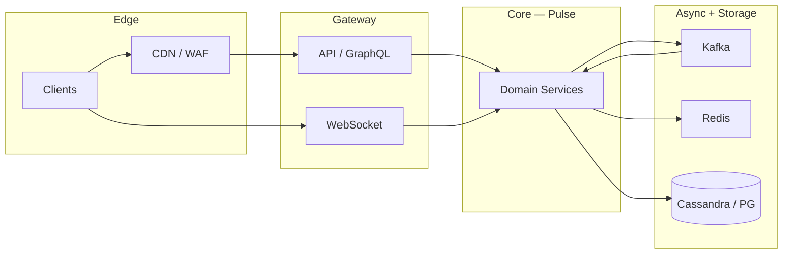

# Compound SRE Scenario — Social Platform Meltdown

> **Week 9** — Global social platform (feed + realtime chat) — multi-symptom P1

```
╔════════════════════════════════════════════════════════════════╗
║   RULES OF ENGAGEMENT                                          ║
╟────────────────────────────────────────────────────────────────╢
║                                                                ║
║   1. Answer from MEMORY. Do not re-read the teaching           ║
║      modules. The whole point is to test what STUCK in         ║
║      your brain.                                               ║
║                                                                ║
║   2. This is a COMPOUND scenario — multiple symptoms,          ║
║      multiple layers. Identify which subsystem each clue       ║
║      belongs to before proposing fixes.                        ║
║                                                                ║
║   3. Full depth expected. Name root causes, cite evidence,     ║
║      draw causal links, prioritize mitigations, and give       ║
║      exact commands where asked.                               ║
║                                                                ║
║   4. It's OK to say "I don't remember."                        ║
║      That's honest and tells us what to review.                ║
║      Faking an answer teaches nothing.                         ║
║                                                                ║
╚════════════════════════════════════════════════════════════════╝
```

---

## Knowledge Domains Tested

**Week 9 (primary):** Twitter-style home timeline (fan-out on write vs read), WhatsApp-style 1:1 and group chat, Read receipts and delivery states, Online presence and typing indicators, Celebrity / hot-key fan-out, Unread counters and notification fan-out

**Prior weeks (integrated):** WebSockets, gRPC, GraphQL (Week 1), Redis cache-aside, stampede, hot keys (Week 2), CAP, session consistency, consistent hashing (Week 3), Cassandra quorum, hinted handoff (Week 4–5), Kafka consumer lag, outbox, circuit breakers (Week 6), Rate limiting, load balancing (Week 7), Vector clocks / ordering (Week 8)

The challenge is not knowing each concept in isolation — it is **mapping each symptom to the correct layer** and understanding how failures cascade across feed/chat, storage, messaging, and edge systems simultaneously.


---

## Compound SRE Scenario

This scenario requires knowledge from **this week's system designs** and **all prior weeks** simultaneously. The challenge is identifying which layer each symptom belongs to and how failures cascade.

```
INCIDENT REPORT
━━━━━━━━━━━━━━━━━━━━━━━━━━━━━━━━━━━━━━━━━━━━━
Severity: P1
Service: Pulse
  420M DAU, 38M concurrent during incident window

  ╔════════════════════════════════════════════════════════════════════════════════╗
  ║ ARCHITECTURE                                                                   ║
  ╠════════════════════════════════════════════════════════════════════════════════╣

  ║ EXTERNAL LAYER                                                                 ║
  ║   Mobile/Web → CloudFront (API + media) → Route 53 GeoDNS                      ║
  ║                                                                                ║
  ║ API GATEWAY LAYER                                                              ║
  ║   ALB (L7) → GraphQL Feed Gateway (40 pods)                                    ║
  ║   ALB (L7) → REST Chat API (30 pods)                                           ║
  ║   NLB (L4) → WebSocket Presence + Chat Stream (60 pods)                        ║
  ║                                                                                ║
  ║ FEED PIPELINE (Twitter-style)                                                  ║
  ║   Post Service → Kafka topic posts.created                                     ║
  ║   Fan-out Workers (pull from Kafka, 120 workers)                               ║
  ║     → write timeline entries to Cassandra (user_timelines CF)                  ║
  ║     → push hot-user timelines to Redis (timeline:{user_id})                    ║
  ║   Home Timeline API: Redis cache-aside → Cassandra fallback                    ║
  ║   Ranking Service (ML features from Feature Store — read only)                 ║
  ║                                                                                ║
  ║ CHAT PIPELINE (WhatsApp-style)                                                 ║
  ║   Chat API → Message Service (gRPC, 24 replicas, L7 gRPC LB)                   ║
  ║   Message Service → Cassandra messages_by_conversation                         ║
  ║   Message Service → Kafka chat.events (delivery, receipts)                     ║
  ║   WebSocket servers subscribe Redis Pub/Sub per conversation                   ║
  ║   Read Receipt Service → Cassandra + Redis unread:{user_id}                    ║
  ║                                                                                ║
  ║ SUPPORTING                                                                     ║
  ║   Media Service → S3 + CloudFront signed URLs                                  ║
  ║   Notification Service → SNS → APNs/FCM                                        ║
  ║   User Graph Service (followers) — PostgreSQL + read replicas                  ║
  ║   Rate Limiter — Redis token bucket per user/IP                                ║
  ║                                                                                ║
  ║ DATA STORES                                                                    ║
  ║   Cassandra: 18-node cluster, RF=3, LOCAL_QUORUM default                       ║
  ║   Redis Cluster: 12 shards, cache + pub/sub                                    ║
  ║   PostgreSQL: user profiles, social graph edges                                ║
  ║   Kafka: 3 AZ, 24 brokers, topics posts.created, chat.events                   ║
  ║                                                                                ║
  ║ REGIONS: us-east-1 (primary), eu-west-1, ap-southeast-1                        ║
  ╚════════════════════════════════════════════════════════════════════════════════╝

INCIDENT TIMELINE:

  08:00 — Celebrity @nova posts breaking-news video. Follower count: 89M. Post triggers fan-out-on-write.

  08:02 — Fan-out workers lag grows 0 → 180K messages behind within 90 seconds.

  08:04 — Users report: home feed frozen / showing posts from 6+ hours ago.

  08:06 — Separate complaints: group chat messages arrive out of order; read receipts show 'delivered' but never 'read' for 12% of messages.

  08:09 — WebSocket reconnect storm: 2.1M reconnects/min. Presence shows friends 'offline' while actively chatting.

  08:11 — GraphQL Feed Gateway p99: 18s (baseline 120ms). CPU 88%.

  08:14 — Redis shard-7 CPU 99%, memory 94%. Keys matching timeline:* and unread:* concentrated.

  08:17 — Cassandra node cass-12 UNREACHABLE. Ops sees hinting active. Some timeline reads return UnavailableException.

  08:20 — Rate limiter false positives: 503 'rate limited' for 8% of normal users in EU. Token bucket key collision suspected.

  08:23 — Kafka consumer group fanout-workers: max lag 4.2M on partition 17 only.

  08:26 — Media thumbnails 403 for new posts — CloudFront signed URL clock skew between regions.

  08:29 — On-call discovers ADDITIONAL problems during bridge (see below).

  ─── Additional problems discovered during investigation ───

  08:29 — PROBLEM A:
            Fan-out worker hot partition
            Kafka partition 17 receives all @nova post fan-out events; single consumer cannot keep up. Lag 4.2M. Other partitions healthy.

            Monitoring:
            → Kafka consumer lag: partition 17 = 4.2M, all others < 12K
            → Fan-out worker pod fanout-17 CPU 99%; fanout-03 at 11%
            → posts.created produce rate 890K msg/sec spike on key @nova

  08:31 — PROBLEM B:
            Redis hot key on timeline cache
            89M follower fan-out attempted Redis push for @nova's own timeline preview key. timeline:nova + unread:nova on shard-7. Single-key ops/sec > 400K.

            Monitoring:
            → Redis shard-7: ops/sec 412K on single key timeline:nova
            → redis-cli --hotkeys shows 89% traffic on 3 keys
            → Memory fragmentation ratio 1.42 on shard-7

  08:33 — PROBLEM C:
            Cassandra quorum failures on cass-12
            Node cass-12 network partition. LOCAL_QUORUM reads/writes for token ranges owned by cass-12 fail intermittently. Hinted handoff queue depth 890K.

            Monitoring:
            → nodetool status: cass-12 UN (unreachable)
            → Hinted handoff queue depth 890,412 on cass-04
            → UnavailableException rate 1,240/sec on user_timelines CF

  08:35 — PROBLEM D:
            Chat message ordering / receipt gap
            chat.events consumers on 3 of 24 pods stuck in rebalance loop after cooperative-sticky assignor upgrade yesterday. Receipts processed on different pods than delivery events.

            Monitoring:
            → chat.events consumer group: 3/24 members in RevokePartitions
            → Read receipt lag 340s; delivery event lag 12s same message_id
            → cooperative-sticky assignor upgrade deploy 2026-03-14

  08:38 — PROBLEM E:
            GraphQL N+1 resolver storm
            Feed Gateway refetches author avatars per post sequentially. 50-post feed = 50 gRPC calls to Media Service. L4 sidecar on 2 pods pins connections.

            Monitoring:
            → Feed Gateway: 47,000 gRPC calls/sec to Media Service
            → Media replica-1 CPU 96%; replicas 2-8 at 9%
            → GraphQL resolver post.author.avatar sequential await pattern

  08:41 — PROBLEM F:
            WebSocket presence TTL mismatch
            Presence stored Redis SET with TTL 120s. WebSocket ping interval 45s but NLB idle timeout 60s on alternate path. Ghost offline states.

            Monitoring:
            → WebSocket disconnect cadence: exactly 60s idle intervals
            → Presence key TTL 120s; last_ping 67s ago on sample clients
            → NLB target group idle timeout: 60s on ws-chat-tg

  08:44 — PROBLEM G:
            Rate limiter shared bucket bug
            Feature flag enabled 'aggregate_rate_limit_by_asn' — entire EU ISP shares one Redis key. Flash crowd on @nova post exhausts bucket for carrier.

            Monitoring:
            → Rate limit 503 rate 8.2% in EU; 0.1% in US
            → Shared Redis key ratelimit:asn:3320 token count 0
            → Feature flag aggregate_rate_limit_by_asn=true since 07:55

  08:47 — PROBLEM H:
            Signed URL clock skew
            Media Service in eu-west-1 generates URLs with local clock 37s ahead of CloudFront edge validators. New uploads 403 until URL expires and refreshes.

            Monitoring:
            → CloudFront 403 on signed URL: Signature expired (clock skew)
            → Media pod clock offset +37s vs NTP in eu-west-1
            → S3 presigned URL X-Amz-Date mismatch in access logs

━━━━━━━━━━━━━━━━━━━━━━━━━━━━━━━━━━━━━━━━━━━━━
```

## Data Flow Overview



Use this map when triaging: **symptoms at the edge** often originate three hops away in async pipelines.


## Pre-Incident Context

The following changes were in flight before the incident. Any may be red herrings; all may contribute.

```
  CHANGE LOG (last 7 days):
  ─────────────────────────────────────────────────────────
  • Feature flag rollout: 5% → 25% → 50% canary
  • Load test cancelled due to change freeze exception
  • One AZ capacity reduction for cost program
  • Dependency upgrade: Kafka client 3.6 → 3.7
  • Redis cluster resharding (add 2 shards) — week 2 of migration
  • On-call runbook updated but not rehearsed
  • SLO review deferred to next quarter
```

**Service:** Pulse
**Severity:** P1
**Scale:** 420M DAU, 38M concurrent during incident window


```
Slack #incidents-war-room
  T+0m  incident-bot:  P1 opened: Pulse multi-symptom degradation
  T+2m  oncall-primary:  Joined bridge. Pulling dashboards for feed/chat/index path.
  T+5m  oncall-db:  Cassandra/Redis/Postgres — which store is hot?
  T+8m  eng-lead:  Any deploys in last 24h? Feature flags?
  08:29  oncall-primary:  Problem A hypothesis forming: Fan-out worker hot partition
  08:31  oncall-primary:  Problem B hypothesis forming: Redis hot key on timeline cache
  08:33  oncall-primary:  Problem C hypothesis forming: Cassandra quorum failures on cass-12
  08:35  oncall-primary:  Problem D hypothesis forming: Chat message ordering / receipt gap
```

---

## Grafana Dashboard Excerpts (Incident Snapshot)

### Panel: Request rate by service

```
  series  incident  notes          
  ------  --------  ---------------
  api     12K       baseline varies
  worker  890K      baseline varies
  ws      2.1M      baseline varies
```

### Panel: Error budget burn

```
  series    incident  notes          
  --------  --------  ---------------
  feed      14×       baseline varies
  chat      8×        baseline varies
  platform  22×       baseline varies
```

### Panel: Saturation

```
  series   incident  notes          
  -------  --------  ---------------
  cpu      94%       baseline varies
  memory   89%       baseline varies
  disk     78%       baseline varies
  network  67%       baseline varies
```


---

## Monitoring Appendix

### PROBLEM-A: Fan-out worker hot partition

Discovery time: **08:29**. Symptom summary: Kafka partition 17 receives all @nova post fan-out events; single consumer cannot keep up. Lag 4.2M. Other partitions healthy.

```
  instance   metric          normal  incident_hot  incident_cold
  ---------  --------------  ------  ------------  -------------
  Pulse-A-0  cpu_pct         78      94            12           
  Pulse-A-1  memory_pct      62      89            45           
  Pulse-A-2  request_rate    12400   89000         2100         
  Pulse-A-3  error_rate_pct  0.1     8.4           0.02         
  Pulse-A-4  p99_latency_ms  120     8400          45           
```

```
PagerDuty timeline (filtered P1/P2):
  08:29  [Pulse/A]  Elevated cpu_pct on critical path
  08:29  [Pulse/A]  SLO burn rate 14× over 5m window
```

### Log patterns — Problem A

```
level=WARN  service=Pulse  problem=A  msg="downstream degraded"
level=ERROR service=Pulse  problem=A  msg="retry budget exhausted"
level=INFO  service=Pulse  problem=A  msg="circuit breaker state=OPEN"
```

### PROBLEM-B: Redis hot key on timeline cache

Discovery time: **08:31**. Symptom summary: 89M follower fan-out attempted Redis push for @nova's own timeline preview key. timeline:nova + unread:nova on shard-7. Single-key ops/sec > 400K.

```
  instance   metric          normal  incident_hot  incident_cold
  ---------  --------------  ------  ------------  -------------
  Pulse-B-0  cpu_pct         78      94            12           
  Pulse-B-1  memory_pct      62      89            45           
  Pulse-B-2  request_rate    12400   89000         2100         
  Pulse-B-3  error_rate_pct  0.1     8.4           0.02         
  Pulse-B-4  p99_latency_ms  120     8400          45           
```

```
PagerDuty timeline (filtered P1/P2):
  08:31  [Pulse/B]  Elevated cpu_pct on critical path
  08:31  [Pulse/B]  SLO burn rate 14× over 5m window
```

### Log patterns — Problem B

```
level=WARN  service=Pulse  problem=B  msg="downstream degraded"
level=ERROR service=Pulse  problem=B  msg="retry budget exhausted"
level=INFO  service=Pulse  problem=B  msg="circuit breaker state=OPEN"
```

### PROBLEM-C: Cassandra quorum failures on cass-12

Discovery time: **08:33**. Symptom summary: Node cass-12 network partition. LOCAL_QUORUM reads/writes for token ranges owned by cass-12 fail intermittently. Hinted handoff queue depth 890K.

```
  instance   metric          normal  incident_hot  incident_cold
  ---------  --------------  ------  ------------  -------------
  Pulse-C-0  cpu_pct         78      94            12           
  Pulse-C-1  memory_pct      62      89            45           
  Pulse-C-2  request_rate    12400   89000         2100         
  Pulse-C-3  error_rate_pct  0.1     8.4           0.02         
  Pulse-C-4  p99_latency_ms  120     8400          45           
```

```
PagerDuty timeline (filtered P1/P2):
  08:33  [Pulse/C]  Elevated cpu_pct on critical path
  08:33  [Pulse/C]  SLO burn rate 14× over 5m window
```

### Log patterns — Problem C

```
level=WARN  service=Pulse  problem=C  msg="downstream degraded"
level=ERROR service=Pulse  problem=C  msg="retry budget exhausted"
level=INFO  service=Pulse  problem=C  msg="circuit breaker state=OPEN"
```

### PROBLEM-D: Chat message ordering / receipt gap

Discovery time: **08:35**. Symptom summary: chat.events consumers on 3 of 24 pods stuck in rebalance loop after cooperative-sticky assignor upgrade yesterday. Receipts processed on different pods than delivery events.

```
  instance   metric          normal  incident_hot  incident_cold
  ---------  --------------  ------  ------------  -------------
  Pulse-D-0  cpu_pct         78      94            12           
  Pulse-D-1  memory_pct      62      89            45           
  Pulse-D-2  request_rate    12400   89000         2100         
  Pulse-D-3  error_rate_pct  0.1     8.4           0.02         
  Pulse-D-4  p99_latency_ms  120     8400          45           
```

```
PagerDuty timeline (filtered P1/P2):
  08:35  [Pulse/D]  Elevated cpu_pct on critical path
  08:35  [Pulse/D]  SLO burn rate 14× over 5m window
```

### Log patterns — Problem D

```
level=WARN  service=Pulse  problem=D  msg="downstream degraded"
level=ERROR service=Pulse  problem=D  msg="retry budget exhausted"
level=INFO  service=Pulse  problem=D  msg="circuit breaker state=OPEN"
```

### PROBLEM-E: GraphQL N+1 resolver storm

Discovery time: **08:38**. Symptom summary: Feed Gateway refetches author avatars per post sequentially. 50-post feed = 50 gRPC calls to Media Service. L4 sidecar on 2 pods pins connections.

```
  instance   metric          normal  incident_hot  incident_cold
  ---------  --------------  ------  ------------  -------------
  Pulse-E-0  cpu_pct         78      94            12           
  Pulse-E-1  memory_pct      62      89            45           
  Pulse-E-2  request_rate    12400   89000         2100         
  Pulse-E-3  error_rate_pct  0.1     8.4           0.02         
  Pulse-E-4  p99_latency_ms  120     8400          45           
```

```
PagerDuty timeline (filtered P1/P2):
  08:38  [Pulse/E]  Elevated cpu_pct on critical path
  08:38  [Pulse/E]  SLO burn rate 14× over 5m window
```

### Log patterns — Problem E

```
level=WARN  service=Pulse  problem=E  msg="downstream degraded"
level=ERROR service=Pulse  problem=E  msg="retry budget exhausted"
level=INFO  service=Pulse  problem=E  msg="circuit breaker state=OPEN"
```

### PROBLEM-F: WebSocket presence TTL mismatch

Discovery time: **08:41**. Symptom summary: Presence stored Redis SET with TTL 120s. WebSocket ping interval 45s but NLB idle timeout 60s on alternate path. Ghost offline states.

```
  instance   metric          normal  incident_hot  incident_cold
  ---------  --------------  ------  ------------  -------------
  Pulse-F-0  cpu_pct         78      94            12           
  Pulse-F-1  memory_pct      62      89            45           
  Pulse-F-2  request_rate    12400   89000         2100         
  Pulse-F-3  error_rate_pct  0.1     8.4           0.02         
  Pulse-F-4  p99_latency_ms  120     8400          45           
```

```
PagerDuty timeline (filtered P1/P2):
  08:41  [Pulse/F]  Elevated cpu_pct on critical path
  08:41  [Pulse/F]  SLO burn rate 14× over 5m window
```

### Log patterns — Problem F

```
level=WARN  service=Pulse  problem=F  msg="downstream degraded"
level=ERROR service=Pulse  problem=F  msg="retry budget exhausted"
level=INFO  service=Pulse  problem=F  msg="circuit breaker state=OPEN"
```

### PROBLEM-G: Rate limiter shared bucket bug

Discovery time: **08:44**. Symptom summary: Feature flag enabled 'aggregate_rate_limit_by_asn' — entire EU ISP shares one Redis key. Flash crowd on @nova post exhausts bucket for carrier.

```
  instance   metric          normal  incident_hot  incident_cold
  ---------  --------------  ------  ------------  -------------
  Pulse-G-0  cpu_pct         78      94            12           
  Pulse-G-1  memory_pct      62      89            45           
  Pulse-G-2  request_rate    12400   89000         2100         
  Pulse-G-3  error_rate_pct  0.1     8.4           0.02         
  Pulse-G-4  p99_latency_ms  120     8400          45           
```

```
PagerDuty timeline (filtered P1/P2):
  08:44  [Pulse/G]  Elevated cpu_pct on critical path
  08:44  [Pulse/G]  SLO burn rate 14× over 5m window
```

### Log patterns — Problem G

```
level=WARN  service=Pulse  problem=G  msg="downstream degraded"
level=ERROR service=Pulse  problem=G  msg="retry budget exhausted"
level=INFO  service=Pulse  problem=G  msg="circuit breaker state=OPEN"
```

### PROBLEM-H: Signed URL clock skew

Discovery time: **08:47**. Symptom summary: Media Service in eu-west-1 generates URLs with local clock 37s ahead of CloudFront edge validators. New uploads 403 until URL expires and refreshes.

```
  instance   metric          normal  incident_hot  incident_cold
  ---------  --------------  ------  ------------  -------------
  Pulse-H-0  cpu_pct         78      94            12           
  Pulse-H-1  memory_pct      62      89            45           
  Pulse-H-2  request_rate    12400   89000         2100         
  Pulse-H-3  error_rate_pct  0.1     8.4           0.02         
  Pulse-H-4  p99_latency_ms  120     8400          45           
```

```
PagerDuty timeline (filtered P1/P2):
  08:47  [Pulse/H]  Elevated cpu_pct on critical path
  08:47  [Pulse/H]  SLO burn rate 14× over 5m window
```

### Log patterns — Problem H

```
level=WARN  service=Pulse  problem=H  msg="downstream degraded"
level=ERROR service=Pulse  problem=H  msg="retry budget exhausted"
level=INFO  service=Pulse  problem=H  msg="circuit breaker state=OPEN"
```


---

## On-Call Runbook Stubs (Reference)

These stubs exist in the wiki but may be stale. Do NOT assume they match production.

### Runbook RB-PULS-A

**Title:** Fan-out worker hot partition

```
  Trigger:  Automated alert Pulse-A-*
  Impact:   User-facing degradation on primary path
  Steps:
    1. Confirm metric spike in Grafana dashboard row 1
    2. Check recent deploys / feature flags
    3. Escalate to service owner if not resolved in 15m
  Last reviewed: 2025-11-14 (STALE)
```

### Runbook RB-PULS-B

**Title:** Redis hot key on timeline cache

```
  Trigger:  Automated alert Pulse-B-*
  Impact:   User-facing degradation on primary path
  Steps:
    1. Confirm metric spike in Grafana dashboard row 2
    2. Check recent deploys / feature flags
    3. Escalate to service owner if not resolved in 15m
  Last reviewed: 2025-11-14 (STALE)
```

### Runbook RB-PULS-C

**Title:** Cassandra quorum failures on cass-12

```
  Trigger:  Automated alert Pulse-C-*
  Impact:   User-facing degradation on primary path
  Steps:
    1. Confirm metric spike in Grafana dashboard row 3
    2. Check recent deploys / feature flags
    3. Escalate to service owner if not resolved in 15m
  Last reviewed: 2025-11-14 (STALE)
```

### Runbook RB-PULS-D

**Title:** Chat message ordering / receipt gap

```
  Trigger:  Automated alert Pulse-D-*
  Impact:   User-facing degradation on primary path
  Steps:
    1. Confirm metric spike in Grafana dashboard row 4
    2. Check recent deploys / feature flags
    3. Escalate to service owner if not resolved in 15m
  Last reviewed: 2025-11-14 (STALE)
```

### Runbook RB-PULS-E

**Title:** GraphQL N+1 resolver storm

```
  Trigger:  Automated alert Pulse-E-*
  Impact:   User-facing degradation on primary path
  Steps:
    1. Confirm metric spike in Grafana dashboard row 5
    2. Check recent deploys / feature flags
    3. Escalate to service owner if not resolved in 15m
  Last reviewed: 2025-11-14 (STALE)
```

### Runbook RB-PULS-F

**Title:** WebSocket presence TTL mismatch

```
  Trigger:  Automated alert Pulse-F-*
  Impact:   User-facing degradation on primary path
  Steps:
    1. Confirm metric spike in Grafana dashboard row 6
    2. Check recent deploys / feature flags
    3. Escalate to service owner if not resolved in 15m
  Last reviewed: 2025-11-14 (STALE)
```

### Runbook RB-PULS-G

**Title:** Rate limiter shared bucket bug

```
  Trigger:  Automated alert Pulse-G-*
  Impact:   User-facing degradation on primary path
  Steps:
    1. Confirm metric spike in Grafana dashboard row 7
    2. Check recent deploys / feature flags
    3. Escalate to service owner if not resolved in 15m
  Last reviewed: 2025-11-14 (STALE)
```

### Runbook RB-PULS-H

**Title:** Signed URL clock skew

```
  Trigger:  Automated alert Pulse-H-*
  Impact:   User-facing degradation on primary path
  Steps:
    1. Confirm metric spike in Grafana dashboard row 8
    2. Check recent deploys / feature flags
    3. Escalate to service owner if not resolved in 15m
  Last reviewed: 2025-11-14 (STALE)
```


---

## Diagnostic Questions

Answer all questions in writing. Cite monitoring evidence, name the subsystem/layer, and explain interactions between problems.

**Question 1:** There are EIGHT distinct problems (A–H) plus the initial user-visible symptoms. For each: name the subsystem, identify which week/topic it belongs to, state the root cause in one sentence, and cite the specific monitoring evidence from the timeline.

**Question 2:** Draw the cascade map — which problems amplify which? Identify at least THREE causal relationships (e.g., fan-out lag → Redis hot key → GraphQL timeout). Explain the feedback loops.

**Question 3:** You are incident commander at 08:50 UTC. Rank problems A–H by priority considering user impact, data integrity, legal/reputational risk, and blast radius. Justify the top 3 and bottom 2.

**Question 4:** Give immediate mitigations (exact commands, config changes, or feature-flag flips) for your top 3 priorities. Include Kafka, Redis, Cassandra, and feature-flag actions.

**Question 5:** The team proposes switching @nova from fan-out-on-write to fan-out-on-read for the duration of the incident. Analyze: what breaks, what improves, what new failure modes appear at 89M followers. Would you approve?

**Question 6:** Chat users report messages appearing out of order ONLY in groups with >256 members, not in 1:1 chats. What architectural difference explains this? What data structure or ordering guarantee is missing?

**Question 7:** Design three monitoring alerts that would have fired BEFORE 08:04 user complaints. Include PromQL or metric names, thresholds, and which problem each catches.

**Question 8:** Post-incident: list five permanent architectural changes with owners. At least two must address Week 9 feed/chat patterns; at least two must address prior-week gaps (caching, Kafka, gRPC, etc.).

**Question 9:** A PM asks: 'Can we just increase Redis shard-7 memory?' Argue for or against in three sentences using hot-key vs hot-partition distinction from Week 3.

**Question 10:** Write the first 60 seconds of your incident bridge script — what do you ask each domain owner (feed, chat, infra) to paste into the channel?


---

## Submission Notes

- Work in a single document; label answers by question number.
- Cite evidence from the timeline and monitoring appendix.
- Diagrams may be ASCII or Mermaid.
- **This file contains questions only — no worked answers.**
- Recorded answers belong in your retention notebook or a separate worked-answers file.

---

## Diagnostic Command Cheat Sheet

The following commands are available to on-call. In your answers, cite which you would run and what output pattern you expect.

### Kafka consumer lag

```bash
kafka-consumer-groups.sh --bootstrap-server $BROKERS \
  --describe --group pulse-workers
kafka-topics.sh --bootstrap-server $BROKERS \
  --describe --topic events.main | grep -A2 Partition
```

### Redis hot key scan

```bash
redis-cli -c -h $REDIS_CLUSTER --hotkeys
redis-cli -c -h $REDIS_CLUSTER INFO commandstats | head -40
redis-cli -c -h $REDIS_CLUSTER --latency-history
```

### Cassandra cluster health

```bash
nodetool status
nodetool tpstats | head -30
nodetool tablestats keyspace.cf | grep -i hint
```

### PostgreSQL / replication

```bash
SELECT * FROM pg_stat_replication;
SELECT slot_name, active, pg_size_pretty(pg_wal_lsn_diff(pg_current_wal_lsn(), restart_lsn)) FROM pg_replication_slots;
SHOW POOLS;  -- PgBouncer admin console
```

### Elasticsearch index health

```bash
curl -s $ES/_cluster/health?pretty
curl -s $ES/_cat/shards?v | grep UNASSIGNED
curl -s $ES/index/_segments | jq '.[] | select(.num==7)'
```

### Kubernetes / mesh

```bash
kubectl top pods -n production --sort-by=cpu | head -20
kubectl get events -n production --sort-by=.lastTimestamp | tail -30
istioctl proxy-stats deploy/$SVC | grep cx_active
```

---

## Red Herring Register

The following observations were raised on the bridge and may mislead. In Question 1 or 2, note which are red herrings and why.

1. Primary database CPU is elevated but within SLO — not every CPU spike is the root cause.
2. A deploy occurred 6 hours before incident — correlation is not causation unless evidence links.
3. Single PoP latency elevated — may be symptom of origin overload, not edge misconfiguration.
4. Error rate dashboard shows 0.0% HTTP 5xx — application errors may hide in 200 bodies or async lag.
5. Auto-scaling added capacity 10 minutes before complaints — scaling treats symptoms, not causes.
6. Vendor status page all-green — third-party APIs can degrade without public incident.

---

## Distributed Trace Samples

Sample OpenTelemetry exports. Trace IDs correlate with log lines in the monitoring appendix.

### Trace TB-0000 (tags: problem=A)

```
trace_id=tb-pulse-0000
duration_ms=480
service=Pulse
spans:
  - span=0 name=HTTP/gateway duration_ms=15 status=OK
  - span=0.1 name=downstream/Fan-out worker hot partition duration_ms=60
  - span=1 name=HTTP/gateway duration_ms=27 status=OK
  - span=1.1 name=downstream/Fan-out worker hot partition duration_ms=85
  - span=2 name=HTTP/gateway duration_ms=39 status=OK
  - span=2.1 name=downstream/Fan-out worker hot partition duration_ms=110
  - span=3 name=HTTP/gateway duration_ms=51 status=ERROR
  - span=3.1 name=downstream/Fan-out worker hot partition duration_ms=135
  - span=4 name=HTTP/gateway duration_ms=63 status=OK
  - span=4.1 name=downstream/Fan-out worker hot partition duration_ms=160
```

### Trace TB-0001 (tags: problem=B)

```
trace_id=tb-pulse-0001
duration_ms=497
service=Pulse
spans:
  - span=0 name=HTTP/gateway duration_ms=15 status=OK
  - span=0.1 name=downstream/Redis hot key on timeline cache duration_ms=60
  - span=1 name=HTTP/gateway duration_ms=27 status=OK
  - span=1.1 name=downstream/Redis hot key on timeline cache duration_ms=85
  - span=2 name=HTTP/gateway duration_ms=39 status=OK
  - span=2.1 name=downstream/Redis hot key on timeline cache duration_ms=110
  - span=3 name=HTTP/gateway duration_ms=51 status=OK
  - span=3.1 name=downstream/Redis hot key on timeline cache duration_ms=135
  - span=4 name=HTTP/gateway duration_ms=63 status=OK
  - span=4.1 name=downstream/Redis hot key on timeline cache duration_ms=160
```

### Trace TB-0002 (tags: problem=C)

```
trace_id=tb-pulse-0002
duration_ms=514
service=Pulse
spans:
  - span=0 name=HTTP/gateway duration_ms=15 status=OK
  - span=0.1 name=downstream/Cassandra quorum failures on cass-12 duration_ms=60
  - span=1 name=HTTP/gateway duration_ms=27 status=OK
  - span=1.1 name=downstream/Cassandra quorum failures on cass-12 duration_ms=85
  - span=2 name=HTTP/gateway duration_ms=39 status=OK
  - span=2.1 name=downstream/Cassandra quorum failures on cass-12 duration_ms=110
  - span=3 name=HTTP/gateway duration_ms=51 status=OK
  - span=3.1 name=downstream/Cassandra quorum failures on cass-12 duration_ms=135
  - span=4 name=HTTP/gateway duration_ms=63 status=OK
  - span=4.1 name=downstream/Cassandra quorum failures on cass-12 duration_ms=160
```

### Trace TB-0003 (tags: problem=D)

```
trace_id=tb-pulse-0003
duration_ms=531
service=Pulse
spans:
  - span=0 name=HTTP/gateway duration_ms=15 status=OK
  - span=0.1 name=downstream/Chat message ordering / receipt gap duration_ms=60
  - span=1 name=HTTP/gateway duration_ms=27 status=OK
  - span=1.1 name=downstream/Chat message ordering / receipt gap duration_ms=85
  - span=2 name=HTTP/gateway duration_ms=39 status=OK
  - span=2.1 name=downstream/Chat message ordering / receipt gap duration_ms=110
  - span=3 name=HTTP/gateway duration_ms=51 status=OK
  - span=3.1 name=downstream/Chat message ordering / receipt gap duration_ms=135
  - span=4 name=HTTP/gateway duration_ms=63 status=OK
  - span=4.1 name=downstream/Chat message ordering / receipt gap duration_ms=160
```

### Trace TB-0004 (tags: problem=E)

```
trace_id=tb-pulse-0004
duration_ms=548
service=Pulse
spans:
  - span=0 name=HTTP/gateway duration_ms=15 status=OK
  - span=0.1 name=downstream/GraphQL N+1 resolver storm duration_ms=60
  - span=1 name=HTTP/gateway duration_ms=27 status=OK
  - span=1.1 name=downstream/GraphQL N+1 resolver storm duration_ms=85
  - span=2 name=HTTP/gateway duration_ms=39 status=OK
  - span=2.1 name=downstream/GraphQL N+1 resolver storm duration_ms=110
  - span=3 name=HTTP/gateway duration_ms=51 status=ERROR
  - span=3.1 name=downstream/GraphQL N+1 resolver storm duration_ms=135
  - span=4 name=HTTP/gateway duration_ms=63 status=OK
  - span=4.1 name=downstream/GraphQL N+1 resolver storm duration_ms=160
```

### Trace TB-0005 (tags: problem=F)

```
trace_id=tb-pulse-0005
duration_ms=565
service=Pulse
spans:
  - span=0 name=HTTP/gateway duration_ms=15 status=OK
  - span=0.1 name=downstream/WebSocket presence TTL mismatch duration_ms=60
  - span=1 name=HTTP/gateway duration_ms=27 status=OK
  - span=1.1 name=downstream/WebSocket presence TTL mismatch duration_ms=85
  - span=2 name=HTTP/gateway duration_ms=39 status=OK
  - span=2.1 name=downstream/WebSocket presence TTL mismatch duration_ms=110
  - span=3 name=HTTP/gateway duration_ms=51 status=OK
  - span=3.1 name=downstream/WebSocket presence TTL mismatch duration_ms=135
  - span=4 name=HTTP/gateway duration_ms=63 status=OK
  - span=4.1 name=downstream/WebSocket presence TTL mismatch duration_ms=160
```

### Trace TB-0006 (tags: problem=G)

```
trace_id=tb-pulse-0006
duration_ms=582
service=Pulse
spans:
  - span=0 name=HTTP/gateway duration_ms=15 status=OK
  - span=0.1 name=downstream/Rate limiter shared bucket bug duration_ms=60
  - span=1 name=HTTP/gateway duration_ms=27 status=OK
  - span=1.1 name=downstream/Rate limiter shared bucket bug duration_ms=85
  - span=2 name=HTTP/gateway duration_ms=39 status=OK
  - span=2.1 name=downstream/Rate limiter shared bucket bug duration_ms=110
  - span=3 name=HTTP/gateway duration_ms=51 status=OK
  - span=3.1 name=downstream/Rate limiter shared bucket bug duration_ms=135
  - span=4 name=HTTP/gateway duration_ms=63 status=OK
  - span=4.1 name=downstream/Rate limiter shared bucket bug duration_ms=160
```

### Trace TB-0007 (tags: problem=H)

```
trace_id=tb-pulse-0007
duration_ms=599
service=Pulse
spans:
  - span=0 name=HTTP/gateway duration_ms=15 status=OK
  - span=0.1 name=downstream/Signed URL clock skew duration_ms=60
  - span=1 name=HTTP/gateway duration_ms=27 status=OK
  - span=1.1 name=downstream/Signed URL clock skew duration_ms=85
  - span=2 name=HTTP/gateway duration_ms=39 status=OK
  - span=2.1 name=downstream/Signed URL clock skew duration_ms=110
  - span=3 name=HTTP/gateway duration_ms=51 status=OK
  - span=3.1 name=downstream/Signed URL clock skew duration_ms=135
  - span=4 name=HTTP/gateway duration_ms=63 status=OK
  - span=4.1 name=downstream/Signed URL clock skew duration_ms=160
```
