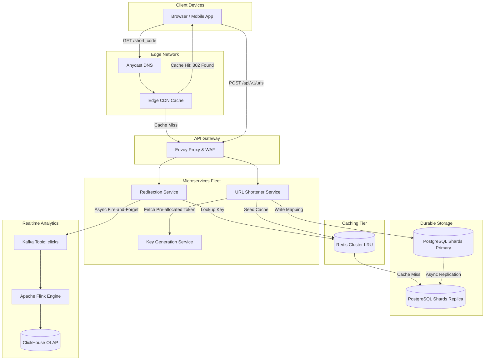

# Design URL Shortener (TinyURL / Bitly)

## Learning Objectives
```
╔════════════════════════════════════════════════════════════════╗
║   AFTER THIS MODULE, YOU WILL BE ABLE TO:                      ║
╟────────────────────────────────────────────────────────────────╢
║                                                                ║
║   1. Design a high-throughput URL shortening and redirection   ║
║      service from first principles: requirements, data model,  ║
║      read/write paths, and key encoding tradeoffs              ║
║                                                                ║
║   2. Master Base62 encoding, MD5/SHA-256 truncation, and       ║
║      Key Generation Service (KGS) range pre-allocation         ║
║                                                                ║
║   3. Evaluate HTTP 301 vs HTTP 302/307 redirection semantics   ║
║      and their implications on CDN caching vs click analytics  ║
║                                                                ║
║   4. Layer multi-tier caching (Cloudflare CDN edge, Redis      ║
║      Cluster LRU) to absorb 99%+ read traffic                  ║
║                                                                ║
║   5. Partition storage across sharded PostgreSQL/DynamoDB and  ║
║      solve hot-key cache stampedes on viral shortened links    ║
║                                                                ║
║   6. Diagnose and mitigate P0 production outages: KGS range    ║
║      exhaustion, cache thundering herd, and link rot           ║
╚════════════════════════════════════════════════════════════════╝
```

---

## Wrong Mental Models (Destroy These First)

```
╔═════════════════════════════════════════════════════════════════════╗
║   MENTAL MODEL #1: "Just MD5 or SHA-256 the URL and take the        ║
║   first 7 characters"                                               ║
╟─────────────────────────────────────────────────────────────────────╢
║   WRONG. Truncating a 128-bit MD5 or 256-bit SHA-256 hash to        ║
║   7 Base62 characters creates immediate birthday paradox collision  ║
║   vulnerabilities. Resolving collisions requires continuous DB      ║
║   lookups and counter salt appends, killing write throughput.       ║
╠═════════════════════════════════════════════════════════════════════╣
║   MENTAL MODEL #2: "Always use HTTP 301 Moved Permanently for       ║
║   maximum redirection speed"                                        ║
╟─────────────────────────────────────────────────────────────────────╢
║   WRONG. HTTP 301 causes browsers to cache the destination URL      ║
║   indefinitely on the user device. Subsequent clicks bypass your    ║
║   infrastructure completely, blindfolding your analytics pipeline   ║
║   and rendering link expiration or instant revocation impossible.   ║
╠═════════════════════════════════════════════════════════════════════╣
║   MENTAL MODEL #3: "An auto-incrementing integer in MySQL is        ║
║   good enough for key generation"                                   ║
╟─────────────────────────────────────────────────────────────────────╢
║   WRONG. Sequential IDs leak business metrics (competitors scrape   ║
║   your total URL creation rate), allow enumeration attacks, and     ║
║   create a hard write bottleneck on a single primary database.      ║
╠═════════════════════════════════════════════════════════════════════╣
║   MENTAL MODEL #4: "We do not need an Edge CDN because short        ║
║   redirects are tiny HTTP headers"                                  ║
╟─────────────────────────────────────────────────────────────────────╢
║   WRONG. At 100,000+ read QPS, round-trip latency across the globe  ║
║   dominates user experience. Terminating TLS and serving HTTP 302   ║
║   with CDN Cache-Control headers at the nearest edge PoP reduces    ║
║   redirect latency from 150ms down to < 15ms.                       ║
╠═════════════════════════════════════════════════════════════════════╣
║   MENTAL MODEL #5: "Delete expired URLs with a background           ║
║   SQL DELETE cron job"                                              ║
╟─────────────────────────────────────────────────────────────────────╢
║   WRONG. Running `DELETE FROM urls WHERE expires_at < NOW()` on     ║
║   a table with 5 billion rows triggers table locks, transaction     ║
║   log bloat, and replication lag. Production systems use lazy       ║
║   eviction on read plus partitioned TTL drop or LSM compaction.     ║
╠═════════════════════════════════════════════════════════════════════╣
║   MENTAL MODEL #6: "Key Generation Service (KGS) can be a single    ║
║   central Redis instance"                                           ║
╟─────────────────────────────────────────────────────────────────────╢
║   WRONG. If Redis restarts or loses connection during peak write    ║
║   traffic, all URL creation halts. KGS must use partitioned range   ║
║   leases managed via Raft/etcd with dual-buffered worker memory.    ║
╚═════════════════════════════════════════════════════════════════════╝
```

---

## Core Teaching

### 1. Requirements & Quantitative Hardware Sizing

#### Functional Requirements
1. **URL Shortening**: Given a long URL (e.g. up to 2,048 characters), generate a unique short link alias (e.g. `https://sho.rt/aZ89b1c`).
2. **Redirection**: Given a short alias, redirect the user to the original long URL with sub-20ms latency.
3. **Custom Aliases**: Optional user-defined custom short alias (e.g. `https://sho.rt/blackfriday`).
4. **Expiration**: Optional TTL for short links (default: 5 years; custom: 1 hour to 10 years).
5. **Telemetry & Analytics**: Track click counts, referrers, geographic locations, and user agent distributions.

#### Non-Functional Requirements & SLA Targets
- **Availability**: 99.99% for redirection read path (< 52 minutes downtime/year).
- **Latency**: p99 < 20ms for redirects; p99 < 100ms for short URL generation.
- **Durability**: 99.9999999% (no lost URL mappings).
- **Security**: Non-guessable short codes to prevent scraping and enumeration attacks.

#### Quantitative Hardware & Capacity Bounds

```
ESTIMATION BOUNDS:
  - Write QPS: 100,000,000 new URLs / month
    → Average Write QPS = 100M / (30 days × 86,400s) ≈ 38.6 writes/sec
    → Peak Write QPS (3x multiplier) ≈ 115 writes/sec
  
  - Read:Write Ratio = 100:1 (Heavy Read Skew)
    → Average Read QPS = 38.6 × 100 ≈ 3,860 reads/sec
    → Peak Read QPS (3x multiplier) ≈ 11,580 reads/sec
    → Viral Peak Event (10x multiplier) ≈ 38,600 reads/sec

  - Storage Calculations (5-year retention horizon):
    → Total URLs = 100M/month × 12 months × 5 years = 6 Billion URLs
    → Bytes per record:
        short_code     : 7 bytes
        long_url       : 500 bytes (average)
        user_id        : 16 bytes (UUID)
        created_at     : 8 bytes
        expires_at     : 8 bytes
        metadata_json  : 61 bytes
        Indexes & B-tree: 400 bytes
        Total per row  : ~1,000 bytes (1 KB)
    → Total 5-Year Storage = 6 Billion × 1 KB = 6 TB raw storage
    → 3-way Replication = 18 TB raw NVMe storage

  - Cache Sizing (80/20 Pareto Rule):
    → Daily read volume = 3,860 × 86,400 ≈ 333 Million redirects / day
    → Cache top 20% hot links: 333M × 0.20 = 66.6 Million URLs
    → RAM required = 66.6M × 1 KB ≈ 66.6 GB RAM (Easily fits in 2x 64GB Redis nodes)

  - Network Bandwidth:
    → Ingress (Writes): 115 writes/sec × 1 KB ≈ 115 KB/s ≈ 0.92 Mbps
    → Egress (Redirects): 11,580 reads/sec × 500 bytes ≈ 5.79 MB/s ≈ 46.3 Mbps
```

---

### 2. High-Level Design (HLD) Box-and-Arrow Architecture

```
                                  [ Edge Tier ]
                                        │
                           ┌────────────▼────────────┐
                           │    Anycast DNS (Cloud)  │
                           └────────────┬────────────┘
                                        │
                               ┌────────▼────────┐
                               │ Edge CDN / WAF  │
                               │  (Cloudflare)   │
                               └────────┬────────┘
                                        │
                         HTTP 302 Cache │ Miss
                                        ▼
                           ┌─────────────────────────┐
                           │   Envoy Ingress Gateway │
                           │  (Rate Limiting / TLS)  │
                           └────────────┬────────────┘
                                        │
            ┌───────────────────────────┴───────────────────────────┐
            │ Write Path (Create URL)                               │ Read Path (Redirect)
            ▼                                                       ▼
┌───────────────────────────┐                           ┌───────────────────────────┐
│   URL Creation Service    │                           │    Redirection Service    │
│  (Go Stateless Pods)      │                           │   (Go Stateless Pods)     │
└──────┬─────────────┬──────┘                           └──────┬─────────────┬──────┘
       │             │                                         │             │
       ▼             ▼                                         ▼             ▼
┌─────────────┐ ┌─────────────┐                         ┌─────────────┐ ┌─────────────┐
│ Key Gen     │ │ Bloom       │                         │ Redis       │ │ Read-Only   │
│ Service     │ │ Filter      │                         │ Cluster LRU │ │ DB Replica  │
│ (KGS Pool)  │ │ (Collision) │                         │ (Hot Links) │ │ (Fallback)  │
└─────────────┘ └─────────────┘                         └──────┬──────┘ └─────────────┘
       │                                                       │
       │ Store Mapping                                         │ Publish Click Event
       ▼                                                       ▼
┌───────────────────────────────────────┐               ┌─────────────────────────────┐
│  Primary Database Shard Cluster       │               │      Kafka Ingestion        │
│ (Sharded PostgreSQL / Vitess / TiDB)  │               │   (analytics_click_stream)  │
└───────────────────────────────────────┘               └──────────────┬──────────────┘
                                                                       │
                                                                       ▼
                                                        ┌─────────────────────────────┐
                                                        │   Flink Stream Aggregator   │
                                                        │  (ClickHouse OLAP Storage)  │
                                                        └─────────────────────────────┘
```

#### Native Mermaid Architecture Schematic



---

### 3. Deep Dive into Core Subsystems & Key Generation

#### Subsystem A: Base62 Encoding vs. Cryptographic Hash Truncation

Why 7 characters of Base62?
Base62 characters consist of `[0-9, a-z, A-Z]`, providing 62 possible values per character:

$$\text{Capacity} = 62^L$$

$$\text{For } L = 6: \quad 62^6 = 56,800,235,584 \quad (\approx 56.8 \text{ Billion URLs})$$

$$\text{For } L = 7: \quad 62^7 = 3,521,614,606,208 \quad (\approx 3.52 \text{ Trillion URLs})$$

At 100M URLs per month, $62^7$ provides sufficient unique address space for over **2,900 years** of operations without collisions.

#### Why MD5 Truncation Fails
```
INPUT: "https://example.com/long/path"
MD5 HASH: 7b2401f8d4c679a8342b0e9a5c81d2f1 (128 bits)

Truncating to first 7 hex digits: "7b2401f" (only 16^7 = 268 Million combinations!)
Birthday Paradox Formula:
  P(collision) ≈ 1 - exp(-N^2 / 2M)
At N = 100,000 URLs and M = 268M:
  P(collision) > 99% within days!
```

#### Subsystem B: Key Generation Service (KGS) Architecture

To eliminate both hashing collisions and database round-trips at write time, we implement a dedicated **Key Generation Service (KGS)** with range leases.

```
+-------------------------------------------------------------------+
|                        etcd / ZooKeeper                           |
|  Maintains global atomic token range pointer (e.g. RangeSize=1M)  |
+---------------------------------+---------------------------------+
                                  │
          ┌───────────────────────┴───────────────────────┐
          │ Range Lease: 1 - 1,000,000                    │ Range Lease: 1,000,001 - 2,000,000
          ▼                                               ▼
+-----------------------------+                 +-----------------------------+
|    KGS Worker Node #1       |                 |    KGS Worker Node #2       |
| Active Buffer: [1 .. 500k]  |                 | Active Buffer: [1.0M..1.5M] |
| Standby Buf  : [500k .. 1M] |                 | Standby Buf  : [1.5M..2.0M] |
+--------------┬--------------+                 +--------------┬--------------+
               │                                               │
               │ Dispense Atomic Token                         │ Dispense Atomic Token
               ▼                                               ▼
+-----------------------------+                 +-----------------------------+
|   URL Create Service #1     |                 |   URL Create Service #2     |
+-----------------------------+                 +-----------------------------+
```

#### High-Performance Go KGS Client & Base62 Encoder

```go
package kgs

import (
	"errors"
	"strings"
	"sync"
	"sync/atomic"
)

const base62Chars = "0123456789abcdefghijklmnopqrstuvwxyzABCDEFGHIJKLMNOPQRSTUVWXYZ"

// Base62Encode converts a uint64 numerical ID into a Base62 string
func Base62Encode(id uint64) string {
	if id == 0 {
		return "0"
	}
	var sb strings.Builder
	sb.Grow(11) // max uint64 length in base62 is 11 chars
	
	for id > 0 {
		rem := id % 62
		sb.WriteByte(base62Chars[rem])
		id /= 62
	}
	
	// Reverse the string
	runes := []rune(sb.String())
	for i, j := 0, len(runes)-1; i < j; i, j = i+1, j-1 {
		runes[i], runes[j] = runes[j], runes[i]
	}
	return string(runes)
}

// TokenBuffer manages a local allocated numeric range
type TokenBuffer struct {
	mu        sync.Mutex
	currentID uint64
	maxID     uint64
}

func (tb *TokenBuffer) NextToken() (uint64, error) {
	val := atomic.AddUint64(&tb.currentID, 1)
	if val > tb.maxID {
		return 0, errors.New("token buffer exhausted; renew lease from etcd")
	}
	return val, nil
}
```

---

### 4. Storage Architecture & Database Schema

#### Production PostgreSQL Sharded Table Schema (`schema.sql`)

```sql
-- Core Table for URL Mappings
CREATE TABLE urls (
    short_code VARCHAR(7) PRIMARY KEY,
    long_url VARCHAR(2048) NOT NULL,
    user_id UUID,
    is_custom BOOLEAN NOT NULL DEFAULT FALSE,
    click_count BIGINT NOT NULL DEFAULT 0,
    created_at TIMESTAMPTZ NOT NULL DEFAULT NOW(),
    expires_at TIMESTAMPTZ,
    last_accessed_at TIMESTAMPTZ
);

-- B-Tree Index on short_code is created automatically by PRIMARY KEY constraint
-- Partial Index for expiration cleanup
CREATE INDEX idx_urls_expires_at ON urls (expires_at) 
WHERE expires_at IS NOT NULL;

-- Sharding Key: Hash of short_code (CRC32(short_code) % 16 shards)
-- Guarantees uniform distribution across database nodes
```

#### API Contracts

##### 1. Create Short URL
- **Endpoint**: `POST /api/v1/urls`
- **Request Payload**:
```json
{
  "long_url": "https://www.company.com/blog/2026/09/scalable-architectures-guide",
  "custom_alias": "scale2026",
  "ttl_seconds": 2592000
}
```
- **Response Payload (201 Created)**:
```json
{
  "short_code": "scale2026",
  "short_url": "https://sho.rt/scale2026",
  "long_url": "https://www.company.com/blog/2026/09/scalable-architectures-guide",
  "expires_at": "2026-10-10T12:00:00Z",
  "created_at": "2026-09-10T12:00:00Z"
}
```

##### 2. Redirect Short URL
- **Endpoint**: `GET /{short_code}`
- **Response Headers**:
```http
HTTP/1.1 302 Found
Location: https://www.company.com/blog/2026/09/scalable-architectures-guide
Cache-Control: private, max-age=300
Date: Thu, 10 Sep 2026 12:00:00 GMT
```

---

## SRE Diagnostic Toolkit

### 1. Telemetry Metrics & Alerting Thresholds

```promql
# Alert: Redirect Latency SLA Breach (p99 > 25ms over 5m window)
histogram_quantile(0.99, sum(rate(http_request_duration_seconds_bucket{job="url-redirect"}[5m])) by (le)) > 0.025

# Alert: Redis Cache Hit Ratio Degradation (< 90%)
sum(rate(redis_keyspace_hits_total[5m])) / 
(sum(rate(redis_keyspace_hits_total[5m])) + sum(rate(redis_keyspace_misses_total[5m]))) < 0.90

# Alert: KGS Remaining Buffer Exhaustion (< 15% range remaining)
kgs_tokens_available / kgs_tokens_allocated < 0.15
```

### 2. Linux Kernel & Socket Sysctl Hardening

```ini
# /etc/sysctl.d/99-url-shortener.conf
# Maximize socket backlog queue to prevent SYN drop during viral redirection bursts
net.core.somaxconn = 65535
net.ipv4.tcp_max_syn_backlog = 65535

# Fast socket recycling for short-lived HTTP redirect connections
net.ipv4.tcp_fin_timeout = 15
net.ipv4.tcp_tw_reuse = 1

# Ephemeral port range expansion
net.ipv4.ip_local_port_range = 1024 65535
```

---

## Decision Framework

| Requirement / Constraint | Recommended Pattern | Rejected Alternative | Engineering Tradeoff Rationale |
| :--- | :--- | :--- | :--- |
| **Redirection Status** | `HTTP 302 Found` (or `307`) | `HTTP 301 Moved Permanently` | 301 allows browser client caching, completely blinding your telemetry and analytics pipeline. 302 ensures hits reach the edge proxy. |
| **Key Generation** | `Key Generation Service (KGS)` with range leases | `MD5/SHA-256 Truncation` | Hash truncation creates birthday paradox collisions requiring database retry loops. KGS guarantees $O(1)$ unique collision-free keys. |
| **Storage Engine** | `Sharded PostgreSQL (or Vitess/DynamoDB)` | `Single Massive RDBMS Instance` | 6 Billion rows cannot be safely indexed in a single MySQL B-tree without massive buffer pool thrashing and vacuum lock contention. |
| **Expiration Handling** | `Lazy Eviction on Access + Monthly Partition Drop` | `Hourly DELETE Cron Query` | Bulk `DELETE` queries lock index pages and cause massive WAL replication lag across downstream read replicas. |

---

## Failure Modes

### Failure Mode 1: Cache Stampede (Thundering Herd) on Viral Short Code
- **Failure Trigger**: An influencer tweets a short URL with 50M followers. The key expires from Redis cache, causing 40,000 concurrent requests to hit the primary database shard simultaneously.
- **Cascading Impact**: DB connection pool exhaustion $\rightarrow$ DB thread starvation $\rightarrow$ 504 Gateway Timeouts across all short links on that database shard.
- **SRE Containment**:
  1. Implement Go `singleflight.Group` on redirection workers so only ONE query hits the DB while others wait for result.
  2. Implement **Probabilistic Early Expiration (XFetch algorithm)**:
     $$\Delta t - \beta \times \ln(\text{rand}()) \times \text{computation\_time} > \text{TTL}$$
     Workers proactively recompute cache entries before they expire.

### Failure Mode 2: KGS Dual Allocation Partition Split
- **Failure Trigger**: Network partition isolates KGS Worker #1 from etcd. Worker #1 continues dispensing tokens from an old lease that etcd expired and re-assigned to Worker #2.
- **Cascading Impact**: Two different users receive the identical short code `ab89X1z`, overwriting or cross-linking sensitive destination URLs.
- **SRE Containment**:
  1. Leases require proactive heartbeating every 2 seconds.
  2. If heartbeat fails for 5 seconds, worker strictly freezes token dispensing and returns HTTP 503 until quorum recovery.

---

## 🛑 SOCRATIC CHECK

### Question 1:
If a user specifies a custom alias (e.g. `blackfriday`), how do you prevent race conditions where two users attempt to claim the exact same custom alias concurrently across two different web server pods?

### Question 2:
Why is base62 chosen over base64 for URL shortener short codes? What goes wrong in real-world web environments if you include `+` and `/`?

### Question 3:
How does the system defend against malicious actors creating short URLs pointing to phishing domains or malware downloads?
