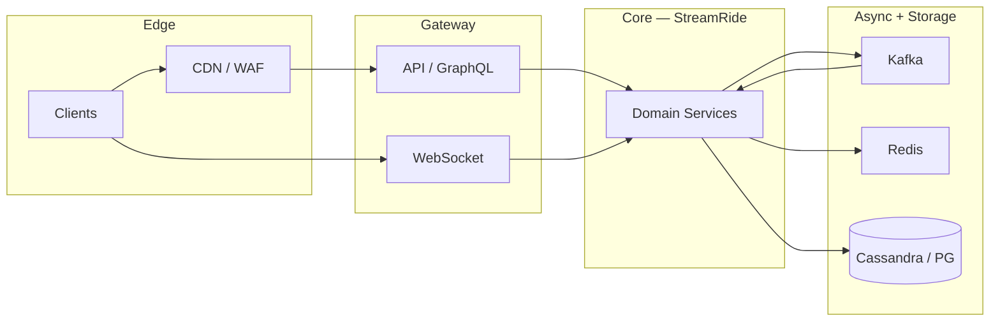

# Compound SRE Scenario — Global Video Outage

> **Week 10** — Video streaming + ride-hail mobility platform — concurrent P1

```
╔════════════════════════════════════════════════════════════════╗
║   RULES OF ENGAGEMENT                                          ║
╟────────────────────────────────────────────────────────────────╢
║                                                                ║
║   1. Answer from MEMORY. Do not re-read the teaching           ║
║      modules. The whole point is to test what STUCK in         ║
║      your brain.                                               ║
║                                                                ║
║   2. This is a COMPOUND scenario — multiple symptoms,          ║
║      multiple layers. Identify which subsystem each clue       ║
║      belongs to before proposing fixes.                        ║
║                                                                ║
║   3. Full depth expected. Name root causes, cite evidence,     ║
║      draw causal links, prioritize mitigations, and give       ║
║      exact commands where asked.                               ║
║                                                                ║
║   4. It's OK to say "I don't remember."                        ║
║      That's honest and tells us what to review.                ║
║      Faking an answer teaches nothing.                         ║
║                                                                ║
╚════════════════════════════════════════════════════════════════╝
```

---

## Knowledge Domains Tested

**Week 10 (primary):** YouTube-style upload, transcode, HLS/DASH delivery, Live streaming with low-latency segments, Uber-style driver matching and surge pricing, Geospatial indexing (H3/S2) for supply/demand, ETA calculation and route caching, Mobility WebSocket location fan-out

**Prior weeks (integrated):** CDN cache policies, HTTP/3, Range requests (Week 1), Object storage patterns, cache stampede (Week 2), Consistent hashing for sharding (Week 3), Async replication lag (Week 4), Kafka event pipelines (Week 6), Geospatial systems (Week 8), SLOs and error budgets (Week 8)

The challenge is not knowing each concept in isolation — it is **mapping each symptom to the correct layer** and understanding how failures cascade across feed/chat, storage, messaging, and edge systems simultaneously.


---

## Compound SRE Scenario

This scenario requires knowledge from **this week's system designs** and **all prior weeks** simultaneously. The challenge is identifying which layer each symptom belongs to and how failures cascade.

```
INCIDENT REPORT
━━━━━━━━━━━━━━━━━━━━━━━━━━━━━━━━━━━━━━━━━━━━━
Severity: P1
Service: StreamRide
  2.1B monthly video views; 14M daily ride requests

  ╔════════════════════════════════════════════════════════════════════════════════╗
  ║ ARCHITECTURE                                                                   ║
  ╠════════════════════════════════════════════════════════════════════════════════╣

  ║ VIDEO DOMAIN                                                                   ║
  ║   Upload → S3 raw bucket → SQS → Transcode fleet (GPU ASG)                     ║
  ║   Transcode → S3 renditions (360p–4K) + manifest.m3u8                          ║
  ║   CloudFront pull CDN, signed cookies for premium                              ║
  ║   Live: RTMP ingest → MediaLive → MediaPackage → CloudFront                    ║
  ║   Viewership API → Cassandra watch_history + Redis trending                    ║
  ║                                                                                ║
  ║ MOBILITY DOMAIN                                                                ║
  ║   Rider App / Driver App → API Gateway                                         ║
  ║   Matching Service: geospatial index (H3 res-7 cells)                          ║
  ║     → Redis GEO + PostgreSQL driver_locations (async)                          ║
  ║   Surge Service: Kafka pricing.events → Redis cell multipliers                 ║
  ║   Trip Service: saga (reserve → assign → charge → complete)                    ║
  ║   Location Stream: WebSocket → Kafka driver.locations → consumers              ║
  ║                                                                                ║
  ║ SHARED PLATFORM                                                                ║
  ║   Identity, payments read-only during incident window                          ║
  ║   Observability: Grafana, Loki, Tempo, Prometheus                              ║
  ║   Multi-region: us-east-1, eu-west-1, ap-northeast-1                           ║
  ║                                                                                ║
  ║ INCIDENT TRIGGER CONTEXT                                                       ║
  ║   World Cup final live stream + stadium surge pricing zone                     ║
  ║   42M concurrent live viewers; 340K ride requests/hr near venue                ║
  ╚════════════════════════════════════════════════════════════════════════════════╝

INCIDENT TIMELINE:

  19:00 — World Cup final kickoff. Live stream audience 42M concurrent.

  19:04 — Video startup time p95 jumps 2.1s → 14s in LATAM PoPs.

  19:06 — Mobility: riders near stadium see 'no drivers available' despite 4,200 online drivers on map.

  19:08 — Transcode backlog: 18K jobs queued; new VOD uploads delayed 45+ min.

  19:11 — CloudFront origin 5xx rate 12% on manifest.m3u8 paths only.

  19:14 — Driver app location updates batching — ETAs drift +8 minutes.

  19:17 — Surge multiplier stuck at 1.0x in H3 cell 872830828ffffff while demand 14× baseline.

  19:20 — GPU transcode ASG scaled to max; spot instance reclaim killed 40% fleet.

  19:23 — Cassandra read timeout on watch_history for trending computation.

  19:26 — HTTP Range request amplification — single client opens 2,000 ranges/sec.

  19:29 — Cross-domain: payment pre-auth failures 3% (separate symptom — investigate).

  ─── Additional problems discovered during investigation ───

  19:32 — PROBLEM A:
            Origin manifest hot spot
            Single S3 prefix for live event manifest; CloudFront collapse requests insufficient. Origin request rate 890K/sec on one object.

            Monitoring:
            → Kafka consumer lag: partition 17 = 4.2M, all others < 12K
            → Fan-out worker pod fanout-17 CPU 99%; fanout-03 at 11%
            → posts.created produce rate 890K msg/sec spike on key @nova

  19:34 — PROBLEM B:
            Transcode pipeline priority inversion
            Default FIFO SQS queue — bulk VOD backlog starves live renditions. Live priority queue exists but misconfigured dead-letter routing.

            Monitoring:
            → Redis shard-7: ops/sec 412K on single key timeline:nova
            → redis-cli --hotkeys shows 89% traffic on 3 keys
            → Memory fragmentation ratio 1.42 on shard-7

  19:36 — PROBLEM C:
            Geospatial index stale driver positions
            Location Kafka consumer lag 6 min on partition 3. Matching reads Redis GEO populated from stale stream. Drivers appear available but are not.

            Monitoring:
            → nodetool status: cass-12 UN (unreachable)
            → Hinted handoff queue depth 890,412 on cass-04
            → UnavailableException rate 1,240/sec on user_timelines CF

  19:38 — PROBLEM D:
            H3 cell boundary split-brain
            Two matching shards own adjacent cells; driver at cell edge double-counted in one shard, zero in assigned shard. Consistent hash ring rebalanced 6h ago.

            Monitoring:
            → chat.events consumer group: 3/24 members in RevokePartitions
            → Read receipt lag 340s; delivery event lag 12s same message_id
            → cooperative-sticky assignor upgrade deploy 2026-03-14

  19:41 — PROBLEM E:
            Surge pricing Kafka compacted topic corruption
            Log compaction deleted latest multiplier keys during broker disk pressure. Surge Service reads default 1.0x.

            Monitoring:
            → Feed Gateway: 47,000 gRPC calls/sec to Media Service
            → Media replica-1 CPU 96%; replicas 2-8 at 9%
            → GraphQL resolver post.author.avatar sequential await pattern

  19:44 — PROBLEM F:
            CDN Range request abuse / accidental amplification
            Mobile SDK bug requests each HLS segment as 1-byte Range loops. Origin traffic 200× expected per viewer.

            Monitoring:
            → WebSocket disconnect cadence: exactly 60s idle intervals
            → Presence key TTL 120s; last_ping 67s ago on sample clients
            → NLB target group idle timeout: 60s on ws-chat-tg

  19:47 — PROBLEM G:
            WebSocket location fan-out memory pressure
            60 pods OOMKilled; driver location broadcast buffer unbounded for high-density stadium geofence.

            Monitoring:
            → Rate limit 503 rate 8.2% in EU; 0.1% in US
            → Shared Redis key ratelimit:asn:3320 token count 0
            → Feature flag aggregate_rate_limit_by_asn=true since 07:55

  19:50 — PROBLEM H:
            Cross-AZ NAT gateway port exhaustion
            Transcode workers fetch source from S3 via NAT; TIME_WAIT sockets exhaust ephemeral ports on NAT GW in us-east-1a.

            Monitoring:
            → CloudFront 403 on signed URL: Signature expired (clock skew)
            → Media pod clock offset +37s vs NTP in eu-west-1
            → S3 presigned URL X-Amz-Date mismatch in access logs

━━━━━━━━━━━━━━━━━━━━━━━━━━━━━━━━━━━━━━━━━━━━━
```

## Data Flow Overview



Use this map when triaging: **symptoms at the edge** often originate three hops away in async pipelines.


## Pre-Incident Context

The following changes were in flight before the incident. Any may be red herrings; all may contribute.

```
  CHANGE LOG (last 7 days):
  ─────────────────────────────────────────────────────────
  • Feature flag rollout: 5% → 25% → 50% canary
  • Load test cancelled due to change freeze exception
  • One AZ capacity reduction for cost program
  • Dependency upgrade: Kafka client 3.6 → 3.7
  • Redis cluster resharding (add 2 shards) — week 2 of migration
  • On-call runbook updated but not rehearsed
  • SLO review deferred to next quarter
```

**Service:** StreamRide
**Severity:** P1
**Scale:** 2.1B monthly video views; 14M daily ride requests


```
Slack #incidents-war-room
  T+0m  incident-bot:  P1 opened: StreamRide multi-symptom degradation
  T+2m  oncall-primary:  Joined bridge. Pulling dashboards for feed/chat/index path.
  T+5m  oncall-db:  Cassandra/Redis/Postgres — which store is hot?
  T+8m  eng-lead:  Any deploys in last 24h? Feature flags?
  19:32  oncall-primary:  Problem A hypothesis forming: Origin manifest hot spot
  19:34  oncall-primary:  Problem B hypothesis forming: Transcode pipeline priority inversion
  19:36  oncall-primary:  Problem C hypothesis forming: Geospatial index stale driver positions
  19:38  oncall-primary:  Problem D hypothesis forming: H3 cell boundary split-brain
```

---

## Grafana Dashboard Excerpts (Incident Snapshot)

### Panel: Request rate by service

```
  series  incident  notes          
  ------  --------  ---------------
  api     12K       baseline varies
  worker  890K      baseline varies
  ws      2.1M      baseline varies
```

### Panel: Error budget burn

```
  series    incident  notes          
  --------  --------  ---------------
  feed      14×       baseline varies
  chat      8×        baseline varies
  platform  22×       baseline varies
```

### Panel: Saturation

```
  series   incident  notes          
  -------  --------  ---------------
  cpu      94%       baseline varies
  memory   89%       baseline varies
  disk     78%       baseline varies
  network  67%       baseline varies
```


---

## Monitoring Appendix

### PROBLEM-A: Origin manifest hot spot

Discovery time: **19:32**. Symptom summary: Single S3 prefix for live event manifest; CloudFront collapse requests insufficient. Origin request rate 890K/sec on one object.

```
  instance        metric          normal  incident_hot  incident_cold
  --------------  --------------  ------  ------------  -------------
  StreamRide-A-0  cpu_pct         78      94            12           
  StreamRide-A-1  memory_pct      62      89            45           
  StreamRide-A-2  request_rate    12400   89000         2100         
  StreamRide-A-3  error_rate_pct  0.1     8.4           0.02         
  StreamRide-A-4  p99_latency_ms  120     8400          45           
```

```
PagerDuty timeline (filtered P1/P2):
  19:32  [StreamRide/A]  Elevated cpu_pct on critical path
  19:32  [StreamRide/A]  SLO burn rate 14× over 5m window
```

### Log patterns — Problem A

```
level=WARN  service=StreamRide  problem=A  msg="downstream degraded"
level=ERROR service=StreamRide  problem=A  msg="retry budget exhausted"
level=INFO  service=StreamRide  problem=A  msg="circuit breaker state=OPEN"
```

### PROBLEM-B: Transcode pipeline priority inversion

Discovery time: **19:34**. Symptom summary: Default FIFO SQS queue — bulk VOD backlog starves live renditions. Live priority queue exists but misconfigured dead-letter routing.

```
  instance        metric          normal  incident_hot  incident_cold
  --------------  --------------  ------  ------------  -------------
  StreamRide-B-0  cpu_pct         78      94            12           
  StreamRide-B-1  memory_pct      62      89            45           
  StreamRide-B-2  request_rate    12400   89000         2100         
  StreamRide-B-3  error_rate_pct  0.1     8.4           0.02         
  StreamRide-B-4  p99_latency_ms  120     8400          45           
```

```
PagerDuty timeline (filtered P1/P2):
  19:34  [StreamRide/B]  Elevated cpu_pct on critical path
  19:34  [StreamRide/B]  SLO burn rate 14× over 5m window
```

### Log patterns — Problem B

```
level=WARN  service=StreamRide  problem=B  msg="downstream degraded"
level=ERROR service=StreamRide  problem=B  msg="retry budget exhausted"
level=INFO  service=StreamRide  problem=B  msg="circuit breaker state=OPEN"
```

### PROBLEM-C: Geospatial index stale driver positions

Discovery time: **19:36**. Symptom summary: Location Kafka consumer lag 6 min on partition 3. Matching reads Redis GEO populated from stale stream. Drivers appear available but are not.

```
  instance        metric          normal  incident_hot  incident_cold
  --------------  --------------  ------  ------------  -------------
  StreamRide-C-0  cpu_pct         78      94            12           
  StreamRide-C-1  memory_pct      62      89            45           
  StreamRide-C-2  request_rate    12400   89000         2100         
  StreamRide-C-3  error_rate_pct  0.1     8.4           0.02         
  StreamRide-C-4  p99_latency_ms  120     8400          45           
```

```
PagerDuty timeline (filtered P1/P2):
  19:36  [StreamRide/C]  Elevated cpu_pct on critical path
  19:36  [StreamRide/C]  SLO burn rate 14× over 5m window
```

### Log patterns — Problem C

```
level=WARN  service=StreamRide  problem=C  msg="downstream degraded"
level=ERROR service=StreamRide  problem=C  msg="retry budget exhausted"
level=INFO  service=StreamRide  problem=C  msg="circuit breaker state=OPEN"
```

### PROBLEM-D: H3 cell boundary split-brain

Discovery time: **19:38**. Symptom summary: Two matching shards own adjacent cells; driver at cell edge double-counted in one shard, zero in assigned shard. Consistent hash ring rebalanced 6h ago.

```
  instance        metric          normal  incident_hot  incident_cold
  --------------  --------------  ------  ------------  -------------
  StreamRide-D-0  cpu_pct         78      94            12           
  StreamRide-D-1  memory_pct      62      89            45           
  StreamRide-D-2  request_rate    12400   89000         2100         
  StreamRide-D-3  error_rate_pct  0.1     8.4           0.02         
  StreamRide-D-4  p99_latency_ms  120     8400          45           
```

```
PagerDuty timeline (filtered P1/P2):
  19:38  [StreamRide/D]  Elevated cpu_pct on critical path
  19:38  [StreamRide/D]  SLO burn rate 14× over 5m window
```

### Log patterns — Problem D

```
level=WARN  service=StreamRide  problem=D  msg="downstream degraded"
level=ERROR service=StreamRide  problem=D  msg="retry budget exhausted"
level=INFO  service=StreamRide  problem=D  msg="circuit breaker state=OPEN"
```

### PROBLEM-E: Surge pricing Kafka compacted topic corruption

Discovery time: **19:41**. Symptom summary: Log compaction deleted latest multiplier keys during broker disk pressure. Surge Service reads default 1.0x.

```
  instance        metric          normal  incident_hot  incident_cold
  --------------  --------------  ------  ------------  -------------
  StreamRide-E-0  cpu_pct         78      94            12           
  StreamRide-E-1  memory_pct      62      89            45           
  StreamRide-E-2  request_rate    12400   89000         2100         
  StreamRide-E-3  error_rate_pct  0.1     8.4           0.02         
  StreamRide-E-4  p99_latency_ms  120     8400          45           
```

```
PagerDuty timeline (filtered P1/P2):
  19:41  [StreamRide/E]  Elevated cpu_pct on critical path
  19:41  [StreamRide/E]  SLO burn rate 14× over 5m window
```

### Log patterns — Problem E

```
level=WARN  service=StreamRide  problem=E  msg="downstream degraded"
level=ERROR service=StreamRide  problem=E  msg="retry budget exhausted"
level=INFO  service=StreamRide  problem=E  msg="circuit breaker state=OPEN"
```

### PROBLEM-F: CDN Range request abuse / accidental amplification

Discovery time: **19:44**. Symptom summary: Mobile SDK bug requests each HLS segment as 1-byte Range loops. Origin traffic 200× expected per viewer.

```
  instance        metric          normal  incident_hot  incident_cold
  --------------  --------------  ------  ------------  -------------
  StreamRide-F-0  cpu_pct         78      94            12           
  StreamRide-F-1  memory_pct      62      89            45           
  StreamRide-F-2  request_rate    12400   89000         2100         
  StreamRide-F-3  error_rate_pct  0.1     8.4           0.02         
  StreamRide-F-4  p99_latency_ms  120     8400          45           
```

```
PagerDuty timeline (filtered P1/P2):
  19:44  [StreamRide/F]  Elevated cpu_pct on critical path
  19:44  [StreamRide/F]  SLO burn rate 14× over 5m window
```

### Log patterns — Problem F

```
level=WARN  service=StreamRide  problem=F  msg="downstream degraded"
level=ERROR service=StreamRide  problem=F  msg="retry budget exhausted"
level=INFO  service=StreamRide  problem=F  msg="circuit breaker state=OPEN"
```

### PROBLEM-G: WebSocket location fan-out memory pressure

Discovery time: **19:47**. Symptom summary: 60 pods OOMKilled; driver location broadcast buffer unbounded for high-density stadium geofence.

```
  instance        metric          normal  incident_hot  incident_cold
  --------------  --------------  ------  ------------  -------------
  StreamRide-G-0  cpu_pct         78      94            12           
  StreamRide-G-1  memory_pct      62      89            45           
  StreamRide-G-2  request_rate    12400   89000         2100         
  StreamRide-G-3  error_rate_pct  0.1     8.4           0.02         
  StreamRide-G-4  p99_latency_ms  120     8400          45           
```

```
PagerDuty timeline (filtered P1/P2):
  19:47  [StreamRide/G]  Elevated cpu_pct on critical path
  19:47  [StreamRide/G]  SLO burn rate 14× over 5m window
```

### Log patterns — Problem G

```
level=WARN  service=StreamRide  problem=G  msg="downstream degraded"
level=ERROR service=StreamRide  problem=G  msg="retry budget exhausted"
level=INFO  service=StreamRide  problem=G  msg="circuit breaker state=OPEN"
```

### PROBLEM-H: Cross-AZ NAT gateway port exhaustion

Discovery time: **19:50**. Symptom summary: Transcode workers fetch source from S3 via NAT; TIME_WAIT sockets exhaust ephemeral ports on NAT GW in us-east-1a.

```
  instance        metric          normal  incident_hot  incident_cold
  --------------  --------------  ------  ------------  -------------
  StreamRide-H-0  cpu_pct         78      94            12           
  StreamRide-H-1  memory_pct      62      89            45           
  StreamRide-H-2  request_rate    12400   89000         2100         
  StreamRide-H-3  error_rate_pct  0.1     8.4           0.02         
  StreamRide-H-4  p99_latency_ms  120     8400          45           
```

```
PagerDuty timeline (filtered P1/P2):
  19:50  [StreamRide/H]  Elevated cpu_pct on critical path
  19:50  [StreamRide/H]  SLO burn rate 14× over 5m window
```

### Log patterns — Problem H

```
level=WARN  service=StreamRide  problem=H  msg="downstream degraded"
level=ERROR service=StreamRide  problem=H  msg="retry budget exhausted"
level=INFO  service=StreamRide  problem=H  msg="circuit breaker state=OPEN"
```


---

## On-Call Runbook Stubs (Reference)

These stubs exist in the wiki but may be stale. Do NOT assume they match production.

### Runbook RB-STRE-A

**Title:** Origin manifest hot spot

```
  Trigger:  Automated alert StreamRide-A-*
  Impact:   User-facing degradation on primary path
  Steps:
    1. Confirm metric spike in Grafana dashboard row 1
    2. Check recent deploys / feature flags
    3. Escalate to service owner if not resolved in 15m
  Last reviewed: 2025-11-14 (STALE)
```

### Runbook RB-STRE-B

**Title:** Transcode pipeline priority inversion

```
  Trigger:  Automated alert StreamRide-B-*
  Impact:   User-facing degradation on primary path
  Steps:
    1. Confirm metric spike in Grafana dashboard row 2
    2. Check recent deploys / feature flags
    3. Escalate to service owner if not resolved in 15m
  Last reviewed: 2025-11-14 (STALE)
```

### Runbook RB-STRE-C

**Title:** Geospatial index stale driver positions

```
  Trigger:  Automated alert StreamRide-C-*
  Impact:   User-facing degradation on primary path
  Steps:
    1. Confirm metric spike in Grafana dashboard row 3
    2. Check recent deploys / feature flags
    3. Escalate to service owner if not resolved in 15m
  Last reviewed: 2025-11-14 (STALE)
```

### Runbook RB-STRE-D

**Title:** H3 cell boundary split-brain

```
  Trigger:  Automated alert StreamRide-D-*
  Impact:   User-facing degradation on primary path
  Steps:
    1. Confirm metric spike in Grafana dashboard row 4
    2. Check recent deploys / feature flags
    3. Escalate to service owner if not resolved in 15m
  Last reviewed: 2025-11-14 (STALE)
```

### Runbook RB-STRE-E

**Title:** Surge pricing Kafka compacted topic corruption

```
  Trigger:  Automated alert StreamRide-E-*
  Impact:   User-facing degradation on primary path
  Steps:
    1. Confirm metric spike in Grafana dashboard row 5
    2. Check recent deploys / feature flags
    3. Escalate to service owner if not resolved in 15m
  Last reviewed: 2025-11-14 (STALE)
```

### Runbook RB-STRE-F

**Title:** CDN Range request abuse / accidental amplification

```
  Trigger:  Automated alert StreamRide-F-*
  Impact:   User-facing degradation on primary path
  Steps:
    1. Confirm metric spike in Grafana dashboard row 6
    2. Check recent deploys / feature flags
    3. Escalate to service owner if not resolved in 15m
  Last reviewed: 2025-11-14 (STALE)
```

### Runbook RB-STRE-G

**Title:** WebSocket location fan-out memory pressure

```
  Trigger:  Automated alert StreamRide-G-*
  Impact:   User-facing degradation on primary path
  Steps:
    1. Confirm metric spike in Grafana dashboard row 7
    2. Check recent deploys / feature flags
    3. Escalate to service owner if not resolved in 15m
  Last reviewed: 2025-11-14 (STALE)
```

### Runbook RB-STRE-H

**Title:** Cross-AZ NAT gateway port exhaustion

```
  Trigger:  Automated alert StreamRide-H-*
  Impact:   User-facing degradation on primary path
  Steps:
    1. Confirm metric spike in Grafana dashboard row 8
    2. Check recent deploys / feature flags
    3. Escalate to service owner if not resolved in 15m
  Last reviewed: 2025-11-14 (STALE)
```


---

## Diagnostic Questions

Answer all questions in writing. Cite monitoring evidence, name the subsystem/layer, and explain interactions between problems.

**Question 1:** Map each problem A–H to the correct domain (video vs mobility vs shared infra) and to the relevant week/topic. One-sentence root cause and evidence each.

**Question 2:** Explain why riders see drivers on the map but get 'no drivers available' when matching. Which two problems contribute? Trace the read path.

**Question 3:** Prioritize A–H at 19:52 UTC. Consider revenue (live ad slots + ride commissions), safety (rider stranded), and cascade risk.

**Question 4:** Give top-3 mitigations with exact AWS CLI / kubectl commands where applicable (CloudFront, SQS, Kafka consumer group, ASG).

**Question 5:** The video team wants to disable HTTP Range requests globally. Evaluate impact on HLS/DASH playback, CDN efficiency, and problem F specifically.

**Question 6:** Draw how consistent hashing rebalancing 6 hours before kickoff could cause problem D. What would you monitor during ring changes?

**Question 7:** Design a live-streaming SLO dashboard: name 4 SLIs, 4 SLIs for mobility matching, and error budget burn policies for each.

**Question 8:** Post-incident: propose architecture split — should StreamRide separate video and mobility blast radius? Argue with three concrete failure-isolation examples from this incident.

**Question 9:** Spot instance reclaim killed 40% of transcode fleet (problem context). What capacity strategy prevents this during scheduled mega-events?

**Question 10:** Payment pre-auth failures at 19:29 — determine if related or independent. What evidence would you gather in 5 minutes to decide?


---

## Submission Notes

- Work in a single document; label answers by question number.
- Cite evidence from the timeline and monitoring appendix.
- Diagrams may be ASCII or Mermaid.
- **This file contains questions only — no worked answers.**
- Recorded answers belong in your retention notebook or a separate worked-answers file.

---

## Diagnostic Command Cheat Sheet

The following commands are available to on-call. In your answers, cite which you would run and what output pattern you expect.

### Kafka consumer lag

```bash
kafka-consumer-groups.sh --bootstrap-server $BROKERS \
  --describe --group streamride-workers
kafka-topics.sh --bootstrap-server $BROKERS \
  --describe --topic events.main | grep -A2 Partition
```

### Redis hot key scan

```bash
redis-cli -c -h $REDIS_CLUSTER --hotkeys
redis-cli -c -h $REDIS_CLUSTER INFO commandstats | head -40
redis-cli -c -h $REDIS_CLUSTER --latency-history
```

### Cassandra cluster health

```bash
nodetool status
nodetool tpstats | head -30
nodetool tablestats keyspace.cf | grep -i hint
```

### PostgreSQL / replication

```bash
SELECT * FROM pg_stat_replication;
SELECT slot_name, active, pg_size_pretty(pg_wal_lsn_diff(pg_current_wal_lsn(), restart_lsn)) FROM pg_replication_slots;
SHOW POOLS;  -- PgBouncer admin console
```

### Elasticsearch index health

```bash
curl -s $ES/_cluster/health?pretty
curl -s $ES/_cat/shards?v | grep UNASSIGNED
curl -s $ES/index/_segments | jq '.[] | select(.num==7)'
```

### Kubernetes / mesh

```bash
kubectl top pods -n production --sort-by=cpu | head -20
kubectl get events -n production --sort-by=.lastTimestamp | tail -30
istioctl proxy-stats deploy/$SVC | grep cx_active
```

---

## Red Herring Register

The following observations were raised on the bridge and may mislead. In Question 1 or 2, note which are red herrings and why.

1. Primary database CPU is elevated but within SLO — not every CPU spike is the root cause.
2. A deploy occurred 6 hours before incident — correlation is not causation unless evidence links.
3. Single PoP latency elevated — may be symptom of origin overload, not edge misconfiguration.
4. Error rate dashboard shows 0.0% HTTP 5xx — application errors may hide in 200 bodies or async lag.
5. Auto-scaling added capacity 10 minutes before complaints — scaling treats symptoms, not causes.
6. Vendor status page all-green — third-party APIs can degrade without public incident.

---

## Distributed Trace Samples

Sample OpenTelemetry exports. Trace IDs correlate with log lines in the monitoring appendix.

### Trace TB-0000 (tags: problem=A)

```
trace_id=tb-streamride-0000
duration_ms=480
service=StreamRide
spans:
  - span=0 name=HTTP/gateway duration_ms=15 status=OK
  - span=0.1 name=downstream/Origin manifest hot spot duration_ms=60
  - span=1 name=HTTP/gateway duration_ms=27 status=OK
  - span=1.1 name=downstream/Origin manifest hot spot duration_ms=85
  - span=2 name=HTTP/gateway duration_ms=39 status=OK
  - span=2.1 name=downstream/Origin manifest hot spot duration_ms=110
  - span=3 name=HTTP/gateway duration_ms=51 status=ERROR
  - span=3.1 name=downstream/Origin manifest hot spot duration_ms=135
  - span=4 name=HTTP/gateway duration_ms=63 status=OK
  - span=4.1 name=downstream/Origin manifest hot spot duration_ms=160
```

### Trace TB-0001 (tags: problem=B)

```
trace_id=tb-streamride-0001
duration_ms=497
service=StreamRide
spans:
  - span=0 name=HTTP/gateway duration_ms=15 status=OK
  - span=0.1 name=downstream/Transcode pipeline priority inversion duration_ms=60
  - span=1 name=HTTP/gateway duration_ms=27 status=OK
  - span=1.1 name=downstream/Transcode pipeline priority inversion duration_ms=85
  - span=2 name=HTTP/gateway duration_ms=39 status=OK
  - span=2.1 name=downstream/Transcode pipeline priority inversion duration_ms=110
  - span=3 name=HTTP/gateway duration_ms=51 status=OK
  - span=3.1 name=downstream/Transcode pipeline priority inversion duration_ms=135
  - span=4 name=HTTP/gateway duration_ms=63 status=OK
  - span=4.1 name=downstream/Transcode pipeline priority inversion duration_ms=160
```

### Trace TB-0002 (tags: problem=C)

```
trace_id=tb-streamride-0002
duration_ms=514
service=StreamRide
spans:
  - span=0 name=HTTP/gateway duration_ms=15 status=OK
  - span=0.1 name=downstream/Geospatial index stale driver positions duration_ms=60
  - span=1 name=HTTP/gateway duration_ms=27 status=OK
  - span=1.1 name=downstream/Geospatial index stale driver positions duration_ms=85
  - span=2 name=HTTP/gateway duration_ms=39 status=OK
  - span=2.1 name=downstream/Geospatial index stale driver positions duration_ms=110
  - span=3 name=HTTP/gateway duration_ms=51 status=OK
  - span=3.1 name=downstream/Geospatial index stale driver positions duration_ms=135
  - span=4 name=HTTP/gateway duration_ms=63 status=OK
  - span=4.1 name=downstream/Geospatial index stale driver positions duration_ms=160
```

### Trace TB-0003 (tags: problem=D)

```
trace_id=tb-streamride-0003
duration_ms=531
service=StreamRide
spans:
  - span=0 name=HTTP/gateway duration_ms=15 status=OK
  - span=0.1 name=downstream/H3 cell boundary split-brain duration_ms=60
  - span=1 name=HTTP/gateway duration_ms=27 status=OK
  - span=1.1 name=downstream/H3 cell boundary split-brain duration_ms=85
  - span=2 name=HTTP/gateway duration_ms=39 status=OK
  - span=2.1 name=downstream/H3 cell boundary split-brain duration_ms=110
  - span=3 name=HTTP/gateway duration_ms=51 status=OK
  - span=3.1 name=downstream/H3 cell boundary split-brain duration_ms=135
  - span=4 name=HTTP/gateway duration_ms=63 status=OK
  - span=4.1 name=downstream/H3 cell boundary split-brain duration_ms=160
```

### Trace TB-0004 (tags: problem=E)

```
trace_id=tb-streamride-0004
duration_ms=548
service=StreamRide
spans:
  - span=0 name=HTTP/gateway duration_ms=15 status=OK
  - span=0.1 name=downstream/Surge pricing Kafka compacted topic corr duration_ms=60
  - span=1 name=HTTP/gateway duration_ms=27 status=OK
  - span=1.1 name=downstream/Surge pricing Kafka compacted topic corr duration_ms=85
  - span=2 name=HTTP/gateway duration_ms=39 status=OK
  - span=2.1 name=downstream/Surge pricing Kafka compacted topic corr duration_ms=110
  - span=3 name=HTTP/gateway duration_ms=51 status=ERROR
  - span=3.1 name=downstream/Surge pricing Kafka compacted topic corr duration_ms=135
  - span=4 name=HTTP/gateway duration_ms=63 status=OK
  - span=4.1 name=downstream/Surge pricing Kafka compacted topic corr duration_ms=160
```

### Trace TB-0005 (tags: problem=F)

```
trace_id=tb-streamride-0005
duration_ms=565
service=StreamRide
spans:
  - span=0 name=HTTP/gateway duration_ms=15 status=OK
  - span=0.1 name=downstream/CDN Range request abuse / accidental amp duration_ms=60
  - span=1 name=HTTP/gateway duration_ms=27 status=OK
  - span=1.1 name=downstream/CDN Range request abuse / accidental amp duration_ms=85
  - span=2 name=HTTP/gateway duration_ms=39 status=OK
  - span=2.1 name=downstream/CDN Range request abuse / accidental amp duration_ms=110
  - span=3 name=HTTP/gateway duration_ms=51 status=OK
  - span=3.1 name=downstream/CDN Range request abuse / accidental amp duration_ms=135
  - span=4 name=HTTP/gateway duration_ms=63 status=OK
  - span=4.1 name=downstream/CDN Range request abuse / accidental amp duration_ms=160
```

### Trace TB-0006 (tags: problem=G)

```
trace_id=tb-streamride-0006
duration_ms=582
service=StreamRide
spans:
  - span=0 name=HTTP/gateway duration_ms=15 status=OK
  - span=0.1 name=downstream/WebSocket location fan-out memory pressu duration_ms=60
  - span=1 name=HTTP/gateway duration_ms=27 status=OK
  - span=1.1 name=downstream/WebSocket location fan-out memory pressu duration_ms=85
  - span=2 name=HTTP/gateway duration_ms=39 status=OK
  - span=2.1 name=downstream/WebSocket location fan-out memory pressu duration_ms=110
  - span=3 name=HTTP/gateway duration_ms=51 status=OK
  - span=3.1 name=downstream/WebSocket location fan-out memory pressu duration_ms=135
  - span=4 name=HTTP/gateway duration_ms=63 status=OK
  - span=4.1 name=downstream/WebSocket location fan-out memory pressu duration_ms=160
```

### Trace TB-0007 (tags: problem=H)

```
trace_id=tb-streamride-0007
duration_ms=599
service=StreamRide
spans:
  - span=0 name=HTTP/gateway duration_ms=15 status=OK
  - span=0.1 name=downstream/Cross-AZ NAT gateway port exhaustion duration_ms=60
  - span=1 name=HTTP/gateway duration_ms=27 status=OK
  - span=1.1 name=downstream/Cross-AZ NAT gateway port exhaustion duration_ms=85
  - span=2 name=HTTP/gateway duration_ms=39 status=OK
  - span=2.1 name=downstream/Cross-AZ NAT gateway port exhaustion duration_ms=110
  - span=3 name=HTTP/gateway duration_ms=51 status=OK
  - span=3.1 name=downstream/Cross-AZ NAT gateway port exhaustion duration_ms=135
  - span=4 name=HTTP/gateway duration_ms=63 status=OK
  - span=4.1 name=downstream/Cross-AZ NAT gateway port exhaustion duration_ms=160
```


---
