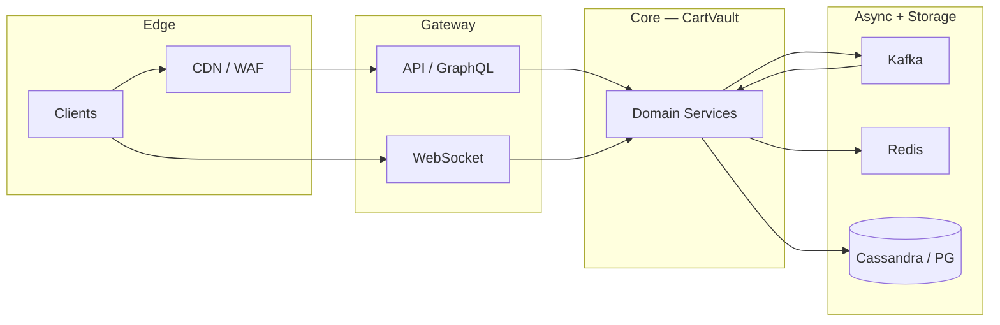

# Compound SRE Scenario — Payment Data Loss

> **Week 11** — Global e-commerce + payments — financial integrity P0/P1

```
╔════════════════════════════════════════════════════════════════╗
║   RULES OF ENGAGEMENT                                          ║
╟────────────────────────────────────────────────────────────────╢
║                                                                ║
║   1. Answer from MEMORY. Do not re-read the teaching           ║
║      modules. The whole point is to test what STUCK in         ║
║      your brain.                                               ║
║                                                                ║
║   2. This is a COMPOUND scenario — multiple symptoms,          ║
║      multiple layers. Identify which subsystem each clue       ║
║      belongs to before proposing fixes.                        ║
║                                                                ║
║   3. Full depth expected. Name root causes, cite evidence,     ║
║      draw causal links, prioritize mitigations, and give       ║
║      exact commands where asked.                               ║
║                                                                ║
║   4. It's OK to say "I don't remember."                        ║
║      That's honest and tells us what to review.                ║
║      Faking an answer teaches nothing.                         ║
║                                                                ║
╚════════════════════════════════════════════════════════════════╝
```

---

## Knowledge Domains Tested

**Week 11 (primary):** Payment authorization/capture/settlement lifecycle, Idempotency keys and exactly-once intent, Inventory reservation and oversell prevention, Saga orchestration for checkout, Transactional outbox for downstream notifications, PCI scope and tokenization boundary

**Prior weeks (integrated):** ACID, isolation levels, MVCC (Week 2), Saga, outbox, CDC (Week 6), Circuit breakers and retries (Week 6), Unique ID generation (Week 7), Clocks and ordering (Week 8), Replication lag, read-your-writes (Week 4)

The challenge is not knowing each concept in isolation — it is **mapping each symptom to the correct layer** and understanding how failures cascade across feed/chat, storage, messaging, and edge systems simultaneously.


---

## Compound SRE Scenario

This scenario requires knowledge from **this week's system designs** and **all prior weeks** simultaneously. The challenge is identifying which layer each symptom belongs to and how failures cascade.

```
INCIDENT REPORT
━━━━━━━━━━━━━━━━━━━━━━━━━━━━━━━━━━━━━━━━━━━━━
Severity: P0 (financial integrity)
Service: CartVault
  Peak checkout 840K orders/hr during flash sale

  ╔════════════════════════════════════════════════════════════════════════════════╗
  ║ ARCHITECTURE                                                                   ║
  ╠════════════════════════════════════════════════════════════════════════════════╣

  ║ EDGE                                                                           ║
  ║   CloudFront → WAF → ALB → Checkout API (stateless)                            ║
  ║                                                                                ║
  ║ CHECKOUT SAGA (orchestrator)                                                   ║
  ║   1. Reserve inventory (Inventory Service / PostgreSQL row locks)              ║
  ║   2. Authorize payment (Payment Gateway adapter → Stripe)                      ║
  ║   3. Capture on ship (async worker)                                            ║
  ║   4. Confirm order → Order DB + outbox row                                     ║
  ║   Debezium CDC → Kafka orders.confirmed → search, email, warehouse             ║
  ║                                                                                ║
  ║ PAYMENT SERVICE                                                                ║
  ║   Idempotency store: Redis (idempotency:{key}) + PostgreSQL audit              ║
  ║   Ledger: append-only PostgreSQL payments_ledger                               ║
  ║   Reconciliation batch job every 15 min vs Stripe reports                      ║
  ║                                                                                ║
  ║ INVENTORY                                                                      ║
  ║   PostgreSQL SKU rows with quantity_reserved, quantity_available               ║
  ║   Redis cache for catalog reads (NOT source of truth)                          ║
  ║                                                                                ║
  ║ FLASH SALE CONTEXT                                                             ║
  ║   Limited SKU: 12,000 units. Sale start 00:00 UTC.                             ║
  ║   Traffic 12× normal. New 'fast checkout' deploy at 23:55.                     ║
  ╚════════════════════════════════════════════════════════════════════════════════╝

INCIDENT TIMELINE:

  00:00 — Flash sale begins. Checkout TPS 12K → 94K within 3 minutes.

  00:03 — Payment success rate drops 99.7% → 91.2%. Spike in duplicate charges reported.

  00:05 — Inventory shows -847 reserved units for SKU FLASH-2026 (negative!).

  00:07 — Customer support: 2,300 users charged twice for same idempotency key.

  00:09 — Order confirmation emails delayed 40+ minutes.

  00:11 — Stripe dashboard: 108K auth requests, CartVault ledger 112K auth rows.

  00:14 — Saga compensations firing — inventory release + refund race observed.

  00:17 — PgBouncer waiting clients 8,400. Primary CPU 78%, replay_lag 1.2s.

  00:20 — Reconciliation job flags $4.2M unmatched captures.

  00:23 — Search index shows 'in stock' for sold-out SKU — stale catalog.

  00:26 — On-call finds eight contributing problems (A–H).

  ─── Additional problems discovered during investigation ───

  00:26 — PROBLEM A:
            Idempotency race on Redis + DB
            Check-then-set on Redis not atomic with DB insert. Concurrent retries with same Idempotency-Key both pass Redis miss.

            Monitoring:
            → Kafka consumer lag: partition 17 = 4.2M, all others < 12K
            → Fan-out worker pod fanout-17 CPU 99%; fanout-03 at 11%
            → posts.created produce rate 890K msg/sec spike on key @nova

  00:28 — PROBLEM B:
            Saga timeout compensation storm
            Payment authorize p99 8s (Stripe rate limit). Saga timeout 5s triggers compensate while auth still succeeds → double state.

            Monitoring:
            → Redis shard-7: ops/sec 412K on single key timeline:nova
            → redis-cli --hotkeys shows 89% traffic on 3 keys
            → Memory fragmentation ratio 1.42 on shard-7

  00:30 — PROBLEM C:
            Inventory lost update (read-modify-write)
            Inventory Service reads quantity from Redis cache, writes to PG without optimistic locking. Lost updates oversell 12K units.

            Monitoring:
            → nodetool status: cass-12 UN (unreachable)
            → Hinted handoff queue depth 890,412 on cass-04
            → UnavailableException rate 1,240/sec on user_timelines CF

  00:32 — PROBLEM D:
            Outbox publisher stuck
            Debezium connector paused; outbox rows accumulate 340K.unprocessed. Emails and warehouse not notified.

            Monitoring:
            → chat.events consumer group: 3/24 members in RevokePartitions
            → Read receipt lag 340s; delivery event lag 12s same message_id
            → cooperative-sticky assignor upgrade deploy 2026-03-14

  00:35 — PROBLEM E:
            PgBouncer transaction mode + RYW violation
            Checkout reads order status from replica via pool; write on primary. Users see 'order not found' after successful payment.

            Monitoring:
            → Feed Gateway: 47,000 gRPC calls/sec to Media Service
            → Media replica-1 CPU 96%; replicas 2-8 at 9%
            → GraphQL resolver post.author.avatar sequential await pattern

  00:38 — PROBLEM F:
            Snowflake ID generator clock rollback
            One checkout pod NTP step −400ms; duplicate order_id collisions on 23 orders before crash loop.

            Monitoring:
            → WebSocket disconnect cadence: exactly 60s idle intervals
            → Presence key TTL 120s; last_ping 67s ago on sample clients
            → NLB target group idle timeout: 60s on ws-chat-tg

  00:41 — PROBLEM G:
            Circuit breaker half-open flood
            Payment adapter CB opens; half-open allows 10 probes/sec × 940 pods = 9.4K Stripe calls/sec re-tripping open.

            Monitoring:
            → Rate limit 503 rate 8.2% in EU; 0.1% in US
            → Shared Redis key ratelimit:asn:3320 token count 0
            → Feature flag aggregate_rate_limit_by_asn=true since 07:55

  00:44 — PROBLEM H:
            Webhook signature verification skip
            Feature flag 'skip_webhook_verify_staging' leaked to prod canary 5%. Duplicate Stripe webhooks processed twice for canary traffic.

            Monitoring:
            → CloudFront 403 on signed URL: Signature expired (clock skew)
            → Media pod clock offset +37s vs NTP in eu-west-1
            → S3 presigned URL X-Amz-Date mismatch in access logs

━━━━━━━━━━━━━━━━━━━━━━━━━━━━━━━━━━━━━━━━━━━━━
```

## Data Flow Overview



Use this map when triaging: **symptoms at the edge** often originate three hops away in async pipelines.


## Pre-Incident Context

The following changes were in flight before the incident. Any may be red herrings; all may contribute.

```
  CHANGE LOG (last 7 days):
  ─────────────────────────────────────────────────────────
  • Feature flag rollout: 5% → 25% → 50% canary
  • Load test cancelled due to change freeze exception
  • One AZ capacity reduction for cost program
  • Dependency upgrade: Kafka client 3.6 → 3.7
  • Redis cluster resharding (add 2 shards) — week 2 of migration
  • On-call runbook updated but not rehearsed
  • SLO review deferred to next quarter
```

**Service:** CartVault
**Severity:** P0 (financial integrity)
**Scale:** Peak checkout 840K orders/hr during flash sale


```
Slack #incidents-war-room
  T+0m  incident-bot:  P1 opened: CartVault multi-symptom degradation
  T+2m  oncall-primary:  Joined bridge. Pulling dashboards for feed/chat/index path.
  T+5m  oncall-db:  Cassandra/Redis/Postgres — which store is hot?
  T+8m  eng-lead:  Any deploys in last 24h? Feature flags?
  00:26  oncall-primary:  Problem A hypothesis forming: Idempotency race on Redis + DB
  00:28  oncall-primary:  Problem B hypothesis forming: Saga timeout compensation storm
  00:30  oncall-primary:  Problem C hypothesis forming: Inventory lost update (read-modify-write)
  00:32  oncall-primary:  Problem D hypothesis forming: Outbox publisher stuck
```

---

## Grafana Dashboard Excerpts (Incident Snapshot)

### Panel: Request rate by service

```
  series  incident  notes          
  ------  --------  ---------------
  api     12K       baseline varies
  worker  890K      baseline varies
  ws      2.1M      baseline varies
```

### Panel: Error budget burn

```
  series    incident  notes          
  --------  --------  ---------------
  feed      14×       baseline varies
  chat      8×        baseline varies
  platform  22×       baseline varies
```

### Panel: Saturation

```
  series   incident  notes          
  -------  --------  ---------------
  cpu      94%       baseline varies
  memory   89%       baseline varies
  disk     78%       baseline varies
  network  67%       baseline varies
```


---

## Monitoring Appendix

### PROBLEM-A: Idempotency race on Redis + DB

Discovery time: **00:26**. Symptom summary: Check-then-set on Redis not atomic with DB insert. Concurrent retries with same Idempotency-Key both pass Redis miss.

```
  instance       metric          normal  incident_hot  incident_cold
  -------------  --------------  ------  ------------  -------------
  CartVault-A-0  cpu_pct         78      94            12           
  CartVault-A-1  memory_pct      62      89            45           
  CartVault-A-2  request_rate    12400   89000         2100         
  CartVault-A-3  error_rate_pct  0.1     8.4           0.02         
  CartVault-A-4  p99_latency_ms  120     8400          45           
```

```
PagerDuty timeline (filtered P1/P2):
  00:26  [CartVault/A]  Elevated cpu_pct on critical path
  00:26  [CartVault/A]  SLO burn rate 14× over 5m window
```

### Log patterns — Problem A

```
level=WARN  service=CartVault  problem=A  msg="downstream degraded"
level=ERROR service=CartVault  problem=A  msg="retry budget exhausted"
level=INFO  service=CartVault  problem=A  msg="circuit breaker state=OPEN"
```

### PROBLEM-B: Saga timeout compensation storm

Discovery time: **00:28**. Symptom summary: Payment authorize p99 8s (Stripe rate limit). Saga timeout 5s triggers compensate while auth still succeeds → double state.

```
  instance       metric          normal  incident_hot  incident_cold
  -------------  --------------  ------  ------------  -------------
  CartVault-B-0  cpu_pct         78      94            12           
  CartVault-B-1  memory_pct      62      89            45           
  CartVault-B-2  request_rate    12400   89000         2100         
  CartVault-B-3  error_rate_pct  0.1     8.4           0.02         
  CartVault-B-4  p99_latency_ms  120     8400          45           
```

```
PagerDuty timeline (filtered P1/P2):
  00:28  [CartVault/B]  Elevated cpu_pct on critical path
  00:28  [CartVault/B]  SLO burn rate 14× over 5m window
```

### Log patterns — Problem B

```
level=WARN  service=CartVault  problem=B  msg="downstream degraded"
level=ERROR service=CartVault  problem=B  msg="retry budget exhausted"
level=INFO  service=CartVault  problem=B  msg="circuit breaker state=OPEN"
```

### PROBLEM-C: Inventory lost update (read-modify-write)

Discovery time: **00:30**. Symptom summary: Inventory Service reads quantity from Redis cache, writes to PG without optimistic locking. Lost updates oversell 12K units.

```
  instance       metric          normal  incident_hot  incident_cold
  -------------  --------------  ------  ------------  -------------
  CartVault-C-0  cpu_pct         78      94            12           
  CartVault-C-1  memory_pct      62      89            45           
  CartVault-C-2  request_rate    12400   89000         2100         
  CartVault-C-3  error_rate_pct  0.1     8.4           0.02         
  CartVault-C-4  p99_latency_ms  120     8400          45           
```

```
PagerDuty timeline (filtered P1/P2):
  00:30  [CartVault/C]  Elevated cpu_pct on critical path
  00:30  [CartVault/C]  SLO burn rate 14× over 5m window
```

### Log patterns — Problem C

```
level=WARN  service=CartVault  problem=C  msg="downstream degraded"
level=ERROR service=CartVault  problem=C  msg="retry budget exhausted"
level=INFO  service=CartVault  problem=C  msg="circuit breaker state=OPEN"
```

### PROBLEM-D: Outbox publisher stuck

Discovery time: **00:32**. Symptom summary: Debezium connector paused; outbox rows accumulate 340K.unprocessed. Emails and warehouse not notified.

```
  instance       metric          normal  incident_hot  incident_cold
  -------------  --------------  ------  ------------  -------------
  CartVault-D-0  cpu_pct         78      94            12           
  CartVault-D-1  memory_pct      62      89            45           
  CartVault-D-2  request_rate    12400   89000         2100         
  CartVault-D-3  error_rate_pct  0.1     8.4           0.02         
  CartVault-D-4  p99_latency_ms  120     8400          45           
```

```
PagerDuty timeline (filtered P1/P2):
  00:32  [CartVault/D]  Elevated cpu_pct on critical path
  00:32  [CartVault/D]  SLO burn rate 14× over 5m window
```

### Log patterns — Problem D

```
level=WARN  service=CartVault  problem=D  msg="downstream degraded"
level=ERROR service=CartVault  problem=D  msg="retry budget exhausted"
level=INFO  service=CartVault  problem=D  msg="circuit breaker state=OPEN"
```

### PROBLEM-E: PgBouncer transaction mode + RYW violation

Discovery time: **00:35**. Symptom summary: Checkout reads order status from replica via pool; write on primary. Users see 'order not found' after successful payment.

```
  instance       metric          normal  incident_hot  incident_cold
  -------------  --------------  ------  ------------  -------------
  CartVault-E-0  cpu_pct         78      94            12           
  CartVault-E-1  memory_pct      62      89            45           
  CartVault-E-2  request_rate    12400   89000         2100         
  CartVault-E-3  error_rate_pct  0.1     8.4           0.02         
  CartVault-E-4  p99_latency_ms  120     8400          45           
```

```
PagerDuty timeline (filtered P1/P2):
  00:35  [CartVault/E]  Elevated cpu_pct on critical path
  00:35  [CartVault/E]  SLO burn rate 14× over 5m window
```

### Log patterns — Problem E

```
level=WARN  service=CartVault  problem=E  msg="downstream degraded"
level=ERROR service=CartVault  problem=E  msg="retry budget exhausted"
level=INFO  service=CartVault  problem=E  msg="circuit breaker state=OPEN"
```

### PROBLEM-F: Snowflake ID generator clock rollback

Discovery time: **00:38**. Symptom summary: One checkout pod NTP step −400ms; duplicate order_id collisions on 23 orders before crash loop.

```
  instance       metric          normal  incident_hot  incident_cold
  -------------  --------------  ------  ------------  -------------
  CartVault-F-0  cpu_pct         78      94            12           
  CartVault-F-1  memory_pct      62      89            45           
  CartVault-F-2  request_rate    12400   89000         2100         
  CartVault-F-3  error_rate_pct  0.1     8.4           0.02         
  CartVault-F-4  p99_latency_ms  120     8400          45           
```

```
PagerDuty timeline (filtered P1/P2):
  00:38  [CartVault/F]  Elevated cpu_pct on critical path
  00:38  [CartVault/F]  SLO burn rate 14× over 5m window
```

### Log patterns — Problem F

```
level=WARN  service=CartVault  problem=F  msg="downstream degraded"
level=ERROR service=CartVault  problem=F  msg="retry budget exhausted"
level=INFO  service=CartVault  problem=F  msg="circuit breaker state=OPEN"
```

### PROBLEM-G: Circuit breaker half-open flood

Discovery time: **00:41**. Symptom summary: Payment adapter CB opens; half-open allows 10 probes/sec × 940 pods = 9.4K Stripe calls/sec re-tripping open.

```
  instance       metric          normal  incident_hot  incident_cold
  -------------  --------------  ------  ------------  -------------
  CartVault-G-0  cpu_pct         78      94            12           
  CartVault-G-1  memory_pct      62      89            45           
  CartVault-G-2  request_rate    12400   89000         2100         
  CartVault-G-3  error_rate_pct  0.1     8.4           0.02         
  CartVault-G-4  p99_latency_ms  120     8400          45           
```

```
PagerDuty timeline (filtered P1/P2):
  00:41  [CartVault/G]  Elevated cpu_pct on critical path
  00:41  [CartVault/G]  SLO burn rate 14× over 5m window
```

### Log patterns — Problem G

```
level=WARN  service=CartVault  problem=G  msg="downstream degraded"
level=ERROR service=CartVault  problem=G  msg="retry budget exhausted"
level=INFO  service=CartVault  problem=G  msg="circuit breaker state=OPEN"
```

### PROBLEM-H: Webhook signature verification skip

Discovery time: **00:44**. Symptom summary: Feature flag 'skip_webhook_verify_staging' leaked to prod canary 5%. Duplicate Stripe webhooks processed twice for canary traffic.

```
  instance       metric          normal  incident_hot  incident_cold
  -------------  --------------  ------  ------------  -------------
  CartVault-H-0  cpu_pct         78      94            12           
  CartVault-H-1  memory_pct      62      89            45           
  CartVault-H-2  request_rate    12400   89000         2100         
  CartVault-H-3  error_rate_pct  0.1     8.4           0.02         
  CartVault-H-4  p99_latency_ms  120     8400          45           
```

```
PagerDuty timeline (filtered P1/P2):
  00:44  [CartVault/H]  Elevated cpu_pct on critical path
  00:44  [CartVault/H]  SLO burn rate 14× over 5m window
```

### Log patterns — Problem H

```
level=WARN  service=CartVault  problem=H  msg="downstream degraded"
level=ERROR service=CartVault  problem=H  msg="retry budget exhausted"
level=INFO  service=CartVault  problem=H  msg="circuit breaker state=OPEN"
```


---

## On-Call Runbook Stubs (Reference)

These stubs exist in the wiki but may be stale. Do NOT assume they match production.

### Runbook RB-CART-A

**Title:** Idempotency race on Redis + DB

```
  Trigger:  Automated alert CartVault-A-*
  Impact:   User-facing degradation on primary path
  Steps:
    1. Confirm metric spike in Grafana dashboard row 1
    2. Check recent deploys / feature flags
    3. Escalate to service owner if not resolved in 15m
  Last reviewed: 2025-11-14 (STALE)
```

### Runbook RB-CART-B

**Title:** Saga timeout compensation storm

```
  Trigger:  Automated alert CartVault-B-*
  Impact:   User-facing degradation on primary path
  Steps:
    1. Confirm metric spike in Grafana dashboard row 2
    2. Check recent deploys / feature flags
    3. Escalate to service owner if not resolved in 15m
  Last reviewed: 2025-11-14 (STALE)
```

### Runbook RB-CART-C

**Title:** Inventory lost update (read-modify-write)

```
  Trigger:  Automated alert CartVault-C-*
  Impact:   User-facing degradation on primary path
  Steps:
    1. Confirm metric spike in Grafana dashboard row 3
    2. Check recent deploys / feature flags
    3. Escalate to service owner if not resolved in 15m
  Last reviewed: 2025-11-14 (STALE)
```

### Runbook RB-CART-D

**Title:** Outbox publisher stuck

```
  Trigger:  Automated alert CartVault-D-*
  Impact:   User-facing degradation on primary path
  Steps:
    1. Confirm metric spike in Grafana dashboard row 4
    2. Check recent deploys / feature flags
    3. Escalate to service owner if not resolved in 15m
  Last reviewed: 2025-11-14 (STALE)
```

### Runbook RB-CART-E

**Title:** PgBouncer transaction mode + RYW violation

```
  Trigger:  Automated alert CartVault-E-*
  Impact:   User-facing degradation on primary path
  Steps:
    1. Confirm metric spike in Grafana dashboard row 5
    2. Check recent deploys / feature flags
    3. Escalate to service owner if not resolved in 15m
  Last reviewed: 2025-11-14 (STALE)
```

### Runbook RB-CART-F

**Title:** Snowflake ID generator clock rollback

```
  Trigger:  Automated alert CartVault-F-*
  Impact:   User-facing degradation on primary path
  Steps:
    1. Confirm metric spike in Grafana dashboard row 6
    2. Check recent deploys / feature flags
    3. Escalate to service owner if not resolved in 15m
  Last reviewed: 2025-11-14 (STALE)
```

### Runbook RB-CART-G

**Title:** Circuit breaker half-open flood

```
  Trigger:  Automated alert CartVault-G-*
  Impact:   User-facing degradation on primary path
  Steps:
    1. Confirm metric spike in Grafana dashboard row 7
    2. Check recent deploys / feature flags
    3. Escalate to service owner if not resolved in 15m
  Last reviewed: 2025-11-14 (STALE)
```

### Runbook RB-CART-H

**Title:** Webhook signature verification skip

```
  Trigger:  Automated alert CartVault-H-*
  Impact:   User-facing degradation on primary path
  Steps:
    1. Confirm metric spike in Grafana dashboard row 8
    2. Check recent deploys / feature flags
    3. Escalate to service owner if not resolved in 15m
  Last reviewed: 2025-11-14 (STALE)
```


---

## Diagnostic Questions

Answer all questions in writing. Cite monitoring evidence, name the subsystem/layer, and explain interactions between problems.

**Question 1:** For each problem A–H: financial integrity impact (none / recoverable / irreversible), root cause, and evidence. Which are P0 vs P1?

**Question 2:** Explain the duplicate charge mechanism for customers with the SAME Idempotency-Key. Which problems combine (A + B + H)? Draw the timeline of one duplicate.

**Question 3:** At 00:45 you must stop the bleeding. Sequence five actions in order with justification. Include whether to pause checkout entirely.

**Question 4:** Exact SQL and Redis commands for first 60 seconds of investigation.

**Question 5:** Inventory shows −847 reserved. How do you reconcile without shipping 847 extra units? Name the saga step that failed and the compensation that should NOT have run.

**Question 6:** Argue outbox vs dual-write for order confirmation emails. Which problem does outbox prevent vs which problem in this incident outbox cannot fix?

**Question 7:** Design idempotency storage correctly for 94K TPS. Compare Redis+PG, PG unique constraint only, and Stripe idempotency key pass-through.

**Question 8:** Post-incident regulatory report: which problems require customer notification vs internal only? Mention PCI scope for problem H.

**Question 9:** Five architectural changes with owners — must include saga timeout policy, inventory source of truth, and reconciliation automation.

**Question 10:** Reconciliation shows $4.2M unmatched — walk through three hypotheses and how to disprove each in one hour.


---

## Submission Notes

- Work in a single document; label answers by question number.
- Cite evidence from the timeline and monitoring appendix.
- Diagrams may be ASCII or Mermaid.
- **This file contains questions only — no worked answers.**
- Recorded answers belong in your retention notebook or a separate worked-answers file.

---

## Diagnostic Command Cheat Sheet

The following commands are available to on-call. In your answers, cite which you would run and what output pattern you expect.

### Kafka consumer lag

```bash
kafka-consumer-groups.sh --bootstrap-server $BROKERS \
  --describe --group cartvault-workers
kafka-topics.sh --bootstrap-server $BROKERS \
  --describe --topic events.main | grep -A2 Partition
```

### Redis hot key scan

```bash
redis-cli -c -h $REDIS_CLUSTER --hotkeys
redis-cli -c -h $REDIS_CLUSTER INFO commandstats | head -40
redis-cli -c -h $REDIS_CLUSTER --latency-history
```

### Cassandra cluster health

```bash
nodetool status
nodetool tpstats | head -30
nodetool tablestats keyspace.cf | grep -i hint
```

### PostgreSQL / replication

```bash
SELECT * FROM pg_stat_replication;
SELECT slot_name, active, pg_size_pretty(pg_wal_lsn_diff(pg_current_wal_lsn(), restart_lsn)) FROM pg_replication_slots;
SHOW POOLS;  -- PgBouncer admin console
```

### Elasticsearch index health

```bash
curl -s $ES/_cluster/health?pretty
curl -s $ES/_cat/shards?v | grep UNASSIGNED
curl -s $ES/index/_segments | jq '.[] | select(.num==7)'
```

### Kubernetes / mesh

```bash
kubectl top pods -n production --sort-by=cpu | head -20
kubectl get events -n production --sort-by=.lastTimestamp | tail -30
istioctl proxy-stats deploy/$SVC | grep cx_active
```

---

## Red Herring Register

The following observations were raised on the bridge and may mislead. In Question 1 or 2, note which are red herrings and why.

1. Primary database CPU is elevated but within SLO — not every CPU spike is the root cause.
2. A deploy occurred 6 hours before incident — correlation is not causation unless evidence links.
3. Single PoP latency elevated — may be symptom of origin overload, not edge misconfiguration.
4. Error rate dashboard shows 0.0% HTTP 5xx — application errors may hide in 200 bodies or async lag.
5. Auto-scaling added capacity 10 minutes before complaints — scaling treats symptoms, not causes.
6. Vendor status page all-green — third-party APIs can degrade without public incident.

---

## Distributed Trace Samples

Sample OpenTelemetry exports. Trace IDs correlate with log lines in the monitoring appendix.

### Trace TB-0000 (tags: problem=A)

```
trace_id=tb-cartvault-0000
duration_ms=480
service=CartVault
spans:
  - span=0 name=HTTP/gateway duration_ms=15 status=OK
  - span=0.1 name=downstream/Idempotency race on Redis + DB duration_ms=60
  - span=1 name=HTTP/gateway duration_ms=27 status=OK
  - span=1.1 name=downstream/Idempotency race on Redis + DB duration_ms=85
  - span=2 name=HTTP/gateway duration_ms=39 status=OK
  - span=2.1 name=downstream/Idempotency race on Redis + DB duration_ms=110
  - span=3 name=HTTP/gateway duration_ms=51 status=ERROR
  - span=3.1 name=downstream/Idempotency race on Redis + DB duration_ms=135
  - span=4 name=HTTP/gateway duration_ms=63 status=OK
  - span=4.1 name=downstream/Idempotency race on Redis + DB duration_ms=160
```

### Trace TB-0001 (tags: problem=B)

```
trace_id=tb-cartvault-0001
duration_ms=497
service=CartVault
spans:
  - span=0 name=HTTP/gateway duration_ms=15 status=OK
  - span=0.1 name=downstream/Saga timeout compensation storm duration_ms=60
  - span=1 name=HTTP/gateway duration_ms=27 status=OK
  - span=1.1 name=downstream/Saga timeout compensation storm duration_ms=85
  - span=2 name=HTTP/gateway duration_ms=39 status=OK
  - span=2.1 name=downstream/Saga timeout compensation storm duration_ms=110
  - span=3 name=HTTP/gateway duration_ms=51 status=OK
  - span=3.1 name=downstream/Saga timeout compensation storm duration_ms=135
  - span=4 name=HTTP/gateway duration_ms=63 status=OK
  - span=4.1 name=downstream/Saga timeout compensation storm duration_ms=160
```

### Trace TB-0002 (tags: problem=C)

```
trace_id=tb-cartvault-0002
duration_ms=514
service=CartVault
spans:
  - span=0 name=HTTP/gateway duration_ms=15 status=OK
  - span=0.1 name=downstream/Inventory lost update (read-modify-write duration_ms=60
  - span=1 name=HTTP/gateway duration_ms=27 status=OK
  - span=1.1 name=downstream/Inventory lost update (read-modify-write duration_ms=85
  - span=2 name=HTTP/gateway duration_ms=39 status=OK
  - span=2.1 name=downstream/Inventory lost update (read-modify-write duration_ms=110
  - span=3 name=HTTP/gateway duration_ms=51 status=OK
  - span=3.1 name=downstream/Inventory lost update (read-modify-write duration_ms=135
  - span=4 name=HTTP/gateway duration_ms=63 status=OK
  - span=4.1 name=downstream/Inventory lost update (read-modify-write duration_ms=160
```

### Trace TB-0003 (tags: problem=D)

```
trace_id=tb-cartvault-0003
duration_ms=531
service=CartVault
spans:
  - span=0 name=HTTP/gateway duration_ms=15 status=OK
  - span=0.1 name=downstream/Outbox publisher stuck duration_ms=60
  - span=1 name=HTTP/gateway duration_ms=27 status=OK
  - span=1.1 name=downstream/Outbox publisher stuck duration_ms=85
  - span=2 name=HTTP/gateway duration_ms=39 status=OK
  - span=2.1 name=downstream/Outbox publisher stuck duration_ms=110
  - span=3 name=HTTP/gateway duration_ms=51 status=OK
  - span=3.1 name=downstream/Outbox publisher stuck duration_ms=135
  - span=4 name=HTTP/gateway duration_ms=63 status=OK
  - span=4.1 name=downstream/Outbox publisher stuck duration_ms=160
```

### Trace TB-0004 (tags: problem=E)

```
trace_id=tb-cartvault-0004
duration_ms=548
service=CartVault
spans:
  - span=0 name=HTTP/gateway duration_ms=15 status=OK
  - span=0.1 name=downstream/PgBouncer transaction mode + RYW violati duration_ms=60
  - span=1 name=HTTP/gateway duration_ms=27 status=OK
  - span=1.1 name=downstream/PgBouncer transaction mode + RYW violati duration_ms=85
  - span=2 name=HTTP/gateway duration_ms=39 status=OK
  - span=2.1 name=downstream/PgBouncer transaction mode + RYW violati duration_ms=110
  - span=3 name=HTTP/gateway duration_ms=51 status=ERROR
  - span=3.1 name=downstream/PgBouncer transaction mode + RYW violati duration_ms=135
  - span=4 name=HTTP/gateway duration_ms=63 status=OK
  - span=4.1 name=downstream/PgBouncer transaction mode + RYW violati duration_ms=160
```

### Trace TB-0005 (tags: problem=F)

```
trace_id=tb-cartvault-0005
duration_ms=565
service=CartVault
spans:
  - span=0 name=HTTP/gateway duration_ms=15 status=OK
  - span=0.1 name=downstream/Snowflake ID generator clock rollback duration_ms=60
  - span=1 name=HTTP/gateway duration_ms=27 status=OK
  - span=1.1 name=downstream/Snowflake ID generator clock rollback duration_ms=85
  - span=2 name=HTTP/gateway duration_ms=39 status=OK
  - span=2.1 name=downstream/Snowflake ID generator clock rollback duration_ms=110
  - span=3 name=HTTP/gateway duration_ms=51 status=OK
  - span=3.1 name=downstream/Snowflake ID generator clock rollback duration_ms=135
  - span=4 name=HTTP/gateway duration_ms=63 status=OK
  - span=4.1 name=downstream/Snowflake ID generator clock rollback duration_ms=160
```

### Trace TB-0006 (tags: problem=G)

```
trace_id=tb-cartvault-0006
duration_ms=582
service=CartVault
spans:
  - span=0 name=HTTP/gateway duration_ms=15 status=OK
  - span=0.1 name=downstream/Circuit breaker half-open flood duration_ms=60
  - span=1 name=HTTP/gateway duration_ms=27 status=OK
  - span=1.1 name=downstream/Circuit breaker half-open flood duration_ms=85
  - span=2 name=HTTP/gateway duration_ms=39 status=OK
  - span=2.1 name=downstream/Circuit breaker half-open flood duration_ms=110
  - span=3 name=HTTP/gateway duration_ms=51 status=OK
  - span=3.1 name=downstream/Circuit breaker half-open flood duration_ms=135
  - span=4 name=HTTP/gateway duration_ms=63 status=OK
  - span=4.1 name=downstream/Circuit breaker half-open flood duration_ms=160
```

### Trace TB-0007 (tags: problem=H)

```
trace_id=tb-cartvault-0007
duration_ms=599
service=CartVault
spans:
  - span=0 name=HTTP/gateway duration_ms=15 status=OK
  - span=0.1 name=downstream/Webhook signature verification skip duration_ms=60
  - span=1 name=HTTP/gateway duration_ms=27 status=OK
  - span=1.1 name=downstream/Webhook signature verification skip duration_ms=85
  - span=2 name=HTTP/gateway duration_ms=39 status=OK
  - span=2.1 name=downstream/Webhook signature verification skip duration_ms=110
  - span=3 name=HTTP/gateway duration_ms=51 status=OK
  - span=3.1 name=downstream/Webhook signature verification skip duration_ms=135
  - span=4 name=HTTP/gateway duration_ms=63 status=OK
  - span=4.1 name=downstream/Webhook signature verification skip duration_ms=160
```
