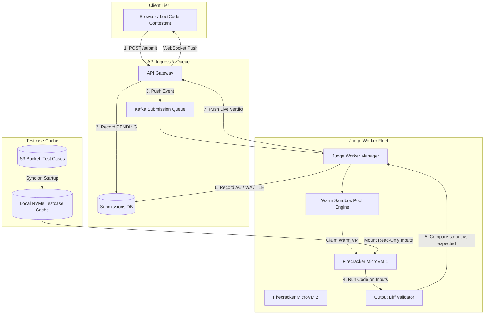

# Design Online Judge & Code Execution Platform (LeetCode / Judge0)

## Learning Objectives
```
╔════════════════════════════════════════════════════════════════╗
║   AFTER THIS MODULE, YOU WILL BE ABLE TO:                      ║
╟────────────────────────────────────────────────────────────────╢
║                                                                ║
║   1. Design a secure, ultra-low-latency remote code execution  ║
║      engine evaluating 500,000+ daily submissions across 30+   ║
║      programming languages                                     ║
║                                                                ║
║   2. Master kernel-level sandboxing: Linux cgroups v2 (CPU/RAM ║
║      hard quotas) and seccomp-bpf syscall whitelist filtering  ║
║                                                                ║
║   3. Compare isolation tiers: standard Docker vs gVisor        ║
║      userspace kernel vs Firecracker microVMs (hardware KVM)   ║
║                                                                ║
║   4. Defend against hostile exploits: fork bombs (RLIMIT_NPROC)║
║      network exfiltration, filesystem filling, and crypto miner║
║      CPU spinlocks                                             ║
║                                                                ║
║   5. Implement Warm Sandbox Pools to slash execution startup   ║
║      cold starts from 1,500ms down to < 50ms                   ║
║                                                                ║
║   6. Diagnose and mitigate P0 production outages: sandbox      ║
║      host kernel escapes, compiler OOM storms, and judge queue ║
║      priority starvation                                       ║
╚════════════════════════════════════════════════════════════════╝
```

---

## Wrong Mental Models (Destroy These First)

```
╔═════════════════════════════════════════════════════════════════════╗
║   MENTAL MODEL #1: "Just run user code directly using               ║
║   exec.Command('python3', 'user_code.py')"                          ║
╟─────────────────────────────────────────────────────────────────────╢
║   WRONG. Executing arbitrary code on the host machine gives the     ║
║   user full host shell privileges. A simple `os.system('rm -rf /')` ║
║   or malicious network socket will compromise your AWS VPC,         ║
║   exfiltrate database credentials, or enlist workers in botnets.    ║
╠═════════════════════════════════════════════════════════════════════╣
║   MENTAL MODEL #2: "Standard Docker containers provide bulletproof  ║
║   isolation for untrusted multi-tenant code"                        ║
╟─────────────────────────────────────────────────────────────────────╢
║   WRONG. Docker containers share the host Linux kernel. Any Linux   ║
║   kernel vulnerability (Dirty COW, namespace breakout) allows an    ║
║   attacker to escape the container into the host root namespace.    ║
║   Untrusted code requires dedicated virtualization (gVisor/KVM).    ║
╠═════════════════════════════════════════════════════════════════════╣
║   MENTAL MODEL #3: "Compile and execute code synchronously inside   ║
║   the HTTP API request thread"                                      ║
╟─────────────────────────────────────────────────────────────────────╢
║   WRONG. Compiling C++ or Rust templates takes 1 to 5 seconds.      ║
║   Synchronous compilation in the HTTP gateway ties up web server    ║
║   threads, saturates socket backlogs, and causes instant 504 drops  ║
║   during a live coding competition. Submissions must be async.      ║
╠═════════════════════════════════════════════════════════════════════╣
║   MENTAL MODEL #4: "CPU time limits can be enforced using simple    ║
║   wall-clock timers"                                                ║
╟─────────────────────────────────────────────────────────────────────╢
║   WRONG. Wall-clock time includes thread context switches and I/O   ║
║   wait. If a host CPU core throttles under heavy load, an optimal   ║
║   solution fails with false-positive Time Limit Exceeded (TLE).     ║
║   Limits must be enforced on actual user/kernel CPU cycles (cgroup) ║
╠═════════════════════════════════════════════════════════════════════╣
║   MENTAL MODEL #5: "Store all test case inputs and outputs in the   ║
║   relational submissions database table"                            ║
╟─────────────────────────────────────────────────────────────────────╢
║   WRONG. Graph and DP test cases frequently exceed 10MB to 50MB.    ║
║   Storing millions of large test case text inputs in Postgres       ║
║   causes massive table bloat. Large test cases live in Object       ║
║   Storage (S3) and are cached locally on NVMe disks in judge pods.  ║
╠═════════════════════════════════════════════════════════════════════╣
║   MENTAL MODEL #6: "Run multiple concurrent user code executions    ║
║   on the same CPU core"                                             ║
╟─────────────────────────────────────────────────────────────────────╢
║   WRONG. Co-locating multiple executions on shared cores causes     ║
║   CPU cache contention and noisy neighbor skew. Performance runs    ║
║   fluctuate wildly. Judges must pin code to dedicated isolated CPU  ║
║   cores (`cpuset` cgroup) with deterministic time slice accounting. ║
╚═════════════════════════════════════════════════════════════════════╝
```

---

## Core Teaching

### 1. Requirements & Quantitative Capacity Sizing

#### Functional Requirements
1. **Multi-Language Execution**: Support C++, Java, Python, Go, Rust, JavaScript, and SQL.
2. **Deterministic Evaluation**: Verify code against hundreds of hidden test cases producing standard status verdicts:
   - **AC**: Accepted
   - **WA**: Wrong Answer
   - **TLE**: Time Limit Exceeded (e.g. > 1,000ms CPU time)
   - **MLE**: Memory Limit Exceeded (e.g. > 256MB RAM)
   - **RE**: Runtime Error (SIGSEGV, ZeroDivision, uncaught exception)
   - **CE**: Compilation Error
3. **Live Competitions & Leaderboards**: Support 50,000 simultaneous contest participants with real-time score calculation.

#### Non-Functional Requirements & SLAs
- **Execution Security**: Zero host compromises (KVM / gVisor isolation; complete network isolation).
- **Evaluation Latency**: p95 verdict returned to user < 3.0 seconds (including compile + run).
- **Scale**: Handle 500,000 daily submissions; peak contest traffic of 2,000 submissions/sec.

#### Quantitative Hardware & Sizing Estimations

```
SCALE ESTIMATION:
  - Daily Submissions: 500,000 submissions / day
  - Peak Ingestion (Weekly Contest): 2,000 submissions/sec
  
  - Average Submission Metrics:
    → Code size: ~5 KB
    → Test cases per problem: 50 test cases (average)
    → Average CPU execution time: 100ms per testcase
    → Total CPU time per submission: 50 × 0.1s = 5.0 CPU-seconds
  
  - Judge Worker Sizing:
    → Peak submission rate: 2,000 submissions/sec
    → CPU cores required at peak = 2,000 submissions/sec × 5.0 CPU-sec = 10,000 vCPU cores!
    → Using 64-core AMD EPYC bare-metal compute instances:
      10,000 cores / 64 cores ≈ 156 Bare-Metal Judge Nodes
  
  - Test Case Storage Footprint:
    → 2,500 active problems × 50 test cases = 125,000 test case files
    → Average test case input/output size: 200 KB
    → Total test case dataset = 125,000 × 200 KB ≈ 25 GB (Fits in local NVMe cache on each judge node!)
```

---

### 2. High-Level Design (HLD) Box-and-Arrow Architecture

```
                                [ User Web / Mobile Client ]
                                             │
                        1. Submit Solution   │ 6. WebSocket Live
                           (POST /submit)    │    Verdict Stream
                                             ▼
                               ┌───────────────────────────┐
                               │   API Gateway & Auth      │
                               │   (Envoy / Rate Limiter)  │
                               └─────────────┬─────────────┘
                                             │
               ┌─────────────────────────────┴─────────────────────────────┐
               │ 2. Save Submission (PENDING)                              │ 3. Enqueue Job
               ▼                                                           ▼
┌─────────────────────────────┐                             ┌─────────────────────────────┐
│    Submission Database      │                             │   Kafka Priority Job Queue  │
│  (PostgreSQL / Vitess)      │                             │   (Topic: code_submissions) │
└─────────────────────────────┘                             └──────────────┬──────────────┘
                                                                           │
                                                                           │ 4. Pull Submission
                                                                           ▼
                                                            ┌─────────────────────────────┐
                                                            │     Judge Worker Manager    │
                                                            │  (Warm Pool Controller)     │
                                                            └──────────────┬──────────────┘
                                                                           │
                                             ┌─────────────────────────────┴─────────────────────────────┐
                                             │ 5a. Compile Step                                          │ 5b. Execute Step
                                             ▼                                                           ▼
                              ┌─────────────────────────────┐                             ┌─────────────────────────────┐
                              │  Compilation Worker (C/C++) │                             │  Isolated Sandbox Pod       │
                              │  (Sandboxed Clang/Rustc)    │                             │  (gVisor / Firecracker KVM) │
                              └─────────────────────────────┘                             │  - cgroups v2 (CPU/Memory)  │
                                                                                          │  - seccomp-bpf (No Sockets) │
                                                                                          │  - tmpfs (50MB Disk Cap)    │
                                                                                          └──────────────┬──────────────┘
                                                                                                         │
                                                                           ┌─────────────────────────────┘
                                                                           │ Output Diff Validator
                                                                           ▼
                                                            ┌─────────────────────────────┐
                                                            │  Result Aggregator & Redis  │
                                                            │  (Publish WebSocket Update) │
                                                            └─────────────────────────────┘
```

#### Native Mermaid Architecture Schematic



---

### 3. Deep Dive into Sandboxing & Isolation Architecture

#### Subsystem A: Kernel Isolation Comparison

| Isolation Level | Technologies | Startup Latency | Security Level | Syscall Handling | Vulnerability Risk |
| :--- | :--- | :--- | :--- | :--- | :--- |
| **L1: Container** | Docker, runc | 200ms - 500ms | **LOW** | Shared host kernel | High; kernel exploits escape root |
| **L2: Userspace Kernel** | Google **gVisor** (runsc) | 50ms - 150ms | **HIGH** | Intercepts all syscalls in Sentry | Low; host kernel never touched |
| **L3: MicroVM** | AWS **Firecracker**, Cloud Hypervisor | 5ms - 20ms | **EXTREME** | Separate guest kernel via KVM | Near Zero; hardware virtualization barrier |

#### Subsystem B: Linux cgroups v2 & seccomp-bpf Rules

```
SECURITY SANDBOX INVARIANTS:
  1. Memory Limit: 
     echo "268435456" > /sys/fs/cgroup/sandbox_01/memory.max  # 256MB Hard Ceiling
     echo "0" > /sys/fs/cgroup/sandbox_01/memory.swap.max     # Swap Disabled!

  2. CPU Limit:
     echo "100000 100000" > /sys/fs/cgroup/sandbox_01/cpu.max # 100% of exactly 1 CPU core

  3. Process Count (Fork Bomb Defense):
     echo "16" > /sys/fs/cgroup/sandbox_01/pids.max            # Max 16 threads/subprocesses

  4. Network Namespace:
     ip netns add sandbox_net_isolated                         # Loopback ONLY, zero WAN egress!
```

#### Production C seccomp Syscall Whitelist Filter (`sandbox.c`)

```c
#include <seccomp.h>
#include <unistd.h>
#include <sys/resource.h>

void enforce_strict_sandbox() {
    // 1. Enforce CPU and Memory Limits via rlimit
    struct rlimit rl_cpu;
    rl_cpu.rlim_cur = 2; // 2 seconds CPU time
    rl_cpu.rlim_max = 2;
    setrlimit(RLIMIT_CPU, &rl_cpu);

    struct rlimit rl_proc;
    rl_proc.rlim_cur = 10; // Max 10 processes
    rl_proc.rlim_max = 10;
    setrlimit(RLIMIT_NPROC, &rl_proc);

    // 2. Initialize Seccomp Whitelist (Kill process on illegal syscall)
    scmp_filter_ctx ctx = seccomp_init(SCMP_ACT_KILL);

    // Whitelist essential execution syscalls only
    seccomp_rule_add(ctx, SCMP_ACT_ALLOW, SCMP_SYS(read), 0);
    seccomp_rule_add(ctx, SCMP_ACT_ALLOW, SCMP_SYS(write), 0);
    seccomp_rule_add(ctx, SCMP_ACT_ALLOW, SCMP_SYS(exit_group), 0);
    seccomp_rule_add(ctx, SCMP_ACT_ALLOW, SCMP_SYS(brk), 0);
    seccomp_rule_add(ctx, SCMP_ACT_ALLOW, SCMP_SYS(mmap), 0);
    seccomp_rule_add(ctx, SCMP_ACT_ALLOW, SCMP_SYS(fstat), 0);

    // Explicitly BLOCK socket creation and filesystem writes
    seccomp_rule_add(ctx, SCMP_ACT_ERRNO(EPERM), SCMP_SYS(socket), 0);
    seccomp_rule_add(ctx, SCMP_ACT_ERRNO(EPERM), SCMP_SYS(connect), 0);
    seccomp_rule_add(ctx, SCMP_ACT_ERRNO(EPERM), SCMP_SYS(clone), 0);

    // Load filter into kernel
    seccomp_load(ctx);
}
```

---

### 4. Storage Schemas & Database Models

#### Submission SQL Schema (`schema.sql`)

```sql
CREATE TABLE submissions (
    submission_id UUID PRIMARY KEY DEFAULT gen_random_uuid(),
    user_id UUID NOT NULL,
    problem_id UUID NOT NULL,
    language VARCHAR(32) NOT NULL, -- 'cpp', 'python3', 'java', 'rust'
    code_text TEXT NOT NULL,
    status VARCHAR(32) NOT NULL DEFAULT 'PENDING',
    -- PENDING, COMPILING, RUNNING, ACCEPTED, WRONG_ANSWER, TLE, MLE, RUNTIME_ERROR, CE
    passed_test_cases INT NOT NULL DEFAULT 0,
    total_test_cases INT NOT NULL DEFAULT 0,
    execution_time_ms INT,
    memory_used_kb INT,
    compiler_output TEXT,
    created_at TIMESTAMPTZ NOT NULL DEFAULT NOW()
);

CREATE INDEX idx_submissions_user_problem ON submissions (user_id, problem_id);
CREATE INDEX idx_submissions_status ON submissions (status) WHERE status = 'PENDING';
```

---

## SRE Diagnostic Toolkit

### 1. Prometheus Telemetry & Alerts

```promql
# Alert: Judge Queue Wait Time SLA Breach (Time in queue > 5s)
histogram_quantile(0.99, sum(rate(judge_queue_latency_seconds_bucket[5m])) by (le)) > 5.0

# Alert: Sandbox Security Breach Attempt (Seccomp Violations > 10/min)
sum(rate(judge_security_seccomp_kills_total[1m])) > 10

# Alert: Judge Worker Pool Saturation (> 90% workers active)
judge_workers_busy / judge_workers_total > 0.90
```

### 2. Linux Kernel Hardening for Bare-Metal Judges

```ini
# /etc/sysctl.d/99-judge-security.conf
# Restrict unprivileged user namespaces to prevent container breakout exploits
kernel.unprivileged_userns_clone = 0

# Enable aggressive kernel address space randomization (KASLR)
kernel.randomize_va_space = 2

# Restrict dmesg access to root only
kernel.dmesg_restrict = 1
```

---

## Decision Framework

| Isolation Choice | Recommended Architecture | Rejected Alternative | Engineering Tradeoff Rationale |
| :--- | :--- | :--- | :--- |
| **Sandbox Runtime** | `AWS Firecracker / gVisor` | `Standard Docker Container` | Docker containers share the host Linux kernel. Any kernel zero-day vulnerability allows host root compromise. |
| **Resource Quotas** | `Linux cgroups v2 (CPU/Memory)` | `Application-level Goroutines` | Application timers cannot prevent infinite C spinlocks or malloc bombs. Kernel cgroups force immediate SIGKILL. |
| **Network Security** | `Isolated Network Namespaces (veth disabled)`| `VPC Security Group Rules` | Kernel-level namespace isolation guarantees zero packets leave the sandbox, preventing credential exfiltration. |
| **Test Case Storage** | `Local NVMe Cache on Bare-Metal` | `Remote S3 Fetch per Submission` | Fetching 50MB test cases from S3 on every submission exhausts network bandwidth and adds 500ms latency per run. |

---

## Failure Modes

### Failure Mode 1: Compiler Bomb DoS Attack
- **Failure Trigger**: A malicious contestant submits a 20-line C++ file utilizing nested recursive template metaprogramming (`template<int N> struct X : X<N-1> {};`).
- **Cascading Impact**: The `g++` compiler process consumes 32GB RAM and 100% CPU for 10 minutes, starving the compiler worker and crashing sibling compilations.
- **SRE Containment**:
  1. Wrap compiler invocations in **strict compilation cgroups**: Cap compiler RAM to 1GB and compile timeout to 8.0 seconds.
  2. If compiler exceeds 8 seconds, instantly terminate with `Compilation Error: Resource Limit Exceeded`.

### Failure Mode 2: Judge Queue Priority Starvation During Competitions
- **Failure Trigger**: 10,000 non-contest practice submissions flood the queue 5 minutes before the weekly live contest starts. Contest submissions wait 4 minutes in queue, destroying user experience.
- **Cascading Impact**: Contestants cannot get feedback before contest ends; platform ratings drop.
- **SRE Containment**:
  1. Implement **Weighted Multi-Queue Scheduling in Kafka**:
     - `queue_contest`: 80% worker allocation priority.
     - `queue_practice`: 20% worker allocation priority.
  2. Enable automated horizontal pod autoscaling (HPA) on the judge fleet based on queue backlog depth.

---

## 🛑 SOCRATIC CHECK

### Question 1:
Why must untrusted code sandboxes be executed under a completely isolated network namespace with loopback interface only?

### Question 2:
How does a Warm Sandbox Pool pre-allocate microVMs without allowing state or files from previous user executions to leak into subsequent runs?

### Question 3:
How does the system distinguish between a program that has crashed due to a Segmentation Fault (SIGSEGV) vs. a program terminated by the Linux OOM-killer (Out of Memory)?
