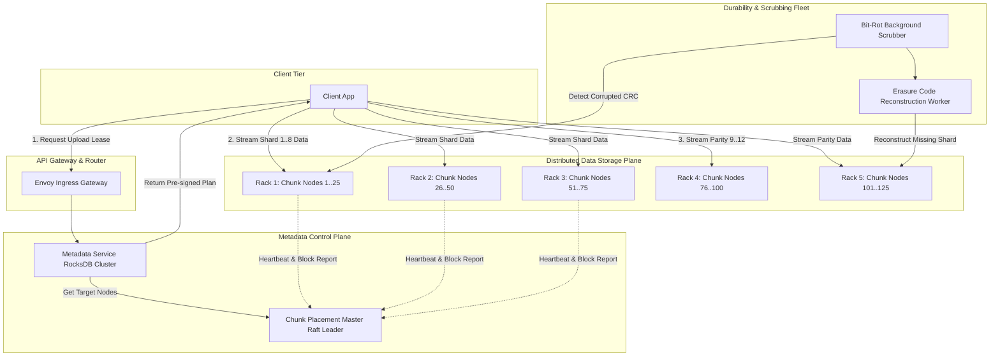

# Design Distributed Blob / Object Storage (AWS S3 / GCS)

## Learning Objectives
```
╔════════════════════════════════════════════════════════════════╗
║   AFTER THIS MODULE, YOU WILL BE ABLE TO:                      ║
╟────────────────────────────────────────────────────────────────╢
║                                                                ║
║   1. Design an exabyte-scale distributed object storage        ║
║      architecture from first principles: metadata plane vs     ║
║      data chunk server separation and immutable semantics      ║
║                                                                ║
║   2. Master data chunking (64MB blocks), multipart upload      ║
║      coordination, and zero-byte reassembly                    ║
║                                                                ║
║   3. Mathematically evaluate 3-way replication vs              ║
║      Reed-Solomon Erasure Coding (8+4) for 11 9's durability   ║
║      at 50% storage overhead (vs 200% for 3x replication)      ║
║                                                                ║
║   4. Architect a distributed metadata engine using LSM-trees   ║
║      and consistent hashing to index billions of object keys   ║
║                                                                ║
║   5. Implement background bit-rot scrubbing (CRC32C), disk     ║
║      failure healing, and network-bounded rack rebalancing     ║
║                                                                ║
║   6. Diagnose and mitigate P0 production outages: Chunk Master ║
║      split-brain, recovery storm network collapse, and hot     ║
║      prefix partition throttling                               ║
╚════════════════════════════════════════════════════════════════╝
```

---

## Wrong Mental Models (Destroy These First)

```
╔════════════════════════════════════════════════════════════════════╗
║   MENTAL MODEL #1: "Store file bytes directly as BLOBs in          ║
║   PostgreSQL or MySQL"                                             ║
╟────────────────────────────────────────────────────────────────────╢
║   WRONG. Storing multi-gigabyte binaries in relational database    ║
║   pages balloons WAL replication logs, evicts relational cache     ║
║   pages from buffer pools, and causes catastrophic vacuum locking. ║
║   Relational databases store metadata only; binary blobs belong on ║
║   append-only chunk servers.                                       ║
╠════════════════════════════════════════════════════════════════════╣
║   MENTAL MODEL #2: "Hardware RAID 6 across server disks is         ║
║   sufficient for durability"                                       ║
╟────────────────────────────────────────────────────────────────────╢
║   WRONG. RAID protects against single-node drive failures, but     ║
║   fails when an entire server rack loses power, top-of-rack (ToR)  ║
║   switches fail, or a data hall floods. Distributed object storage ║
║   operates at the software layer across failure domains (racks/AZs)║
╠════════════════════════════════════════════════════════════════════╣
║   MENTAL MODEL #3: "3-way cross-datacenter replication is the      ║
║   only way to achieve 11 9s durability"                            ║
╟────────────────────────────────────────────────────────────────────╢
║   WRONG. 3x replication incurs 200% storage overhead (300 PB raw   ║
║   for 100 PB data). Modern hyperscale systems use Reed-Solomon     ║
║   Erasure Coding (e.g. 8+4 or 12+4), achieving 11 9s durability    ║
║   at only 33% to 50% storage overhead, saving millions annually.   ║
╠════════════════════════════════════════════════════════════════════╣
║   MENTAL MODEL #4: "Clients upload 50GB files directly through     ║
║   the API Gateway web server"                                      ║
╟────────────────────────────────────────────────────────────────────╢
║   WRONG. Proxying multi-gigabyte payload streams through API       ║
║   gateways saturates worker connection pools and memory buffers.   ║
║   API gateways issue short-lived Pre-signed Upload URLs; clients   ║
║   stream data directly to Chunk Storage Nodes.                     ║
╠════════════════════════════════════════════════════════════════════╣
║   MENTAL MODEL #5: "Object storage files can be updated            ║
║   in-place like a POSIX filesystem"                                ║
╟────────────────────────────────────────────────────────────────────╢
║   WRONG. Object storage is strictly WORM (Write Once, Read Many).  ║
║   Blobs are immutable. Any update creates a new version with a     ║
║   new chunk hash. In-place byte range modifications are prohibited ║
║   to allow massive lock-free concurrent streaming reads.           ║
╠════════════════════════════════════════════════════════════════════╣
║   MENTAL MODEL #6: "Chunk Master should store the full mapping of  ║
║   all chunk disk sectors in a relational database"                 ║
╟────────────────────────────────────────────────────────────────────╢
║   WRONG. Querying a central database on every chunk read creates   ║
║   a catastrophic bottleneck. Chunk masters keep chunk locations    ║
║   in RAM, assembled dynamically on startup from Chunk Server       ║
║   heartbeat block reports.                                         ║
╚════════════════════════════════════════════════════════════════════╝
```

---

## Core Teaching

### 1. Requirements & Quantitative Capacity Sizing

#### Functional Requirements
1. **Bucket & Object Management**: Create buckets, upload objects (`PUT /bucket/key`), download objects (`GET /bucket/key`), delete objects (`DELETE /bucket/key`).
2. **Multipart Upload**: Support chunked parallel uploads for objects ranging from 5MB to 5TB.
3. **Pre-signed URLs**: Secure time-bounded direct client-to-storage node uploads and downloads.
4. **Versioning & Immutability**: Support object versioning and lifecycle policies (e.g., transition to cold storage after 90 days).

#### Non-Functional Requirements & SLA Targets
- **Durability**: 99.999999999% (11 9's durability per year).
- **Availability**: 99.99% for reads; 99.9% for writes.
- **Latency**: First-byte latency < 100ms for small objects; sustained streaming throughput > 100 MB/s.

#### Quantitative Hardware & Capacity Bounds

```
SCALE ESTIMATION (100 PB Production Tier):
  - Total Usable Capacity    : 100 Petabytes (100 × 10^15 bytes)
  - Total Objects            : 10 Billion objects (avg size = 10 MB)
  - Erasure Coding Scheme    : Reed-Solomon 8 + 4 (8 data shards, 4 parity shards)
    → Storage Overhead       : 4 / 8 = 50% extra storage
    → Total Raw Disk Required : 100 PB × 1.50 = 150 PB raw disk
  
  - Server & Drive Provisioning:
    → Enterprise HDD/NVMe Drive Size : 20 TB drives
    → Total Drives Needed            : 150,000 TB / 20 TB = 7,500 drives
    → Storage Nodes (60 drives/chassis): 7,500 / 60 = 125 Storage Nodes
    → Distribution Across 5 Racks   : 25 Storage Nodes per Rack (15 PB/rack)
  
  - Throughput & Bandwidth:
    → Target Read Throughput : 500 Gbps (62.5 GB/s aggregate egress)
    → Target Write Throughput: 100 Gbps (12.5 GB/s aggregate ingress)
    → Per Storage Node NIC   : Dual 100 GbE bonded NICs per chassis
  
  - Metadata Engine Sizing:
    → 10 Billion objects
    → Metadata record per object:
        bucket_id       : 8 bytes
        object_key      : 128 bytes (average)
        version_id      : 16 bytes
        size_bytes      : 8 bytes
        etag / md5      : 32 bytes
        chunk_list ptrs : 64 bytes
        B-tree overhead : 144 bytes
        Total per object: 400 bytes
    → Total Metadata Footprint: 10B × 400 bytes = 4 TB (Fits in RAM/NVMe RocksDB cluster)
```

---

### 2. High-Level Design (HLD) Box-and-Arrow Architecture

```
                                  [ Client Application ]
                                             │
                       1. Authenticate &     │ 2. Direct Streaming PUT/GET
                          Fetch Pre-signed   │    via Chunk Node IP/Port
                          URL & Chunk Plan   │
                                             ▼
                               ┌───────────────────────────┐
                               │   Edge Ingress Gateway    │
                               │     (Envoy TLS / WAF)     │
                               └─────────────┬─────────────┘
                                             │
               ┌─────────────────────────────┴─────────────────────────────┐
               │ Metadata Requests                                         │ Direct Blob Streaming
               ▼                                                           ▼
┌─────────────────────────────┐                             ┌─────────────────────────────┐
│      Metadata Service       │                             │     Chunk Storage Fleet     │
│   (Sharded Key-Value LSM)   │                             │  (125x Storage Nodes)       │
└──────────────┬──────────────┘                             └──────────────┬──────────────┘
               │                                                           │
               │ Query Placement Map                                       │ Block Reports
               ▼                                                           ▼
┌─────────────────────────────┐                             ┌─────────────────────────────┐
│  Chunk Placement Coordinator│◄────────────────────────────┤  Background Bit-Rot Scrubber│
│     (Raft Master Cluster)   │      Heartbeat & Capacity   │    (CRC32C Periodic Audit)  │
└─────────────────────────────┘                             └─────────────────────────────┘
```

#### Native Mermaid Architecture Schematic



---

### 3. Deep Dive into Core Subsystems & Erasure Coding Math

#### Subsystem A: Reed-Solomon Erasure Coding ($N = K + M$)

Traditional 3-way replication stores 3 identical copies of each chunk.
With Reed-Solomon coding:
- A blob is split into $K$ data shards.
- Generator polynomial matrices generate $M$ parity shards.
- Total stored shards = $N = K + M$.
- **Durability Invariant**: Any $K$ out of $N$ shards can reconstruct the original file!

$$\text{Storage Overhead} = \frac{M}{K}$$

$$\text{For } 8 + 4 \text{ Scheme:} \quad \text{Overhead} = \frac{4}{8} = 50\% \quad (\text{vs. } 200\% \text{ for 3x replication})$$

```
ORIGINAL 64MB CHUNK:
  ├── Shard D1 (8MB) ──► Stored on Rack 1 Node A
  ├── Shard D2 (8MB) ──► Stored on Rack 1 Node B
  ├── Shard D3 (8MB) ──► Stored on Rack 2 Node A
  ├── Shard D4 (8MB) ──► Stored on Rack 2 Node B
  ├── Shard D5 (8MB) ──► Stored on Rack 3 Node A
  ├── Shard D6 (8MB) ──► Stored on Rack 3 Node B
  ├── Shard D7 (8MB) ──► Stored on Rack 4 Node A
  ├── Shard D8 (8MB) ──► Stored on Rack 4 Node B
  ├── Parity P1 (8MB) ─► Stored on Rack 5 Node A
  ├── Parity P2 (8MB) ─► Stored on Rack 5 Node B
  ├── Parity P3 (8MB) ─► Stored on Rack 5 Node C
  └── Parity P4 (8MB) ─► Stored on Rack 5 Node D

FAULT TOLERANCE:
  Can lose ANY 4 storage nodes (or an entire rack!) simultaneously 
  with ZERO data loss and zero read downtime.
```

#### High-Performance Go Chunk Reassembly Engine

```go
package storage

import (
	"fmt"
	"io"

	"github.com/klauspost/reedsolomon"
)

type ErasureDecoder struct {
	dataShards   int
	parityShards int
	enc          reedsolomon.Encoder
}

func NewErasureDecoder(k, m int) (*ErasureDecoder, error) {
	enc, err := reedsolomon.New(k, m)
	if err != nil {
		return nil, err
	}
	return &ErasureDecoder{
		dataShards:   k,
		parityShards: m,
		enc:          enc,
	}, nil
}

// ReconstructAndWrite recovers damaged shards and streams decoded bytes
func (ed *ErasureDecoder) ReconstructAndWrite(shards [][]byte, out io.Writer, originalSize int64) error {
	// Verify if reconstruction is needed
	ok, err := ed.enc.Verify(shards)
	if !ok {
		// Reconstruct missing shards using Cauchy Reed-Solomon matrix math
		err = ed.enc.Reconstruct(shards)
		if err != nil {
			return fmt.Errorf("insufficient shards for reconstruction: %w", err)
		}
	}

	// Stream valid data shards to consumer
	written := int64(0)
	for i := 0; i < ed.dataShards; i++ {
		toWrite := int64(len(shards[i]))
		if written+toWrite > originalSize {
			toWrite = originalSize - written
		}
		_, err := out.Write(shards[i][:toWrite])
		if err != nil {
			return err
		}
		written += toWrite
	}
	return nil
}
```

---

### 4. Metadata Architecture & Database Schema

#### Metadata SQL Schema (`metadata_schema.sql`)

```sql
-- Objects Table: Partitioned by Bucket ID and Object Key
CREATE TABLE objects (
    bucket_id UUID NOT NULL,
    object_key VARCHAR(1024) NOT NULL,
    version_id TIMESTAMPTZ NOT NULL DEFAULT NOW(),
    size_bytes BIGINT NOT NULL,
    etag VARCHAR(64) NOT NULL,
    storage_class VARCHAR(16) NOT NULL DEFAULT 'STANDARD',
    is_latest BOOLEAN NOT NULL DEFAULT TRUE,
    created_at TIMESTAMPTZ NOT NULL DEFAULT NOW(),
    PRIMARY KEY (bucket_id, object_key, version_id)
);

-- Chunk Mapping Table: Maps an object version to its physical chunk slices
CREATE TABLE object_chunks (
    chunk_id UUID PRIMARY KEY DEFAULT gen_random_uuid(),
    bucket_id UUID NOT NULL,
    object_key VARCHAR(1024) NOT NULL,
    version_id TIMESTAMPTZ NOT NULL,
    chunk_index INT NOT NULL,
    shard_count INT NOT NULL DEFAULT 12, -- 8 data + 4 parity
    erasure_scheme VARCHAR(16) NOT NULL DEFAULT 'RS_8_4',
    checksum_crc32c BIGINT NOT NULL,
    FOREIGN KEY (bucket_id, object_key, version_id) REFERENCES objects(bucket_id, object_key, version_id)
);

CREATE INDEX idx_object_chunks_lookup ON object_chunks (bucket_id, object_key, version_id);
```

#### REST API Protocols

##### 1. Initialize Multipart Upload
- **Request**: `POST /my-bucket/large-video.mp4?uploads`
- **Response (200 OK)**:
```json
{
  "upload_id": "upload_98bf4a12_e823",
  "key": "large-video.mp4",
  "part_size_bytes": 67108864,
  "chunk_servers": [
    {"part_number": 1, "target_endpoint": "https://chunk-node-042.internal/upload?token=..."},
    {"part_number": 2, "target_endpoint": "https://chunk-node-089.internal/upload?token=..."}
  ]
}
```

##### 2. Complete Multipart Upload
- **Request**: `POST /my-bucket/large-video.mp4?uploadId=upload_98bf4a12_e823`
- **Payload**:
```json
{
  "parts": [
    {"part_number": 1, "etag": "d41d8cd98f00b204e9800998ecf8427e"},
    {"part_number": 2, "etag": "7b2401f8d4c679a8342b0e9a5c81d2f1"}
  ]
}
```

---

## SRE Diagnostic Toolkit

### 1. Prometheus Telemetry & Alerts

```promql
# Alert: Storage Node Degradation Rate (> 5 nodes degraded in 1h)
increase(storage_node_disk_read_errors_total[1h]) > 5

# Alert: Chunk Reconstruction Backlog Spike
reconstruction_pending_shards_total > 50000

# Alert: First-Byte Latency SLA Breach (p99 > 150ms)
histogram_quantile(0.99, sum(rate(object_storage_ttfb_seconds_bucket[5m])) by (le)) > 0.15
```

### 2. Linux Kernel & Storage Tuning (`XFS` / Direct I/O)

```ini
# Storage node sysctl optimizations for multi-gigabit disk streaming
# /etc/sysctl.d/99-blob-storage.conf
fs.file-max = 2097152
vm.dirty_ratio = 10
vm.dirty_background_ratio = 5

# Prevent memory fragmentation on large disk read/write buffers
vm.min_free_kbytes = 1048576

# Disable TCP slow start after idle to maintain full gigabit transfer rates
net.ipv4.tcp_slow_start_after_idle = 0
```

---

## Decision Framework

| Requirement / Component | Recommended Architecture | Rejected Alternative | Engineering Rationale |
| :--- | :--- | :--- | :--- |
| **Durability Encoding** | `Reed-Solomon (8+4) Erasure Coding` | `3-way Cross-Rack Replication` | 3x replication requires 200% overhead ($300 PB for 100 PB usable). RS 8+4 delivers identical 11 9s durability at 50% overhead ($150 PB). |
| **File Update Model** | `Append-Only Immutable Blobs (WORM)` | `In-Place POSIX Block Updates` | In-place updates require distributed locking across chunk servers. Immutability enables lock-free parallel reads. |
| **Client Data Ingress** | `Direct-to-Chunk Node via Pre-signed URLs` | `Proxying through API Gateway Web Fleet` | Passing multi-gigabyte media through web reverse proxies causes socket exhaustion and memory buffer pool thrashing. |
| **Metadata Store** | `Distributed LSM-Tree (RocksDB / CockroachDB)` | `Central B-tree PostgreSQL Instance` | B-trees suffer high write amplification under high-concurrency object creation. LSM-trees optimize sequential write ingest. |

---

## Failure Modes

### Failure Mode 1: Recovery Storm Network Meltdown
- **Failure Trigger**: A top-of-rack (ToR) switch fails, cutting off 25 storage nodes (15 PB of data) simultaneously.
- **Cascading Impact**: The placement coordinator marks 15 PB missing and triggers immediate parallel reconstruction across the remaining racks. Network aggregate throughput spikes to 400 Gbps, saturating core spine switches and causing client read requests to time out (p99 latency spikes from 80ms to 12s).
- **SRE Containment**:
  1. Implement **Token-Bucket Rate Limiting on Reconstruction Traffic**: Cap background healing bandwidth to no more than 20% of inter-rack switch capacity.
  2. Implement **Hysteresis Dead-Time**: Wait 15 minutes before initiating cross-rack rebuilds for temporary rack reboot events.

### Failure Mode 2: Chunk Master Split-Brain during Network Partition
- **Failure Trigger**: A transient cross-AZ network split causes two master candidates to believe they are the active Raft leader.
- **Cascading Impact**: Two different nodes assign the same chunk ID to two different client uploads, causing silent data overwrite.
- **SRE Containment**:
  1. Enforce strict **Raft Quorum Pre-Vote Protocol**.
  2. Implement **Lease Read Verification**: Leaders cannot issue allocation leases without validating active quorum heartbeats within the last 500ms.

---

## 🛑 SOCRATIC CHECK

### Question 1:
Why do production blob stores like AWS S3 use a fixed chunk size (e.g. 64MB) instead of storing each uploaded file as a single contiguous file on disk?

### Question 2:
What happens to incomplete multipart uploads when a client network disconnects midway through uploading a 50GB file? How does the storage engine prevent disk leaks?

### Question 3:
How does background bit-rot scrubbing verify the integrity of cold data without exhausting disk read IOPS needed for live customer reads?
