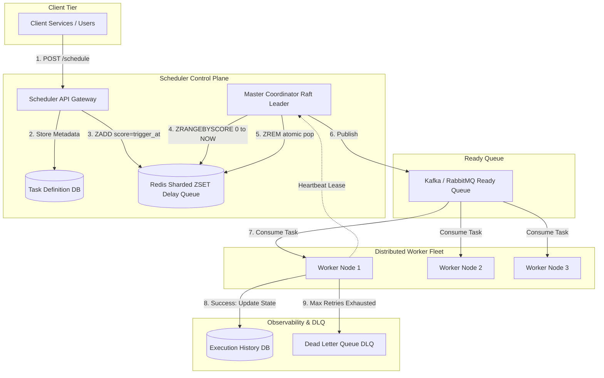

# Design Distributed Job Scheduler and Cron (Temporal / Quartz / Celery)

## Learning Objectives
```
╔════════════════════════════════════════════════════════════════╗
║   AFTER THIS MODULE, YOU WILL BE ABLE TO:                      ║
╟────────────────────────────────────────────────────────────────╢
║                                                                ║
║   1. Design an enterprise-grade distributed job scheduler and  ║
║      cron engine executing 100M+ tasks daily with sub-second   ║
║      schedule accuracy                                         ║
║                                                                ║
║   2. Master the mechanics of Hashed Wheel Timers (O(1) insert  ║
║      and trigger) and distributed delay queues (Redis ZSET,    ║
║      PostgreSQL SELECT FOR UPDATE SKIP LOCKED)                 ║
║                                                                ║
║   3. Implement worker leasing, distributed leader election,    ║
║      and partition fencing to prevent duplicate job execution  ║
║                                                                ║
║   4. Architect idempotent task state machines (Scheduled ->    ║
║      Dispatched -> Running -> Succeeded / Retrying / DLQ)      ║
║                                                                ║
║   5. Solve the midnight thundering herd: schedule jitter,      ║
║      worker pre-fetching, and priority backpressure shedding   ║
║                                                                ║
║   6. Diagnose P0 production incidents: worker pool starvation, ║
║      runaway retry cascades, and lease renewal deadlocks       ║
╚════════════════════════════════════════════════════════════════╝
```

---

## Wrong Mental Models (Destroy These First)

```
╔═════════════════════════════════════════════════════════════════════╗
║   MENTAL MODEL #1: "Just run Linux cron on a server and fire        ║
║   HTTP webhooks to workers"                                         ║
╟─────────────────────────────────────────────────────────────────────╢
║   WRONG. Single-server cron is a hard single point of failure       ║
║   (SPOF). If the server reboots or encounters memory pressure at    ║
║   midnight, scheduled jobs are silently dropped with zero retry     ║
║   guarantees, zero observability, and zero execution tracking.      ║
╠═════════════════════════════════════════════════════════════════════╣
║   MENTAL MODEL #2: "Query SELECT * FROM tasks WHERE trigger_at      ║
║   <= NOW() every 1 second"                                          ║
╟─────────────────────────────────────────────────────────────────────╢
║   WRONG. At 50 million scheduled tasks, polling an index range      ║
║   every second creates massive B-tree lock contention and disk      ║
║   thrashing. As worker fleets scale, concurrent polling causes      ║
║   deadlocks and CPU starvation on database primaries.               ║
╠═════════════════════════════════════════════════════════════════════╣
║   MENTAL MODEL #3: "Exactly-once task execution can be guaranteed   ║
║   by the scheduler network"                                         ║
╟─────────────────────────────────────────────────────────────────────╢
║   WRONG. Distributed systems theory proves networks are asynchronous║
║   and lossy (FLM/Two Generals Problem). If a worker executes a task ║
║   but dies before acknowledging, the scheduler must redeliver.      ║
║   Schedulers deliver at-least-once; idempotency keys in worker      ║
║   business logic guarantee effective exactly-once semantics.        ║
╠═════════════════════════════════════════════════════════════════════╣
║   MENTAL MODEL #4: "Standard Kafka can be used directly as a        ║
║   delayed task queue"                                               ║
╟─────────────────────────────────────────────────────────────────────╢
║   WRONG. Kafka is an append-only commit log. It does not support    ║
║   arbitrary out-of-order delay times (e.g. Task A delay 5s, Task B  ║
║   delay 3 hours in the same topic). Doing so blocks the consumer    ║
║   head of line. Delay queues require time-indexed data structures.  ║
╠═════════════════════════════════════════════════════════════════════╣
║   MENTAL MODEL #5: "Retry failed jobs immediately to preserve SLA"  ║
╟─────────────────────────────────────────────────────────────────────╢
║   WRONG. If downstream service B is failing due to overload,        ║
║   immediate retries multiply traffic by N, creating a self-inflicted║
║   DDoS storm. Retries must always incorporate exponential backoff   ║
║   with full decorrelated jitter plus strict retry caps.             ║
╠═════════════════════════════════════════════════════════════════════╣
║   MENTAL MODEL #6: "Workers should heartbeat by writing to the      ║
║   primary relational database"                                      ║
╟─────────────────────────────────────────────────────────────────────╢
║   WRONG. 10,000 workers heartbeating every 2 seconds generate       ║
║   5,000 writes/sec solely for liveness. This pollutes WAL logs and  ║
║   evicts buffer pool pages. Worker leases belong in fast, in-memory ║
║   ephemeral stores like Redis or etcd TTL leases.                   ║
╚═════════════════════════════════════════════════════════════════════╝
```

---

## Core Teaching

### 1. Requirements & Quantitative Capacity Sizing

#### Functional Requirements
1. **Job Scheduling**: Schedule recurring cron tasks (`0 0 * * *`) and one-shot delayed tasks (`execute_at = 2026-09-10T15:30:00Z`).
2. **Task Dispatch & Execution**: Dispatch tasks to worker fleets based on priority, tags, and queue routing.
3. **Execution Tracking & History**: Track task state lifecycle (Pending, Dispatched, Running, Succeeded, Failed, Cancelled).
4. **Retry & DLQ**: Configurable retry policies (max retries, backoff curve) and routing to Dead Letter Queues (DLQ) upon final exhaustion.
5. **Cancellation & Pausing**: Dynamically cancel or pause scheduled tasks before execution.

#### Non-Functional Requirements & SLA Targets
- **Accuracy**: Trigger latency < 1 second from scheduled execution timestamp.
- **Scale**: Handle 100 Million daily tasks; peak dispatch capacity of 25,000 tasks/sec.
- **Fault Tolerance**: Automatic leader failover in < 5 seconds with zero lost scheduled tasks.
- **Isolation**: Tenant and priority queue isolation to prevent low-priority batch jobs from starving high-priority transactional webhooks.

#### Quantitative Capacity Estimation

```
SCALE ESTIMATION (100M Tasks/Day):
  - Daily Total Tasks: 100,000,000 tasks / day
  - Average Trigger QPS: 100M / 86,400s ≈ 1,157 tasks/sec
  - Peak Trigger QPS (Midnight Spikes 20x): ~25,000 tasks/sec
  
  - Payload Storage Sizing:
    → Task Definition Metadata:
        task_id         : 16 bytes (UUIDv7)
        cron_expression : 32 bytes
        payload_json    : 1,024 bytes (average)
        retry_policy    : 64 bytes
        status          : 16 bytes
        timestamps      : 32 bytes
        Total per task  : ~1.2 KB
    → Daily Execution Logs: 100M × 1.2 KB ≈ 120 GB / day
    → 30-Day Execution History: 3.6 TB storage (PostgreSQL / ClickHouse)
  
  - Delay Queue Memory (Active Pending Tasks):
    → Assume 10M tasks scheduled within the next 24 hours
    → Redis Sorted Set (ZSET) entry: (timestamp_score, task_id) ≈ 64 bytes
    → Memory for 10M pending keys in Redis: 10M × 64 bytes ≈ 640 MB (Minimal RAM!)
  
  - Worker Pool Sizing:
    → Peak Task Inflow: 25,000 tasks/sec
    → Average Task Duration: 200 ms (0.2s)
    → Active Concurrent Workers Required = 25,000 × 0.2s = 5,000 concurrent worker slots
    → At 50 goroutines/threads per worker pod: 100 Worker Pods
```

---

### 2. High-Level Design (HLD) Box-and-Arrow Architecture

```
                                  [ Client Application ]
                                             │
                                1. Schedule Task / Cron
                                             ▼
                               ┌───────────────────────────┐
                               │   Scheduler API Ingress   │
                               │    (Go REST / gRPC Pods)  │
                               └─────────────┬─────────────┘
                                             │
               ┌─────────────────────────────┴─────────────────────────────┐
               │ 2. Persist Task Def                                       │ 3. Push Delayed Task ID
               ▼                                                           ▼
┌─────────────────────────────┐                             ┌─────────────────────────────┐
│    Primary Task Store       │                             │   Distributed Delay Queue   │
│ (PostgreSQL / CockroachDB)  │                             │  (Redis Sharded ZSETs /     │
└─────────────────────────────┘                             │   Hashed Wheel Timer)       │
                                                            └──────────────┬──────────────┘
                                                                           │
                                                              4. Poller    │ 5. Due Tasks
                                                                 Lease     │    (score <= NOW)
                                                                           ▼
                                                            ┌─────────────────────────────┐
                                                            │   Scheduler Master Leader   │
                                                            │     (Raft / etcd Election)  │
                                                            └──────────────┬──────────────┘
                                                                           │
                                                              6. Enqueue   │ Real-time Ready
                                                                 Tasks     │ Queue
                                                                           ▼
                                                            ┌─────────────────────────────┐
                                                            │     Kafka / RabbitMQ        │
                                                            │     (execution_ready)       │
                                                            └──────────────┬──────────────┘
                                                                           │
                                                              7. Worker    │ 8. Heartbeat &
                                                                 Consume   │    ACK Lease
                                                                           ▼
                                                            ┌─────────────────────────────┐
                                                            │    Worker Execution Fleet   │
                                                            │   (100x Distributed Pods)   │
                                                            └──────────────┬──────────────┘
                                                                           │
                                                              9. Persist   │ 10. Dead Letter
                                                                 Execution │     Queue on Max
                                                                 Status    │     Failures
                                                                           ▼
                                                            ┌─────────────────────────────┐
                                                            │   Status Tracker & DLQ      │
                                                            └─────────────────────────────┘
```

#### Native Mermaid Architecture Schematic



---

### 3. Deep Dive into Core Subsystems & Scheduling Mechanics

#### Subsystem A: Hashed Wheel Timer Mechanics

For extreme high-throughput dispatch (sub-millisecond granularity), polling a database or Redis ZSET at 50,000 QPS introduces CPU overhead. High-performance runtimes (Netty, Kafka, Linux kernel) utilize **Hierarchical Hashed Wheel Timers**.

```
          [ HASHED WHEEL TIMER (60 Slots, 1-second ticks) ]

                       Slot 0 [ 0s ]
                    ┌─────────────┐
       Slot 59 ─────┤             ├───── Slot 1 [ 1s ]
                    │      ▲      │
       Slot 58 ─────┤      │      ├───── Slot 2 [ 2s ]
                    │   Pointer   │
                    │   (Ticks    │
                    │   Every 1s) │
                    └─────────────┘
                     ...       ...
                       Slot 30

EACH SLOT HOLDS A LINKED LIST OF TASKS:
  Slot 14 ──► [ Task #101 | RemainingRounds = 0 ] ──► [ Task #408 | RemainingRounds = 2 ]

ALGORITHM:
  1. Pointer advances by 1 slot every second: current_slot = (current_slot + 1) % 60.
  2. For each task in current_slot:
     - If RemainingRounds == 0: Trigger task immediately!
     - If RemainingRounds > 0: Decrement RemainingRounds -= 1.
  3. Complexity: O(1) insertion, O(1) trigger execution.
```

#### Production Go Distributed Lock & Lease Dispatch Engine

```go
package scheduler

import (
	"context"
	"fmt"
	"time"

	"github.com/redis/go-redis/v9"
)

type DelayQueueScheduler struct {
	rdb        *redis.Client
	queueKey   string
	readyTopic string
}

func NewDelayQueueScheduler(rdb *redis.Client, queueKey, readyTopic string) *DelayQueueScheduler {
	return &DelayQueueScheduler{
		rdb:        rdb,
		queueKey:   queueKey,
		readyTopic: readyTopic,
	}
}

// ScheduleTask inserts task into Redis Sorted Set indexed by Unix Epoch Milliseconds
func (d *DelayQueueScheduler) ScheduleTask(ctx context.Context, taskID string, executeAt time.Time) error {
	score := float64(executeAt.UnixMilli())
	return d.rdb.ZAdd(ctx, d.queueKey, redis.Z{
		Score:  score,
		Member: taskID,
	}).Err()
}

// PollAndDispatch utilizes atomic Lua Script to prevent duplicate dispatch across masters
func (d *DelayQueueScheduler) PollAndDispatch(ctx context.Context, batchSize int64) ([]string, error) {
	nowMilli := time.Now().UnixMilli()

	// Atomic Lua Script: Find tasks <= now, pop them, and return IDs
	luaScript := `
		local tasks = redis.call('ZRANGEBYSCORE', KEYS[1], 0, ARGV[1], 'LIMIT', 0, ARGV[2])
		if #tasks > 0 then
			redis.call('ZREM', KEYS[1], unpack(tasks))
		end
		return tasks
	`

	res, err := d.rdb.Eval(ctx, luaScript, []string{d.queueKey}, nowMilli, batchSize).Result()
	if err != nil {
		return nil, fmt.Errorf("failed to execute atomic poll lua script: %w", err)
	}

	taskList, ok := res.([]interface{})
	if !ok {
		return nil, nil
	}

	dispatched := make([]string, len(taskList))
	for i, t := range taskList {
		dispatched[i] = fmt.Sprintf("%v", t)
	}
	return dispatched, nil
}
```

---

### 4. Storage Schemas & Database Models

#### PostgreSQL Production Task Schema (`schema.sql`)

```sql
-- Scheduled Task Definitions
CREATE TABLE task_definitions (
    task_id UUID PRIMARY KEY DEFAULT gen_random_uuid(),
    cron_expression VARCHAR(64),          -- NULL for one-time tasks
    payload JSONB NOT NULL,
    max_retries INT NOT NULL DEFAULT 3,
    timeout_seconds INT NOT NULL DEFAULT 300,
    priority INT NOT NULL DEFAULT 10,     -- 1 (Highest) to 100 (Lowest)
    queue_name VARCHAR(64) NOT NULL DEFAULT 'default',
    is_paused BOOLEAN NOT NULL DEFAULT FALSE,
    created_at TIMESTAMPTZ NOT NULL DEFAULT NOW(),
    updated_at TIMESTAMPTZ NOT NULL DEFAULT NOW()
);

-- Task Execution Instances (Append-Only Lifecycle Ledger)
CREATE TABLE task_executions (
    execution_id UUID PRIMARY KEY DEFAULT gen_random_uuid(),
    task_id UUID NOT NULL REFERENCES task_definitions(task_id),
    scheduled_for TIMESTAMPTZ NOT NULL,
    dispatched_at TIMESTAMPTZ,
    started_at TIMESTAMPTZ,
    completed_at TIMESTAMPTZ,
    status VARCHAR(32) NOT NULL DEFAULT 'PENDING', 
    -- PENDING, DISPATCHED, RUNNING, SUCCESS, FAILED, RETRYING, DEAD_LETTER
    retry_count INT NOT NULL DEFAULT 0,
    worker_id VARCHAR(128),
    error_message TEXT,
    created_at TIMESTAMPTZ NOT NULL DEFAULT NOW()
);

-- Index for Pending Task Sweep
CREATE INDEX idx_task_executions_pending ON task_executions (scheduled_for, status)
WHERE status IN ('PENDING', 'RETRYING');

-- Index for Worker Heartbeat Recovery
CREATE INDEX idx_task_executions_running ON task_executions (started_at)
WHERE status = 'RUNNING';
```

---

## SRE Diagnostic Toolkit

### 1. Prometheus Telemetry & Alerts

```promql
# Alert: Schedule Trigger Latency Breach (> 2 seconds behind real time)
histogram_quantile(0.99, sum(rate(scheduler_trigger_delay_seconds_bucket[5m])) by (le)) > 2.0

# Alert: Dead Letter Queue Inflow Spike (> 10 tasks/sec reaching DLQ)
sum(rate(scheduler_dlq_tasks_total[5m])) > 10

# Alert: Master Leader Election Flapping (> 3 transitions in 10m)
changes(scheduler_master_leader_status[10m]) > 3
```

### 2. Linux Kernel & Socket Sysctl Tuning

```ini
# /etc/sysctl.d/99-scheduler.conf
# Support large number of concurrent worker TCP connections
net.core.somaxconn = 65535
net.ipv4.tcp_max_syn_backlog = 65535

# Fast socket teardown for short-lived webhook triggers
net.ipv4.tcp_fin_timeout = 15
net.ipv4.tcp_tw_reuse = 1
```

---

## Decision Framework

| Decision Dimension | Recommended Architecture | Rejected Alternative | Engineering Rationale |
| :--- | :--- | :--- | :--- |
| **Delay Data Structure** | `Redis Sharded ZSET + Lua Script` | `Relational DB Range Polling` | DB index polling causes extreme lock contention at 25,000 QPS. Redis executes atomic $O(\log N)$ ZRANGE and ZREM in memory. |
| **Task Delivery Semantics**| `At-Least-Once Delivery + Worker Idempotency` | `Protocol-level Exactly-Once` | True network exactly-once is mathematically impossible during worker crashes. Idempotency keys solve deduplication safely. |
| **Worker Liveness** | `TTL Heartbeat Leases in Redis / etcd` | `Relational DB Heartbeat Writes` | 10,000 workers heartbeating to Postgres exhausts connection pools and saturates WAL disks. Ephemeral keys handle TTL auto-expiry. |
| **Midnight Thundering Herd**| `Schedule Jitter (hash(user_id) % 300s)` | `Strict Concurrent Midnight Dispatch` | Millions of tasks firing at 00:00:00 UTC crashes downstream microservices. Jitter spreads load evenly over a 5-minute window. |

---

## Failure Modes

### Failure Mode 1: Worker Hang Causing Zombie Task Leases
- **Failure Trigger**: A worker acquires a critical payment settlement task, enters a 30-minute deadlock on a third-party socket, and stops processing.
- **Cascading Impact**: The task remains in `RUNNING` status indefinitely. The payment deadline passes, violating customer SLAs.
- **SRE Containment**:
  1. Enforce **Lease TTLs**: The worker must renew its lease in Redis every 10 seconds.
  2. Implement **Zombie Reaper**: A background supervisor scans for `status = 'RUNNING'` where `last_heartbeat < NOW() - 30 seconds`, terminates the task, increments `retry_count`, and redispatches.

### Failure Mode 2: Cascading Retry Storm on Downstream Outage
- **Failure Trigger**: Email provider SendGrid suffers an outage. 5,000 worker threads fail email tasks and retry immediately without backoff.
- **Cascading Impact**: Millions of retries accumulate in the ready queue, starving high-priority invoice generation tasks.
- **SRE Containment**:
  1. Enforce **Decorrelated Exponential Jitter**:
     $$\text{sleep} = \min(\text{max\_backoff}, \text{base\_delay} \times 2^{\text{retry\_count}} + \text{rand}(0, \text{jitter}))$$
  2. **Circuit Breaker on Queue Ingestion**: Pause consumption from `email_queue` while allowing `billing_queue` to drain normally.

---

## 🛑 SOCRATIC CHECK

### Question 1:
How does a distributed scheduler prevent two different master nodes from claiming and dispatching the exact same delayed task when both execute `ZRANGEBYSCORE` concurrently?

### Question 2:
Why must recurring cron jobs be re-scheduled by creating a brand-new task instance record rather than mutating the existing execution record?

### Question 3:
If an entire worker datacenter loses connectivity while executing 5,000 tasks, how does the scheduler safely recover those tasks without double-executing non-idempotent operations?
