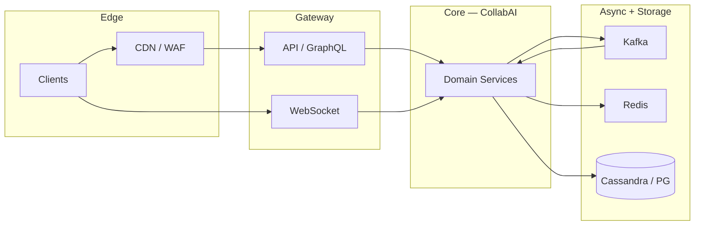

# Compound SRE Scenario — Realtime Collaboration Outage

> **Week 14** — Google Docs-style collab + LLM serving + feature store — P1

```
╔════════════════════════════════════════════════════════════════╗
║   RULES OF ENGAGEMENT                                          ║
╟────────────────────────────────────────────────────────────────╢
║                                                                ║
║   1. Answer from MEMORY. Do not re-read the teaching           ║
║      modules. The whole point is to test what STUCK in         ║
║      your brain.                                               ║
║                                                                ║
║   2. This is a COMPOUND scenario — multiple symptoms,          ║
║      multiple layers. Identify which subsystem each clue       ║
║      belongs to before proposing fixes.                        ║
║                                                                ║
║   3. Full depth expected. Name root causes, cite evidence,     ║
║      draw causal links, prioritize mitigations, and give       ║
║      exact commands where asked.                               ║
║                                                                ║
║   4. It's OK to say "I don't remember."                        ║
║      That's honest and tells us what to review.                ║
║      Faking an answer teaches nothing.                         ║
║                                                                ║
╚════════════════════════════════════════════════════════════════╝
```

---

## Knowledge Domains Tested

**Week 14 (primary):** Operational transformation / CRDT document sync, Presence, cursor broadcast, revision history, LLM inference serving (batching, KV cache), Feature store online/offline consistency, Model routing and A/B traffic, Realtime collaboration conflict resolution

**Prior weeks (integrated):** WebSockets (Week 1), CRDTs, vector clocks, LWW (Week 8), Kafka feature pipelines (Week 6), Rate limiting (Week 7), Caching and hot keys (Week 2), Observability and SLOs (Week 8)

The challenge is not knowing each concept in isolation — it is **mapping each symptom to the correct layer** and understanding how failures cascade across feed/chat, storage, messaging, and edge systems simultaneously.


---

## Compound SRE Scenario

This scenario requires knowledge from **this week's system designs** and **all prior weeks** simultaneously. The challenge is identifying which layer each symptom belongs to and how failures cascade.

```
INCIDENT REPORT
━━━━━━━━━━━━━━━━━━━━━━━━━━━━━━━━━━━━━━━━━━━━━
Severity: P1
Service: CollabAI
  22M docs; 1.8M concurrent editors during incident

  ╔════════════════════════════════════════════════════════════════════════════════╗
  ║ ARCHITECTURE                                                                   ║
  ╠════════════════════════════════════════════════════════════════════════════════╣

  ║ COLLABORATION                                                                  ║
  ║   Browser → WebSocket Gateway (80 pods) → OT Engine                            ║
  ║   OT Engine: in-memory op buffer per doc → Kafka doc.ops                       ║
  ║   Persistence: CRDT snapshot + op log in Cassandra                             ║
  ║   Revision history: S3 immutable snapshots every 100 ops                       ║
  ║                                                                                ║
  ║ AI ASSIST (in-doc)                                                             ║
  ║   Assist API → LLM Router → vLLM fleet (GPU)                                   ║
  ║   Feature Store (online Redis + offline S3) for personalization                ║
  ║   Prompt cache keyed by doc_hash + user tier                                   ║
  ║                                                                                ║
  ║ FEATURE STORE                                                                  ║
  ║   Kafka feature.updates → Redis online store                                   ║
  ║   Batch: Spark → S3 → loaded to Redis nightly                                  ║
  ║   Version vector per feature group                                             ║
  ║                                                                                ║
  ║ INCIDENT CONTEXT                                                               ║
  ║   Monday 09:00 enterprise onboarding — 400-person doc edit session             ║
  ║   + AI assist feature launch (10% traffic canary)                              ║
  ╚════════════════════════════════════════════════════════════════════════════════╝

INCIDENT TIMELINE:

  09:00 — 400 users open same enterprise playbook doc. AI assist enabled.

  09:02 — Users report: edits revert after 2–3 seconds; cursors jump randomly.

  09:05 — AI assist returns generic responses; personalization clearly off.

  09:08 — WebSocket gateway CPU 95%; op broadcast latency p99 8s.

  09:11 — OT Engine pod collab-ot-17 OOM; doc shard reassigned mid-session.

  09:14 — Kafka doc.ops lag 2.4M on partition keyed by doc_id hash.

  09:17 — CRDT merge conflicts spike; S3 snapshot age 45 min for hot doc.

  09:20 — vLLM queue depth 12K; P99 TTFT 38s (SLO 800ms).

  09:23 — Feature store online Redis missing keys for cohort 'enterprise_v3'.

  09:26 — Vector clock skew: ops from collab-ot-17 rejected as 'stale'.

  09:29 — Problems A–H identified.

  ─── Additional problems discovered during investigation ───

  09:29 — PROBLEM A:
            OT serializability violation under partition
            Doc reassigned during OOM; two OT engines buffer ops for same doc_id without mutual exclusion.

            Monitoring:
            → Kafka consumer lag: partition 17 = 4.2M, all others < 12K
            → Fan-out worker pod fanout-17 CPU 99%; fanout-03 at 11%
            → posts.created produce rate 890K msg/sec spike on key @nova

  09:31 — PROBLEM B:
            WebSocket fan-out buffer bloat
            400 cursors × 400 users = 160K msgs/sec per doc broadcast; no delta compression.

            Monitoring:
            → Redis shard-7: ops/sec 412K on single key timeline:nova
            → redis-cli --hotkeys shows 89% traffic on 3 keys
            → Memory fragmentation ratio 1.42 on shard-7

  09:33 — PROBLEM C:
            CRDT snapshot stale + LWW tie-break wrong
            Snapshot 45 min old; concurrent ops use wall-clock LWW. NTP skew 200ms across pods → edits lost.

            Monitoring:
            → nodetool status: cass-12 UN (unreachable)
            → Hinted handoff queue depth 890,412 on cass-04
            → UnavailableException rate 1,240/sec on user_timelines CF

  09:35 — PROBLEM D:
            Kafka hot partition doc.ops
            Enterprise doc hash → single partition; 2.4M lag. Other docs unaffected.

            Monitoring:
            → chat.events consumer group: 3/24 members in RevokePartitions
            → Read receipt lag 340s; delivery event lag 12s same message_id
            → cooperative-sticky assignor upgrade deploy 2026-03-14

  09:38 — PROBLEM E:
            Feature store online/offline skew
            Batch load failed silently; Redis serves T-24h features. AI assist personalization degraded.

            Monitoring:
            → Feed Gateway: 47,000 gRPC calls/sec to Media Service
            → Media replica-1 CPU 96%; replicas 2-8 at 9%
            → GraphQL resolver post.author.avatar sequential await pattern

  09:41 — PROBLEM F:
            LLM KV cache poisoning
            Prompt cache shared across users by doc_hash only; User A's confidential text leaked in User B assist suggestion.

            Monitoring:
            → WebSocket disconnect cadence: exactly 60s idle intervals
            → Presence key TTL 120s; last_ping 67s ago on sample clients
            → NLB target group idle timeout: 60s on ws-chat-tg

  09:44 — PROBLEM G:
            Vector clock not incremented on gateway forward
            WebSocket gateway forwards ops without passing vc component; merge rejects valid ops as stale.

            Monitoring:
            → Rate limit 503 rate 8.2% in EU; 0.1% in US
            → Shared Redis key ratelimit:asn:3320 token count 0
            → Feature flag aggregate_rate_limit_by_asn=true since 07:55

  09:47 — PROBLEM H:
            Rate limiter on assist API per IP not per user
            400 users behind corporate NAT share one bucket; 429 errors cascade to 'AI offline' banner.

            Monitoring:
            → CloudFront 403 on signed URL: Signature expired (clock skew)
            → Media pod clock offset +37s vs NTP in eu-west-1
            → S3 presigned URL X-Amz-Date mismatch in access logs

━━━━━━━━━━━━━━━━━━━━━━━━━━━━━━━━━━━━━━━━━━━━━
```

## Data Flow Overview



Use this map when triaging: **symptoms at the edge** often originate three hops away in async pipelines.


## Pre-Incident Context

The following changes were in flight before the incident. Any may be red herrings; all may contribute.

```
  CHANGE LOG (last 7 days):
  ─────────────────────────────────────────────────────────
  • Feature flag rollout: 5% → 25% → 50% canary
  • Load test cancelled due to change freeze exception
  • One AZ capacity reduction for cost program
  • Dependency upgrade: Kafka client 3.6 → 3.7
  • Redis cluster resharding (add 2 shards) — week 2 of migration
  • On-call runbook updated but not rehearsed
  • SLO review deferred to next quarter
```

**Service:** CollabAI
**Severity:** P1
**Scale:** 22M docs; 1.8M concurrent editors during incident


```
Slack #incidents-war-room
  T+0m  incident-bot:  P1 opened: CollabAI multi-symptom degradation
  T+2m  oncall-primary:  Joined bridge. Pulling dashboards for feed/chat/index path.
  T+5m  oncall-db:  Cassandra/Redis/Postgres — which store is hot?
  T+8m  eng-lead:  Any deploys in last 24h? Feature flags?
  09:29  oncall-primary:  Problem A hypothesis forming: OT serializability violation under partition
  09:31  oncall-primary:  Problem B hypothesis forming: WebSocket fan-out buffer bloat
  09:33  oncall-primary:  Problem C hypothesis forming: CRDT snapshot stale + LWW tie-break wrong
  09:35  oncall-primary:  Problem D hypothesis forming: Kafka hot partition doc.ops
```

---

## Grafana Dashboard Excerpts (Incident Snapshot)

### Panel: Request rate by service

```
  series  incident  notes          
  ------  --------  ---------------
  api     12K       baseline varies
  worker  890K      baseline varies
  ws      2.1M      baseline varies
```

### Panel: Error budget burn

```
  series    incident  notes          
  --------  --------  ---------------
  feed      14×       baseline varies
  chat      8×        baseline varies
  platform  22×       baseline varies
```

### Panel: Saturation

```
  series   incident  notes          
  -------  --------  ---------------
  cpu      94%       baseline varies
  memory   89%       baseline varies
  disk     78%       baseline varies
  network  67%       baseline varies
```


---

## Monitoring Appendix

### PROBLEM-A: OT serializability violation under partition

Discovery time: **09:29**. Symptom summary: Doc reassigned during OOM; two OT engines buffer ops for same doc_id without mutual exclusion.

```
  instance      metric          normal  incident_hot  incident_cold
  ------------  --------------  ------  ------------  -------------
  CollabAI-A-0  cpu_pct         78      94            12           
  CollabAI-A-1  memory_pct      62      89            45           
  CollabAI-A-2  request_rate    12400   89000         2100         
  CollabAI-A-3  error_rate_pct  0.1     8.4           0.02         
  CollabAI-A-4  p99_latency_ms  120     8400          45           
```

```
PagerDuty timeline (filtered P1/P2):
  09:29  [CollabAI/A]  Elevated cpu_pct on critical path
  09:29  [CollabAI/A]  SLO burn rate 14× over 5m window
```

### Log patterns — Problem A

```
level=WARN  service=CollabAI  problem=A  msg="downstream degraded"
level=ERROR service=CollabAI  problem=A  msg="retry budget exhausted"
level=INFO  service=CollabAI  problem=A  msg="circuit breaker state=OPEN"
```

### PROBLEM-B: WebSocket fan-out buffer bloat

Discovery time: **09:31**. Symptom summary: 400 cursors × 400 users = 160K msgs/sec per doc broadcast; no delta compression.

```
  instance      metric          normal  incident_hot  incident_cold
  ------------  --------------  ------  ------------  -------------
  CollabAI-B-0  cpu_pct         78      94            12           
  CollabAI-B-1  memory_pct      62      89            45           
  CollabAI-B-2  request_rate    12400   89000         2100         
  CollabAI-B-3  error_rate_pct  0.1     8.4           0.02         
  CollabAI-B-4  p99_latency_ms  120     8400          45           
```

```
PagerDuty timeline (filtered P1/P2):
  09:31  [CollabAI/B]  Elevated cpu_pct on critical path
  09:31  [CollabAI/B]  SLO burn rate 14× over 5m window
```

### Log patterns — Problem B

```
level=WARN  service=CollabAI  problem=B  msg="downstream degraded"
level=ERROR service=CollabAI  problem=B  msg="retry budget exhausted"
level=INFO  service=CollabAI  problem=B  msg="circuit breaker state=OPEN"
```

### PROBLEM-C: CRDT snapshot stale + LWW tie-break wrong

Discovery time: **09:33**. Symptom summary: Snapshot 45 min old; concurrent ops use wall-clock LWW. NTP skew 200ms across pods → edits lost.

```
  instance      metric          normal  incident_hot  incident_cold
  ------------  --------------  ------  ------------  -------------
  CollabAI-C-0  cpu_pct         78      94            12           
  CollabAI-C-1  memory_pct      62      89            45           
  CollabAI-C-2  request_rate    12400   89000         2100         
  CollabAI-C-3  error_rate_pct  0.1     8.4           0.02         
  CollabAI-C-4  p99_latency_ms  120     8400          45           
```

```
PagerDuty timeline (filtered P1/P2):
  09:33  [CollabAI/C]  Elevated cpu_pct on critical path
  09:33  [CollabAI/C]  SLO burn rate 14× over 5m window
```

### Log patterns — Problem C

```
level=WARN  service=CollabAI  problem=C  msg="downstream degraded"
level=ERROR service=CollabAI  problem=C  msg="retry budget exhausted"
level=INFO  service=CollabAI  problem=C  msg="circuit breaker state=OPEN"
```

### PROBLEM-D: Kafka hot partition doc.ops

Discovery time: **09:35**. Symptom summary: Enterprise doc hash → single partition; 2.4M lag. Other docs unaffected.

```
  instance      metric          normal  incident_hot  incident_cold
  ------------  --------------  ------  ------------  -------------
  CollabAI-D-0  cpu_pct         78      94            12           
  CollabAI-D-1  memory_pct      62      89            45           
  CollabAI-D-2  request_rate    12400   89000         2100         
  CollabAI-D-3  error_rate_pct  0.1     8.4           0.02         
  CollabAI-D-4  p99_latency_ms  120     8400          45           
```

```
PagerDuty timeline (filtered P1/P2):
  09:35  [CollabAI/D]  Elevated cpu_pct on critical path
  09:35  [CollabAI/D]  SLO burn rate 14× over 5m window
```

### Log patterns — Problem D

```
level=WARN  service=CollabAI  problem=D  msg="downstream degraded"
level=ERROR service=CollabAI  problem=D  msg="retry budget exhausted"
level=INFO  service=CollabAI  problem=D  msg="circuit breaker state=OPEN"
```

### PROBLEM-E: Feature store online/offline skew

Discovery time: **09:38**. Symptom summary: Batch load failed silently; Redis serves T-24h features. AI assist personalization degraded.

```
  instance      metric          normal  incident_hot  incident_cold
  ------------  --------------  ------  ------------  -------------
  CollabAI-E-0  cpu_pct         78      94            12           
  CollabAI-E-1  memory_pct      62      89            45           
  CollabAI-E-2  request_rate    12400   89000         2100         
  CollabAI-E-3  error_rate_pct  0.1     8.4           0.02         
  CollabAI-E-4  p99_latency_ms  120     8400          45           
```

```
PagerDuty timeline (filtered P1/P2):
  09:38  [CollabAI/E]  Elevated cpu_pct on critical path
  09:38  [CollabAI/E]  SLO burn rate 14× over 5m window
```

### Log patterns — Problem E

```
level=WARN  service=CollabAI  problem=E  msg="downstream degraded"
level=ERROR service=CollabAI  problem=E  msg="retry budget exhausted"
level=INFO  service=CollabAI  problem=E  msg="circuit breaker state=OPEN"
```

### PROBLEM-F: LLM KV cache poisoning

Discovery time: **09:41**. Symptom summary: Prompt cache shared across users by doc_hash only; User A's confidential text leaked in User B assist suggestion.

```
  instance      metric          normal  incident_hot  incident_cold
  ------------  --------------  ------  ------------  -------------
  CollabAI-F-0  cpu_pct         78      94            12           
  CollabAI-F-1  memory_pct      62      89            45           
  CollabAI-F-2  request_rate    12400   89000         2100         
  CollabAI-F-3  error_rate_pct  0.1     8.4           0.02         
  CollabAI-F-4  p99_latency_ms  120     8400          45           
```

```
PagerDuty timeline (filtered P1/P2):
  09:41  [CollabAI/F]  Elevated cpu_pct on critical path
  09:41  [CollabAI/F]  SLO burn rate 14× over 5m window
```

### Log patterns — Problem F

```
level=WARN  service=CollabAI  problem=F  msg="downstream degraded"
level=ERROR service=CollabAI  problem=F  msg="retry budget exhausted"
level=INFO  service=CollabAI  problem=F  msg="circuit breaker state=OPEN"
```

### PROBLEM-G: Vector clock not incremented on gateway forward

Discovery time: **09:44**. Symptom summary: WebSocket gateway forwards ops without passing vc component; merge rejects valid ops as stale.

```
  instance      metric          normal  incident_hot  incident_cold
  ------------  --------------  ------  ------------  -------------
  CollabAI-G-0  cpu_pct         78      94            12           
  CollabAI-G-1  memory_pct      62      89            45           
  CollabAI-G-2  request_rate    12400   89000         2100         
  CollabAI-G-3  error_rate_pct  0.1     8.4           0.02         
  CollabAI-G-4  p99_latency_ms  120     8400          45           
```

```
PagerDuty timeline (filtered P1/P2):
  09:44  [CollabAI/G]  Elevated cpu_pct on critical path
  09:44  [CollabAI/G]  SLO burn rate 14× over 5m window
```

### Log patterns — Problem G

```
level=WARN  service=CollabAI  problem=G  msg="downstream degraded"
level=ERROR service=CollabAI  problem=G  msg="retry budget exhausted"
level=INFO  service=CollabAI  problem=G  msg="circuit breaker state=OPEN"
```

### PROBLEM-H: Rate limiter on assist API per IP not per user

Discovery time: **09:47**. Symptom summary: 400 users behind corporate NAT share one bucket; 429 errors cascade to 'AI offline' banner.

```
  instance      metric          normal  incident_hot  incident_cold
  ------------  --------------  ------  ------------  -------------
  CollabAI-H-0  cpu_pct         78      94            12           
  CollabAI-H-1  memory_pct      62      89            45           
  CollabAI-H-2  request_rate    12400   89000         2100         
  CollabAI-H-3  error_rate_pct  0.1     8.4           0.02         
  CollabAI-H-4  p99_latency_ms  120     8400          45           
```

```
PagerDuty timeline (filtered P1/P2):
  09:47  [CollabAI/H]  Elevated cpu_pct on critical path
  09:47  [CollabAI/H]  SLO burn rate 14× over 5m window
```

### Log patterns — Problem H

```
level=WARN  service=CollabAI  problem=H  msg="downstream degraded"
level=ERROR service=CollabAI  problem=H  msg="retry budget exhausted"
level=INFO  service=CollabAI  problem=H  msg="circuit breaker state=OPEN"
```


---

## On-Call Runbook Stubs (Reference)

These stubs exist in the wiki but may be stale. Do NOT assume they match production.

### Runbook RB-COLL-A

**Title:** OT serializability violation under partition

```
  Trigger:  Automated alert CollabAI-A-*
  Impact:   User-facing degradation on primary path
  Steps:
    1. Confirm metric spike in Grafana dashboard row 1
    2. Check recent deploys / feature flags
    3. Escalate to service owner if not resolved in 15m
  Last reviewed: 2025-11-14 (STALE)
```

### Runbook RB-COLL-B

**Title:** WebSocket fan-out buffer bloat

```
  Trigger:  Automated alert CollabAI-B-*
  Impact:   User-facing degradation on primary path
  Steps:
    1. Confirm metric spike in Grafana dashboard row 2
    2. Check recent deploys / feature flags
    3. Escalate to service owner if not resolved in 15m
  Last reviewed: 2025-11-14 (STALE)
```

### Runbook RB-COLL-C

**Title:** CRDT snapshot stale + LWW tie-break wrong

```
  Trigger:  Automated alert CollabAI-C-*
  Impact:   User-facing degradation on primary path
  Steps:
    1. Confirm metric spike in Grafana dashboard row 3
    2. Check recent deploys / feature flags
    3. Escalate to service owner if not resolved in 15m
  Last reviewed: 2025-11-14 (STALE)
```

### Runbook RB-COLL-D

**Title:** Kafka hot partition doc.ops

```
  Trigger:  Automated alert CollabAI-D-*
  Impact:   User-facing degradation on primary path
  Steps:
    1. Confirm metric spike in Grafana dashboard row 4
    2. Check recent deploys / feature flags
    3. Escalate to service owner if not resolved in 15m
  Last reviewed: 2025-11-14 (STALE)
```

### Runbook RB-COLL-E

**Title:** Feature store online/offline skew

```
  Trigger:  Automated alert CollabAI-E-*
  Impact:   User-facing degradation on primary path
  Steps:
    1. Confirm metric spike in Grafana dashboard row 5
    2. Check recent deploys / feature flags
    3. Escalate to service owner if not resolved in 15m
  Last reviewed: 2025-11-14 (STALE)
```

### Runbook RB-COLL-F

**Title:** LLM KV cache poisoning

```
  Trigger:  Automated alert CollabAI-F-*
  Impact:   User-facing degradation on primary path
  Steps:
    1. Confirm metric spike in Grafana dashboard row 6
    2. Check recent deploys / feature flags
    3. Escalate to service owner if not resolved in 15m
  Last reviewed: 2025-11-14 (STALE)
```

### Runbook RB-COLL-G

**Title:** Vector clock not incremented on gateway forward

```
  Trigger:  Automated alert CollabAI-G-*
  Impact:   User-facing degradation on primary path
  Steps:
    1. Confirm metric spike in Grafana dashboard row 7
    2. Check recent deploys / feature flags
    3. Escalate to service owner if not resolved in 15m
  Last reviewed: 2025-11-14 (STALE)
```

### Runbook RB-COLL-H

**Title:** Rate limiter on assist API per IP not per user

```
  Trigger:  Automated alert CollabAI-H-*
  Impact:   User-facing degradation on primary path
  Steps:
    1. Confirm metric spike in Grafana dashboard row 8
    2. Check recent deploys / feature flags
    3. Escalate to service owner if not resolved in 15m
  Last reviewed: 2025-11-14 (STALE)
```


---

## Diagnostic Questions

Answer all questions in writing. Cite monitoring evidence, name the subsystem/layer, and explain interactions between problems.

**Question 1:** Map A–H to collaboration vs AI vs feature-store layers. Root cause + evidence each.

**Question 2:** Explain edit revert symptom using OT vs CRDT — which problems are OT-specific, which CRDT-specific? Can both apply simultaneously?

**Question 3:** Security: assess problem F severity (data leak). Immediate containment steps and long-term cache key design.

**Question 4:** Prioritize A–H at 09:50. Consider enterprise contract SLA, data leak, vs AI latency.

**Question 5:** Draw causal links: OOM → partition reassignment → ? → edit revert.

**Question 6:** Mitigations for D and B with exact Kafka and WebSocket config changes.

**Question 7:** Design doc_id sharding for OT engine so 400-user doc never single-pods. Consistent hashing vs dedicated hot-doc pool?

**Question 8:** Feature store: how to detect online/offline skew E before users notice? Version vectors and canary comparison workflow.

**Question 9:** Replace wall-clock LWW for C — what ordering mechanism from Week 8?

**Question 10:** Post-incident: five changes spanning collab + LLM + feature store with owners.


---

## Submission Notes

- Work in a single document; label answers by question number.
- Cite evidence from the timeline and monitoring appendix.
- Diagrams may be ASCII or Mermaid.
- **This file contains questions only — no worked answers.**
- Recorded answers belong in your retention notebook or a separate worked-answers file.

---

## Diagnostic Command Cheat Sheet

The following commands are available to on-call. In your answers, cite which you would run and what output pattern you expect.

### Kafka consumer lag

```bash
kafka-consumer-groups.sh --bootstrap-server $BROKERS \
  --describe --group collabai-workers
kafka-topics.sh --bootstrap-server $BROKERS \
  --describe --topic events.main | grep -A2 Partition
```

### Redis hot key scan

```bash
redis-cli -c -h $REDIS_CLUSTER --hotkeys
redis-cli -c -h $REDIS_CLUSTER INFO commandstats | head -40
redis-cli -c -h $REDIS_CLUSTER --latency-history
```

### Cassandra cluster health

```bash
nodetool status
nodetool tpstats | head -30
nodetool tablestats keyspace.cf | grep -i hint
```

### PostgreSQL / replication

```bash
SELECT * FROM pg_stat_replication;
SELECT slot_name, active, pg_size_pretty(pg_wal_lsn_diff(pg_current_wal_lsn(), restart_lsn)) FROM pg_replication_slots;
SHOW POOLS;  -- PgBouncer admin console
```

### Elasticsearch index health

```bash
curl -s $ES/_cluster/health?pretty
curl -s $ES/_cat/shards?v | grep UNASSIGNED
curl -s $ES/index/_segments | jq '.[] | select(.num==7)'
```

### Kubernetes / mesh

```bash
kubectl top pods -n production --sort-by=cpu | head -20
kubectl get events -n production --sort-by=.lastTimestamp | tail -30
istioctl proxy-stats deploy/$SVC | grep cx_active
```

---

## Red Herring Register

The following observations were raised on the bridge and may mislead. In Question 1 or 2, note which are red herrings and why.

1. Primary database CPU is elevated but within SLO — not every CPU spike is the root cause.
2. A deploy occurred 6 hours before incident — correlation is not causation unless evidence links.
3. Single PoP latency elevated — may be symptom of origin overload, not edge misconfiguration.
4. Error rate dashboard shows 0.0% HTTP 5xx — application errors may hide in 200 bodies or async lag.
5. Auto-scaling added capacity 10 minutes before complaints — scaling treats symptoms, not causes.
6. Vendor status page all-green — third-party APIs can degrade without public incident.

---

## Distributed Trace Samples

Sample OpenTelemetry exports. Trace IDs correlate with log lines in the monitoring appendix.

### Trace TB-0000 (tags: problem=A)

```
trace_id=tb-collabai-0000
duration_ms=480
service=CollabAI
spans:
  - span=0 name=HTTP/gateway duration_ms=15 status=OK
  - span=0.1 name=downstream/OT serializability violation under parti duration_ms=60
  - span=1 name=HTTP/gateway duration_ms=27 status=OK
  - span=1.1 name=downstream/OT serializability violation under parti duration_ms=85
  - span=2 name=HTTP/gateway duration_ms=39 status=OK
  - span=2.1 name=downstream/OT serializability violation under parti duration_ms=110
  - span=3 name=HTTP/gateway duration_ms=51 status=ERROR
  - span=3.1 name=downstream/OT serializability violation under parti duration_ms=135
  - span=4 name=HTTP/gateway duration_ms=63 status=OK
  - span=4.1 name=downstream/OT serializability violation under parti duration_ms=160
```

### Trace TB-0001 (tags: problem=B)

```
trace_id=tb-collabai-0001
duration_ms=497
service=CollabAI
spans:
  - span=0 name=HTTP/gateway duration_ms=15 status=OK
  - span=0.1 name=downstream/WebSocket fan-out buffer bloat duration_ms=60
  - span=1 name=HTTP/gateway duration_ms=27 status=OK
  - span=1.1 name=downstream/WebSocket fan-out buffer bloat duration_ms=85
  - span=2 name=HTTP/gateway duration_ms=39 status=OK
  - span=2.1 name=downstream/WebSocket fan-out buffer bloat duration_ms=110
  - span=3 name=HTTP/gateway duration_ms=51 status=OK
  - span=3.1 name=downstream/WebSocket fan-out buffer bloat duration_ms=135
  - span=4 name=HTTP/gateway duration_ms=63 status=OK
  - span=4.1 name=downstream/WebSocket fan-out buffer bloat duration_ms=160
```

### Trace TB-0002 (tags: problem=C)

```
trace_id=tb-collabai-0002
duration_ms=514
service=CollabAI
spans:
  - span=0 name=HTTP/gateway duration_ms=15 status=OK
  - span=0.1 name=downstream/CRDT snapshot stale + LWW tie-break wron duration_ms=60
  - span=1 name=HTTP/gateway duration_ms=27 status=OK
  - span=1.1 name=downstream/CRDT snapshot stale + LWW tie-break wron duration_ms=85
  - span=2 name=HTTP/gateway duration_ms=39 status=OK
  - span=2.1 name=downstream/CRDT snapshot stale + LWW tie-break wron duration_ms=110
  - span=3 name=HTTP/gateway duration_ms=51 status=OK
  - span=3.1 name=downstream/CRDT snapshot stale + LWW tie-break wron duration_ms=135
  - span=4 name=HTTP/gateway duration_ms=63 status=OK
  - span=4.1 name=downstream/CRDT snapshot stale + LWW tie-break wron duration_ms=160
```

### Trace TB-0003 (tags: problem=D)

```
trace_id=tb-collabai-0003
duration_ms=531
service=CollabAI
spans:
  - span=0 name=HTTP/gateway duration_ms=15 status=OK
  - span=0.1 name=downstream/Kafka hot partition doc.ops duration_ms=60
  - span=1 name=HTTP/gateway duration_ms=27 status=OK
  - span=1.1 name=downstream/Kafka hot partition doc.ops duration_ms=85
  - span=2 name=HTTP/gateway duration_ms=39 status=OK
  - span=2.1 name=downstream/Kafka hot partition doc.ops duration_ms=110
  - span=3 name=HTTP/gateway duration_ms=51 status=OK
  - span=3.1 name=downstream/Kafka hot partition doc.ops duration_ms=135
  - span=4 name=HTTP/gateway duration_ms=63 status=OK
  - span=4.1 name=downstream/Kafka hot partition doc.ops duration_ms=160
```

### Trace TB-0004 (tags: problem=E)

```
trace_id=tb-collabai-0004
duration_ms=548
service=CollabAI
spans:
  - span=0 name=HTTP/gateway duration_ms=15 status=OK
  - span=0.1 name=downstream/Feature store online/offline skew duration_ms=60
  - span=1 name=HTTP/gateway duration_ms=27 status=OK
  - span=1.1 name=downstream/Feature store online/offline skew duration_ms=85
  - span=2 name=HTTP/gateway duration_ms=39 status=OK
  - span=2.1 name=downstream/Feature store online/offline skew duration_ms=110
  - span=3 name=HTTP/gateway duration_ms=51 status=ERROR
  - span=3.1 name=downstream/Feature store online/offline skew duration_ms=135
  - span=4 name=HTTP/gateway duration_ms=63 status=OK
  - span=4.1 name=downstream/Feature store online/offline skew duration_ms=160
```

### Trace TB-0005 (tags: problem=F)

```
trace_id=tb-collabai-0005
duration_ms=565
service=CollabAI
spans:
  - span=0 name=HTTP/gateway duration_ms=15 status=OK
  - span=0.1 name=downstream/LLM KV cache poisoning duration_ms=60
  - span=1 name=HTTP/gateway duration_ms=27 status=OK
  - span=1.1 name=downstream/LLM KV cache poisoning duration_ms=85
  - span=2 name=HTTP/gateway duration_ms=39 status=OK
  - span=2.1 name=downstream/LLM KV cache poisoning duration_ms=110
  - span=3 name=HTTP/gateway duration_ms=51 status=OK
  - span=3.1 name=downstream/LLM KV cache poisoning duration_ms=135
  - span=4 name=HTTP/gateway duration_ms=63 status=OK
  - span=4.1 name=downstream/LLM KV cache poisoning duration_ms=160
```

### Trace TB-0006 (tags: problem=G)

```
trace_id=tb-collabai-0006
duration_ms=582
service=CollabAI
spans:
  - span=0 name=HTTP/gateway duration_ms=15 status=OK
  - span=0.1 name=downstream/Vector clock not incremented on gateway  duration_ms=60
  - span=1 name=HTTP/gateway duration_ms=27 status=OK
  - span=1.1 name=downstream/Vector clock not incremented on gateway  duration_ms=85
  - span=2 name=HTTP/gateway duration_ms=39 status=OK
  - span=2.1 name=downstream/Vector clock not incremented on gateway  duration_ms=110
  - span=3 name=HTTP/gateway duration_ms=51 status=OK
  - span=3.1 name=downstream/Vector clock not incremented on gateway  duration_ms=135
  - span=4 name=HTTP/gateway duration_ms=63 status=OK
  - span=4.1 name=downstream/Vector clock not incremented on gateway  duration_ms=160
```

### Trace TB-0007 (tags: problem=H)

```
trace_id=tb-collabai-0007
duration_ms=599
service=CollabAI
spans:
  - span=0 name=HTTP/gateway duration_ms=15 status=OK
  - span=0.1 name=downstream/Rate limiter on assist API per IP not pe duration_ms=60
  - span=1 name=HTTP/gateway duration_ms=27 status=OK
  - span=1.1 name=downstream/Rate limiter on assist API per IP not pe duration_ms=85
  - span=2 name=HTTP/gateway duration_ms=39 status=OK
  - span=2.1 name=downstream/Rate limiter on assist API per IP not pe duration_ms=110
  - span=3 name=HTTP/gateway duration_ms=51 status=OK
  - span=3.1 name=downstream/Rate limiter on assist API per IP not pe duration_ms=135
  - span=4 name=HTTP/gateway duration_ms=63 status=OK
  - span=4.1 name=downstream/Rate limiter on assist API per IP not pe duration_ms=160
```


---
