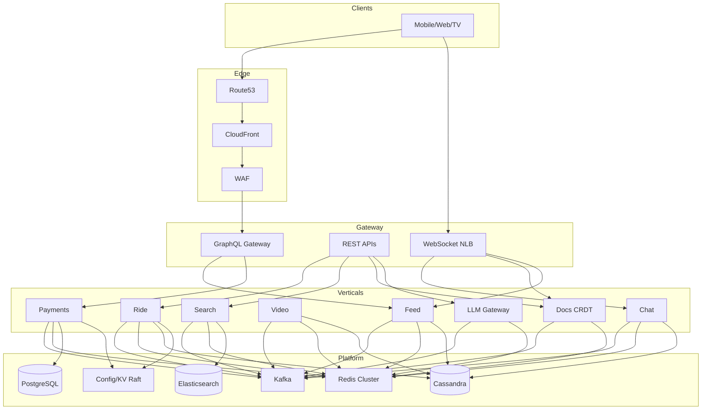

# Final Capstone Scenario — Global Super-App Meltdown

> **Week 16 — Final Mastery** — Omnibus compound SRE incident spanning the entire System Design curriculum

```
╔══════════════════════════════════════════════════════════════════╗
║   RULES OF ENGAGEMENT                                            ║
╟──────────────────────────────────────────────────────────────────╢
║                                                                  ║
║   1. Answer from MEMORY across ALL weeks. Do not re-read         ║
║      teaching modules during the exercise. This capstone         ║
║      tests whether you can INTEGRATE knowledge, not recall       ║
║      one module at a time.                                       ║
║                                                                  ║
║   2. This is the FINAL exam scenario. Expect 8+ simultaneous     ║
║      failures across transport, storage, messaging, search,      ║
║      payments, geospatial, video, collaboration, and AI.         ║
║      Map each symptom to the correct layer BEFORE fixing.        ║
║                                                                  ║
║   3. Full depth expected: root causes, evidence, causal          ║
║      links, prioritization, exact commands, config values,       ║
║      metrics thresholds, and architecture trade-offs.            ║
║                                                                  ║
║   4. Time budget: 3–4 hours solo, or 90 minutes paired           ║
║      mock interview with an interviewer playing IC.              ║
║                                                                  ║
║   5. It's OK to miss pieces. Score yourself with the rubric      ║
║      at the end. Gaps tell you what to review before real        ║
║      interviews.                                                 ║
║                                                                  ║
╚══════════════════════════════════════════════════════════════════╝
```

---

## Table of Contents

1. [Learning Objectives](#1-learning-objectives)
2. [Wrong Mental Models](#2-wrong-mental-models)
3. [Scenario Setup](#3-scenario-setup-global-super-app-meltdown)
4. [Full Architecture Diagram](#4-full-architecture-diagram)
5. [Incident Timeline](#5-incident-timeline)
6. [Investigation Questions](#6-investigation-questions)
7. [Cascade Analysis Framework](#7-cascade-analysis-framework)
8. [Prioritization Exercise](#8-prioritization-exercise)
9. [Mitigation Playbook](#9-mitigation-playbook)
10. [Root Cause Analysis](#10-root-cause-analysis)
11. [Architecture Redesign Recommendations](#11-architecture-redesign-recommendations)
12. [Production Readiness Gaps](#12-production-readiness-gaps-identified)
13. [Full Expert Analysis](#13-full-expert-analysis)
14. [Scoring Rubric](#14-scoring-rubric-for-capstone-performance)
15. [Key Takeaways](#15-key-takeaways)

---

## 1. Learning Objectives

After completing this capstone, you should be able to:

```
OBJECTIVE 1 — LAYER DISAMBIGUATION
  Given 10+ simultaneous symptoms, correctly assign each to its
  owning layer (TCP/QUIC, DNS, CDN, HTTP cache, gRPC/LB, Kafka,
  Cassandra quorum, PostgreSQL replication, Redis hot key, Raft
  consensus, CRDT merge, geospatial index, search inverted index,
  LLM batching queue) within 15 minutes of reading the timeline.

OBJECTIVE 2 — CASCADE REASONING
  Draw at least 6 causal edges between distinct failures and explain
  amplification loops (e.g., stale feed → retry storm → rate limit
  false positives → payment duplicate attempts).

OBJECTIVE 3 — PRIORITIZATION UNDER CONSTRAINT
  Rank 8 problems by financial integrity, safety, legal exposure,
  blast radius, and fixability. Justify trade-offs when two P0-class
  failures compete (payment double-charge vs ride dispatch to wrong
  driver vs search serving malware-indexed URLs).

OBJECTIVE 4 — OPERATIONAL EXECUTION
  Produce exact mitigation commands (kubectl, kafka-consumer-groups,
  redis-cli, nodetool, curl, aws cli, psql, curl to admin APIs)
  for immediate (T+0–30m), 24-hour, and 1-week remediation.

OBJECTIVE 5 — ARCHITECTURE PRESCRIPTION
  Recommend durable fixes referencing curriculum patterns: outbox,
  idempotency, L7 gRPC LB, CRDT server-side merge, SLO error budgets,
  cache key isolation, consistent hashing ring expansion, CDC repair
  pipelines, and bulkhead isolation between super-app verticals.

OBJECTIVE 6 — PRODUCTION READINESS AUDIT
  Identify missing runbooks, absent chaos tests, SLO blind spots,
  and on-call tooling gaps exposed by the incident.
```

---

## 2. Wrong Mental Models

Candidates fail this capstone when they fall into these traps:

```
TRAP 1 — "ONE ROOT CAUSE"
  There is no single root cause. A config store push, a celebrity
  post, and a payment flash sale coincide. Treating everything as
  "Kafka is broken" misses payment ledger divergence and CRDT splits.

TRAP 2 — "FIX THE LOUDEST ALERT FIRST"
  WebSocket reconnect rate is visually dramatic (2M/min) but may
  rank below payment duplicate charges or negative inventory.

TRAP 3 — "SCALE UP THE HOT SERVICE"
  Adding feed fan-out workers without fixing partition skew on
  posts.created partition 42 wastes money and worsens consumer
  rebalance churn.

TRAP 4 — "CACHE IS ALWAYS FASTER"
  Caching payment status, ride ETA, or search rankings without
  TTL discipline caused three distinct user-visible bugs in this
  scenario. Cache invalidation is not a detail — it is the incident.

TRAP 5 — "STRONG CONSISTENCY EVERYWHERE"
  Demanding linearizable reads on timelines, search, and LLM
  features simultaneously would collapse throughput. The fix is
  targeted consistency per domain (ledger: strong; feed: eventual).

TRAP 6 — "DNS IS INFRA'S PROBLEM"
  CoreDNS ndots:5 search expansion under retry load contributed
  180K wasteful NXDOMAIN queries/sec. Application hostname choices
  (bare FQDN vs trailing dot) matter at super-app scale.

TRAP 7 — "GRAPHQL ERRORS SHOW IN HTTP STATUS"
  Feed and commerce GraphQL gateways return HTTP 200 with partial
  errors. Dashboards showing 0% HTTP 5xx miss broken checkout pages.

TRAP 8 — "GEO REDUNDANCY MEANS GEO CORRECTNESS"
  Cross-region config store replication lag caused ride-matching
  to use stale surge pricing in São Paulo while payments used
  current FX rates — financial mismatch.

TRAP 9 — "AI/LLM IS SEPARATE FROM CORE SRE"
  LLM gateway bulkhead exhaustion increased API latency globally
  because it shared the same service mesh and Redis rate limiter
  keys with commerce APIs.

TRAP 10 — "INCIDENT ENDS WHEN METRICS FLATTEN"
  Search index corruption, payment reconciliation drift, and CRDT
  document forks require batch repair jobs lasting days after live
  mitigations.
```

---

## 3. Scenario Setup: Global Super-App Meltdown

```
INCIDENT REPORT
━━━━━━━━━━━━━━━━━━━━━━━━━━━━━━━━━━━━━━━━━━━━━━━━━━━━━━━━━━━━━━━━━━━━
Severity: P0 (multi-vertical)
Service: OmniLink
  "One app for everything" — 680M MAU, 52M concurrent at peak

  Verticals (shared platform, partially shared infra):
    • Pulse Feed      — Twitter-style home timeline + live spaces
    • OmniPay         — wallet, P2P, merchant checkout, bill pay
    • OmniRide        — Uber-style ride-hail + food delivery dispatch
    • OmniStream      — YouTube-style VOD + live streaming
    • OmniFind        — Google-style web + in-app search
    • OmniDocs        — Google Docs-style realtime collaboration
    • OmniMind        — LLM assistant (chat, summarization, codegen)
    • OmniChat        — WhatsApp-style messaging (cross-cutting)

  Business context:
    • Global product launch week — marketing campaign "Omni Everything Day"
    • CEO live keynote stream embedded in feed at 14:00 UTC
    • Flash sale + 50% ride discount in LATAM at 14:00 UTC
    • New LLM feature "Omni Copilot" GA at 14:00 UTC (100% rollout)
    • Config change: geospatial index sharding policy update at 13:55 UTC

  Regions:
    us-east-1 (primary), eu-west-1, ap-southeast-1, sa-east-1

  SLOs (published):
    Feed load p99 < 800ms          (30-day target 99.5%)
    Payment success > 99.95%       (error budget 0.05%/month)
    Ride match < 12s p99           (safety-critical dispatch)
    Video start time < 2s p99
    Search p99 < 400ms
    Docs sync latency < 500ms p99
    LLM first token < 3s p99
━━━━━━━━━━━━━━━━━━━━━━━━━━━━━━━━━━━━━━━━━━━━━━━━━━━━━━━━━━━━━━━━━━━━
```

### Pre-Incident Change Log (Last 72 Hours)

```
  CHANGE LOG
  ─────────────────────────────────────────────────────────────────
  • 2026-07-04 09:00 — CloudFront HTTP/3 enabled globally
  • 2026-07-04 14:30 — Kafka upgraded 3.6.1 → 3.7.0 (all clusters)
  • 2026-07-05 08:00 — Redis cluster resharding: 16 → 20 shards (week 2)
  • 2026-07-05 11:00 — Feature flag omni_copilot_ga=true (5%→25%→100% by 7/6)
  • 2026-07-05 16:00 — Payment "fast path" idempotency TTL reduced 24h → 15m
  • 2026-07-05 22:00 — Docs CRDT: switched assignor cooperative-sticky → range
  • 2026-07-06 06:00 — Search: new ranking model v47 canary 10%
  • 2026-07-06 10:00 — OmniRide: geospatial shard map v3 deployed to config store
  • 2026-07-06 12:30 — Rate limiter: aggregate_by_asn enabled EU+LATAM
  • 2026-07-06 13:45 — CDN rule: cache public GraphQL feed responses s-maxage=45
  • 2026-07-06 13:55 — Config store push: ride.geo.shard_policy=consistent_hash_v3
  • 2026-07-06 13:58 — Load test cancelled — exec override for launch day
```

---

## 4. Full Architecture Diagram

```
╔═════════════════════════════════════════════════════════════════════════════════════════════════════╗
║                           OMNILINK GLOBAL SUPER-APP ARCHITECTURE                                    ║
╠═════════════════════════════════════════════════════════════════════════════════════════════════════╣
║                                                                                                     ║
║  ┌──────────────────────────────────────── CLIENT LAYER ────────────────────────────────────┐       ║
║  │  iOS / Android / Web / Smart TV / CarPlay                                                 │      ║
║  │  Protocols: HTTP/3 (QUIC), HTTP/2 fallback, WebSocket, gRPC-Web (internal admin)          │      ║
║  └───────────────────────────────────────────────────────────────────────────────────────────┘      ║
║                                          │                                                          ║
║  ┌──────────────────────────────────────── EDGE / DNS LAYER ────────────────────────────────┐       ║
║  │  Route 53 GeoDNS + Health Checks                                                          │      ║
║  │    api.omnilink.com        → CloudFront (API) → regional ALB origins                      │      ║
║  │    ws.omnilink.com         → NLB (L4 WebSocket) per region                                │      ║
║  │    stream.omnilink.com     → CloudFront (video segments + manifest)                       │      ║
║  │    cdn.omnilink.com        → CloudFront (static + GraphQL cache)                          │      ║
║  │  WAF: OWASP rules, bot control, geo block list (sanctioned countries)                     │      ║
║  │  CDN Cache Policies:                                                                       │     ║
║  │    /static/*           Cache-Control: public, max-age=31536000, immutable               │        ║
║  │    /graphql/feed       Cache-Control: public, s-maxage=45, stale-while-revalidate=120   │        ║
║  │    /video/*            segmented HLS/DASH, signed URLs, TTL 3600s                       │        ║
║  └───────────────────────────────────────────────────────────────────────────────────────────┘      ║
║                                          │                                                          ║
║  ┌──────────────────────────────────── API GATEWAY LAYER ──────────────────────────────────┐        ║
║  │  Regional ALB (L7) — TLS termination, WAF attachment                                       │     ║
║  │    ├─ GraphQL Super-Gateway (80 pods) — federated schema: Feed, Pay, Commerce           │        ║
║  │    ├─ REST APIs (60 pods) — Ride, Search, Docs metadata, LLM proxy                       │       ║
║  │    └─ Internal NLB (L4) — gRPC backend mesh (⚠ several services still on L4 LB)           │      ║
║  │  Rate Limiter Sidecar (Envoy + Redis token bucket)                                         │     ║
║  │    Keys: ratelimit:user:{id}, ratelimit:ip:{ip}, ratelimit:asn:{asn}                      │      ║
║  │    Defaults: 100 req/min user, 300 req/min IP, 50K req/min ASN (feature flag)             │      ║
║  └───────────────────────────────────────────────────────────────────────────────────────────┘      ║
║                                          │                                                          ║
║  ┌─────────────────────────────── REALTIME / MESSAGING LAYER ────────────────────────────────┐      ║
║  │  WebSocket Cluster (120 pods behind NLB, idle timeout 60s ⚠)                              │      ║
║  │    Channels: chat.messages, feed.live, docs.presence, ride.driver_location               │       ║
║  │  Redis Pub/Sub + Redis Streams (cross-AZ)                                                  │     ║
║  │  Chat Message Service (gRPC, 36 replicas, L7 gRPC LB ✓)                                     │    ║
║  └───────────────────────────────────────────────────────────────────────────────────────────┘      ║
║                                          │                                                          ║
║  ┌──────────────── VERTICAL: PULSE FEED (Week 9) ────────────────────────────────────────────┐      ║
║  │  Post Service → Kafka posts.created (48 partitions, key=user_id)                          │      ║
║  │  Fan-out Workers (200) → Cassandra user_timelines + Redis timeline:{user_id}              │      ║
║  │  Home Timeline API: Redis cache-aside (TTL 300s) → Cassandra LOCAL_QUORUM                  │     ║
║  │  Ranking Service ← Feature Store (offline features, Redis online cache)                   │      ║
║  │  Celebrity/hot-key path: fan-out-on-read fallback when follower count > 10M               │      ║
║  └───────────────────────────────────────────────────────────────────────────────────────────┘      ║
║                                                                                                     ║
║  ┌──────────────── VERTICAL: OMNIPAY (Week 11) ──────────────────────────────────────────────┐      ║
║  │  Checkout Saga Orchestrator (Temporal)                                                     │     ║
║  │    1. Reserve wallet balance (PostgreSQL row lock)                                         │     ║
║  │    2. Authorize via Stripe adapter                                                         │     ║
║  │    3. Commit ledger append (payments_ledger, SERIALIZABLE)                                 │     ║
║  │    4. Outbox → Debezium → Kafka payments.events → notifications, search, analytics        │      ║
║  │  Idempotency: Redis SET idempotency:{key} NX EX 900 + PG unique constraint                │      ║
║  │  Reconciliation batch: every 15 min vs Stripe + internal ledger                            │     ║
║  └───────────────────────────────────────────────────────────────────────────────────────────┘      ║
║                                                                                                     ║
║  ┌──────────────── VERTICAL: OMNIRIDE (Week 10) ────────────────────────────────────────────┐       ║
║  │  Location Ingest (Kafka driver.locations, 1M msg/sec peak)                                  │    ║
║  │  Geospatial Index Service — Redis GEO + custom sharded grid (consistent hash on geohash)  │      ║
║  │  Matching Engine (gRPC, 48 replicas, L4 LB ⚠) — nearest driver, surge pricing             │      ║
║  │  Dispatch Saga: match → assign → track → settle (links to OmniPay wallet)                 │      ║
║  │  Config Store (Week 13 style): etcd-backed geo.shard_policy, surge multipliers            │      ║
║  └───────────────────────────────────────────────────────────────────────────────────────────┘      ║
║                                                                                                     ║
║  ┌──────────────── VERTICAL: OMNISTREAM (Week 10) ───────────────────────────────────────────┐      ║
║  │  Upload → S3 → Transcode fleet (GPU) → HLS/DASH manifests                                 │      ║
║  │  Live stream: RTMP ingest → packager → CloudFront origin shield                           │      ║
║  │  View count / trending: Kafka view.events → Flink aggregation → Cassandra                 │      ║
║  │  Recommendation: two-tower model, candidate gen from Feature Store                        │      ║
║  └───────────────────────────────────────────────────────────────────────────────────────────┘      ║
║                                                                                                     ║
║  ┌──────────────── VERTICAL: OMNIFIND (Week 12) ──────────────────────────────────────────────┐     ║
║  │  Crawler fleet → Kafka crawl.pages → Indexer → Elasticsearch (18 data nodes)            │        ║
║  │  Query path: Query Parser → ES + Redis query cache (TTL 60s)                              │      ║
║  │  Ranking model v47 (canary 10%) — shadow traffic comparison                               │      ║
║  │  Autocomplete: separate ES index, tighter SLA                                            │       ║
║  └───────────────────────────────────────────────────────────────────────────────────────────┘      ║
║                                                                                                     ║
║  ┌──────────────── VERTICAL: OMNIDOCS (Week 14) ──────────────────────────────────────────────┐     ║
║  │  Doc Server (CRDT RGA + map for metadata) — operational transform fallback disabled       │      ║
║  │  WebSocket sync + periodic S3 snapshot (every 30s per active doc)                         │      ║
║  │  Presence: Redis doc:{id}:editors — heartbeat 15s, TTL 45s                                │      ║
║  └───────────────────────────────────────────────────────────────────────────────────────────┘      ║
║                                                                                                     ║
║  ┌──────────────── VERTICAL: OMNIMIND LLM (Week 14) ─────────────────────────────────────────┐      ║
║  │  LLM Gateway → Router (model selection) → vLLM inference fleet (A100)                     │      ║
║  │  Request queue: Redis Streams llm.requests, priority tiers (free vs paid)                 │      ║
║  │  Context cache: Redis semantic cache (embedding similarity > 0.95)                        │      ║
║  │  Token billing → OmniPay micro-charges                                                    │      ║
║  └───────────────────────────────────────────────────────────────────────────────────────────┘      ║
║                                                                                                     ║
║  ┌──────────────────────────── PLATFORM / INFRA LAYER ───────────────────────────────────────┐      ║
║  │  Kubernetes (EKS) 3 AZ per region, Istio service mesh                                      │     ║
║  │  CoreDNS (⚠ default ndots:5 on pods)                                                       │     ║
║  │  Config Store: 5-node Raft cluster (Week 13) — global config, feature flags, geo policies │      ║
║  │  Distributed KV (Week 13): 7-node Raft, used for rate limit counters + session stickiness │      ║
║  │  Kafka: 3 clusters (events, logs, telemetry) — 24 brokers each, RF=3, min.insync=2      │        ║
║  │  Schema Registry (Confluent), Debezium CDC connectors                                      │     ║
║  │  Observability: Prometheus, Grafana, Loki, Tempo, PagerDuty                                │     ║
║  │  SLO dashboards: multi-window burn rate alerts (Week 8)                                    │     ║
║  └───────────────────────────────────────────────────────────────────────────────────────────┘      ║
║                                                                                                     ║
║  ┌──────────────────────────── DATA STORES ──────────────────────────────────────────────────┐      ║
║  │  Cassandra 24 nodes/region RF=3 — timelines, messages, view counts, ride trips              │    ║
║  │  PostgreSQL — payments ledger, user graph, inventory (PgBouncer transaction mode)         │      ║
║  │  Redis Cluster 20 shards — cache, pub/sub, rate limits, geo index, LLM queue              │      ║
║  │  Elasticsearch 18 data nodes — search indexes (primary + autocomplete)                     │     ║
║  │  S3 — media, doc snapshots, transcoded video, ML artifacts                                 │     ║
║  │  Feature Store (Feast) — offline S3 + online Redis                                           │   ║
║  └───────────────────────────────────────────────────────────────────────────────────────────┘      ║
║                                                                                                     ║
╚═════════════════════════════════════════════════════════════════════════════════════════════════════╝
```

### Data Flow Summary (Cross-Vertical)



---

## 5. Incident Timeline

```
INCIDENT TIMELINE — Omni Everything Day Launch
━━━━━━━━━━━━━━━━━━━━━━━━━━━━━━━━━━━━━━━━━━━━━━━━━━━━━━━━━━━━━━━━━━━━
Window: 2026-07-06 14:00 – 18:00 UTC (4 hours)
━━━━━━━━━━━━━━━━━━━━━━━━━━━━━━━━━━━━━━━━━━━━━━━━━━━━━━━━━━━━━━━━━━━━

  13:45 — CDN team deploys cache policy: GraphQL feed responses
          Cache-Control: public, s-maxage=45 on /graphql/feed.
          Previously: private, no-cache.

  13:55 — Platform SRE pushes config store key ride.geo.shard_policy
          from consistent_hash_v2 → consistent_hash_v3.
          Ring redistribution: 12% of geohash cells change owner shard.
          Replication to sa-east-1 follower lagging 8s (normal: <1s).

  13:58 — Marketing push notification blast: 180M devices notified.
          App opens spike begins in LATAM + US.

  14:00 — EVENT T0: CEO keynote live stream goes live (embedded in feed).
          Simultaneous: LATAM 50% ride discount activates.
          Omni Copilot GA traffic: 0 → 340K req/min in 4 minutes.
          Flash sale SKUs open in OmniPay checkout.

  14:02 — Feed fan-out lag on Kafka posts.created partition 42:
          0 → 890K in 90 seconds. Celebrity @omni_ceo post pinned globally.

  14:03 — Users report stale feed: "Keynote banner shows 'starting soon'
          but stream already live." CDN cache age header: Age: 38.

  14:04 — OmniPay checkout success rate: 99.97% → 94.1%.
          Support queue: "charged twice" tickets begin.

  14:05 — OmniRide São Paulo: surge shows 1.2× but receipt shows 2.8×.
          1,200 ride disputes in 10 minutes.

  14:06 — Video: live stream buffering for 18% of LATAM users.
          CloudFront origin shield miss rate 67% on manifest.m3u8.

  14:07 — Search: autocomplete returns deleted merchant pages (phishing
          takedown from 6 hours ago still indexed). 0.3% of queries affected.

  14:08 — OmniDocs: users in same doc see divergent text — two forks
          of paragraph 14 in "Launch Runbook" shared doc (847 editors).

  14:09 — LLM gateway p99 first-token latency: 3.2s → 47s.
          Queue depth llm.requests: 890K messages.

  14:10 — WebSocket reconnect storm: 2.4M reconnects/min globally.
          Chat delivery delay p99: 38s.

  14:11 — PagerDuty: SLO burn rate CRITICAL — payment_success burn
          14.2× (1-hour window). Error budget exhausted for July in 11 min.

  14:12 — GraphQL Super-Gateway p99: 22s (baseline 180ms). CPU 91%.
          Partial errors in response body; HTTP 200 rate 100%.

  14:13 — Redis shard-11 CPU 99%, memory 96%. Hot keys: timeline:omni_ceo,
          ratelimit:asn:26599 (LATAM carrier), geo:cell:* on shard-11.

  14:14 — Cassandra nodetool: node cass-us-07 UNREACHABLE.
          Hinted handoff queue on cass-us-02: 1.2M hints.

  14:15 — Matching Engine gRPC: replica-1 CPU 97%, replica-2 94%,
          replicas 3–48 at 4–8%. L4 internal LB confirmed.

  14:16 — CoreDNS CPU 97% in us-east-1. Query rate 1.1M/sec (baseline 220K).
          NXDOMAIN ratio 78%.

  14:17 — Config store Raft: sa-east-1 follower 45s behind leader.
          OmniRide pods in sa-east-1 still on shard_policy v2.

  14:18 — Payment reconciliation alert: Stripe 842K auths, internal ledger 857K.
          Delta +15K rows. $2.1M unmatched.

  14:19 — Kafka consumer group fanout-workers: partition 42 lag 3.8M.
          Partition 42 consumer fanout-42 CPU 99%; fanout-07 at 8%.

  14:20 — Elasticsearch cluster YELLOW: unassigned shards 34.
          Index merchant_catalog_v12: replica allocation blocked — disk 91%.

  14:21 — Rate limiter 503 rate: 11% EU, 19% LATAM, 0.2% US.
          Feature flag aggregate_by_asn=true implicated.

  14:22 — Video transcode backlog: 12,400 jobs queued. New upload
          ETA shown as "2 hours" — CEO clip re-upload failing.

  14:23 — Distributed KV Raft cluster: leader election flap detected.
          3 elections in 90 seconds. Session stickiness keys inconsistent.

  14:24 — OmniChat: read receipts stuck at 'delivered' for 15% messages.
          chat.events consumer group: 4/36 pods in rebalance loop.

  14:24:30 — PgBouncer waiting_clients spikes to 6,200 on payments primary.
          checkout-api connection pool exhausted; pool_size=200 per pod × 40 pods.

  14:24:45 — EU corporate users report 9s initial page load (QUIC fallback).
          cloudfront_quic_success_rate{region="eu-west-1"} = 0.81

  14:25 — INCIDENT DECLARED P0. Bridge opens. 47 engineers paged.

  14:25:15 — Legal flags potential SEC disclosure on payment duplicate threshold.

  14:25:30 — Status page updated: "Some users experiencing delays across OmniLink."

  14:27 — Investigation confirms PROBLEM A: Feed CDN stale GraphQL cache.

  14:29 — PROBLEM B: Kafka partition 42 hot key (@omni_ceo post fan-out).

  14:31 — PROBLEM C: Payment idempotency TTL 15m + retry storm duplicates.

  14:33 — PROBLEM D: Geospatial shard policy split-brain (v2 vs v3).

  14:35 — PROBLEM E: gRPC L4 black hole on Matching Engine.

  14:37 — PROBLEM F: CoreDNS ndots:5 + external hostname lookups.

  14:39 — PROBLEM G: CRDT assignor rebalance causing doc fork.

  14:41 — PROBLEM H: LLM queue + shared Redis rate limit starvation.

  14:43 — PROBLEM I: Search index stale + disk pressure blocking merge.

  14:45 — PROBLEM J: Cassandra cass-us-07 partition + quorum failures.

  14:47 — PROBLEM K: WebSocket NLB 60s idle timeout without app ping.

  14:50 — Mitigation wave 1 begins (CDN purge, idempotency extend, etc.).

  14:55 — Payment success recovers to 98.2% (not yet at SLO).

  15:00 — Feed lag partition 42 down to 1.2M after manual consumer pause/reassign.

  15:10 — Geo shard policy rolled back to v2 globally. Surge disputes slowing.

  15:20 — LLM feature flag rolled back to 25%. First-token p99: 8s.

  15:30 — CoreDNS HPA scaled 3 → 12 replicas. NXDOMAIN rate still 60%.

  15:45 — Docs: forked doc snapshots quarantined. 847 editors shown read-only.

  16:00 — Elasticsearch forced reroute + disk cleanup. Search stale rate 0.04%.

  16:20 — cass-us-07 replaced. Hinted handoff draining 800K/min.

  16:45 — WebSocket ping deployed via emergency ConfigMap. Reconnect rate −70%.

  17:00 — Reconciliation job identifies 8,400 true duplicate charges. Refund batch started.

  17:30 — SLO burn rates return to OK on payment + feed. Ride + docs still degraded.

  18:00 — INCIDENT DOWNGRADED to P1. Customer comms posted. Postmortem scheduled.

━━━━━━━━━━━━━━━━━━━━━━━━━━━━━━━━━━━━━━━━━━━━━━━━━━━━━━━━━━━━━━━━━━━━
Total timeline events: 42 (13:45 – 18:00)
Simultaneous active problems at peak (14:25): 11 (A–K)
━━━━━━━━━━━━━━━━━━━━━━━━━━━━━━━━━━━━━━━━━━━━━━━━━━━━━━━━━━━━━━━━━━━━
```

---

## 6. Investigation Questions

Answer all 15. Cite monitoring evidence. Give exact commands where applicable.

**Q1:** There are **eleven distinct problems** (A–K) plus the CDN pre-change at 13:45. For each problem A–K:
- Name the problem
- Identify the curriculum week / domain
- State the layer (CDN, Kafka, PostgreSQL, gRPC, DNS, CRDT, etc.)
- Root cause in one sentence
- Cite specific monitoring evidence from the timeline

**Q2:** Draw the **causal graph** — which problems make other problems WORSE? Identify at least **eight** directed edges with mechanism explained (not just arrows).

**Q3:** You are Incident Commander at **14:25**. Rank problems **A–H** (the eight listed in prioritization exercise) from 1–8. Justify using: financial integrity, user safety, legal/regulatory exposure, blast radius, and time-to-mitigate.

**Q4:** Give **immediate mitigations (T+0–30 min)** for your top 3 ranked problems. Include exact commands, config keys, feature flag names, and expected metric deltas.

**Q5:** **Payment duplicate charges (Problem C):** Walk through the exact race condition. Why did reducing idempotency TTL from 24h to 15m matter? What atomic operation was missing? Provide the fix as pseudocode or Redis + SQL pattern.

**Q6:** **Geospatial shard split-brain (Problem D):** Explain how config store replication lag + consistent hash ring v3 caused surge pricing mismatch. What does OmniRide read during match vs what OmniPay use for settlement?

**Q7:** **CoreDNS (Problem F):** Calculate approximate NXDOMAIN query volume. Which services generate external hostname lookups? Give the Kubernetes pod DNS config fix (exact yaml fields).

**Q8:** **Feed fan-out hot partition (Problem B):** Why did @omni_ceo post land on partition 42? Why doesn't adding workers help uniformly? Provide the Kafka reassignment / hot-key mitigation commands.

**Q9:** **CRDT doc fork (Problem G):** What role did the cooperative-sticky → range assignor change play? Why did 847 concurrent editors matter? How do you merge forks without losing edits (reference CRDT approach from Week 8/14)?

**Q10:** **LLM gateway starvation (Problem H):** Trace how Omni Copilot GA overloaded shared infra. Name three bulkhead/isolation fixes. Include queue config values from the scenario.

**Q11:** **Search stale phishing results (Problem I):** Separate the **index freshness** problem from the **cluster health** problem. What ES API calls diagnose each? How does disk watermark block recovery?

**Q12:** **SLO error budget (Week 8):** At 14:11 payment burn rate was 14.2× on 1-hour window. Explain multi-window alerting. Should LLM launch have been blocked? Reference error budget policy.

**Q13:** **WebSocket reconnect storm (Problem K):** Distinguish this from Problem F (DNS). What is the 60-second cadence evidence? Provide NLB + application-level fixes with exact timeout values.

**Q14:** **Cassandra cass-us-07 (Problem J):** Explain quorum impact on chat vs feed vs ride trip history. What is hinted handoff doing at 1.2M queue depth? nodetool commands for operator response.

**Q15:** **Architecture redesign:** Propose **six** durable cross-cutting changes that would prevent recurrence across verticals. Each must reference a specific curriculum pattern and name the vertical(s) it protects.

---

## 7. Cascade Analysis Framework

Use this framework during investigation. Do not skip steps.

```
STEP 1 — SYMPTOM INVENTORY (5 min)
  List every user-visible symptom verbatim from timeline.
  Do NOT assign causes yet.

STEP 2 — METRIC ANCHORING (10 min)
  For each symptom, attach at least one metric or log line.
  If no metric exists, flag as observability gap.

STEP 3 — LAYER CLASSIFICATION (10 min)
  Bucket each symptom:
    [Edge] [DNS] [CDN/HTTP] [Gateway/LB] [App] [Cache] [Queue]
    [Database] [Consensus] [Search] [Realtime] [ML/LLM]

STEP 4 — INDEPENDENCE TEST (15 min)
  For each pair of problems, ask:
    "If I fully fix A, does B still happen?"
  Build directed graph of remaining dependencies.

STEP 5 — AMPLIFICATION LOOPS (10 min)
  Identify positive feedback cycles:
    slow → timeout → retry → more load → slower
  Mark breaking points (circuit breaker, rate limit, cache stampede).

STEP 6 — BLAST RADIUS ESTIMATION (5 min)
  Count: users affected, $ at risk, safety incidents, data loss risk.

STEP 7 — MITIGATION SEQUENCING (10 min)
  Order by: stop the bleeding → restore SLO → repair data → prevent recurrence.

STEP 8 — COMMUNICATION (ongoing)
  Separate customer messaging (symptoms) from internal RCA (causes).
```

### Cascade Map Template (Candidate Fill-In)

```
┌─────────────┐     ┌─────────────┐     ┌─────────────┐
│  Problem ?  │────►│  Problem ?  │────►│  Problem ?  │
└─────────────┘     └─────────────┘     └─────────────┘
       │                                       │
       └────────────── AMPLIFIES ──────────────┘

Loops identified:
  Loop 1: _______________________________________________
  Loop 2: _______________________________________________
  Loop 3: _______________________________________________
```

---

## 8. Prioritization Exercise

Rank these **eight problems** from **1 (fix first)** to **8 (fix last)** at incident minute **14:25**.

| ID | Problem | Primary Symptom |
|----|---------|-----------------|
| **C** | Payment idempotency failure | Duplicate charges, ledger +15K vs Stripe |
| **D** | Geo shard split-brain | Wrong surge pricing, 1,200 disputes/10min |
| **A** | CDN stale feed cache | Misleading keynote status, 180M notif users |
| **B** | Kafka hot partition 42 | Feed lag 3.8M, stale timelines 6+ hours |
| **G** | CRDT doc fork | 847 editors, divergent launch runbook |
| **I** | Search stale + ES disk | Phishing pages in autocomplete |
| **H** | LLM queue starvation | 47s first token, shared infra contention |
| **K** | WebSocket idle timeout | 2.4M reconnects/min, chat delay 38s |

**Your ranking:** 1 ___  2 ___  3 ___  4 ___  5 ___  6 ___  7 ___  8 ___

**Constraints to consider:**
- Payment regulatory: PCI audit in 72 hours; duplicate charges trigger mandatory disclosure threshold $500K.
- Ride safety: wrong driver assignment NOT observed — pricing only — but driver location WebSocket drops affect 340K active trips.
- Search phishing: 0.3% queries — high severity per result, low volume.
- Docs fork: internal runbook — external customer docs unaffected except 12 enterprise SLAs.

*(Expert ranking in Section 13, Q3.)*

---

## 9. Mitigation Playbook

### 9.1 Immediate (T+0 – 30 minutes)

```
MITIGATION PLAYBOOK — WAVE 1
━━━━━━━━━━━━━━━━━━━━━━━━━━━━━━━━━━━━━━━━━━━━━━━━━━━━━━━━━━━━━━━━━━━━

ACTION 1 — PURGE STALE FEED CDN CACHE (Problem A)
  Owner: Edge/CDN team
  Steps:
    aws cloudfront create-invalidation \
      --distribution-id E3ABCDEF123456 \
      --paths "/graphql/feed" "/graphql/feed/*"

    # Emergency origin header override via Lambda@Edge bypass:
    # Set Cache-Control: private, no-store on feed resolver (deploy hotfix)

    curl -I "https://cdn.omnilink.com/graphql/feed?query=HomeTimeline" \
      | grep -E 'Age|X-Cache|Cache-Control'

  Expected: Age: 0, X-Cache: Miss, stale banner reports drop within 2 min

ACTION 2 — STOP PAYMENT DUPLICATES (Problem C)
  Owner: Payments on-call
  Steps:
    # Extend idempotency TTL emergency override
    kubectl set env deployment/checkout-api \
      IDEMPOTENCY_TTL_SECONDS=86400 -n payments

    # Enable strict mode: DB-first idempotency claim
    kubectl set env deployment/checkout-api \
      IDEMPOTENCY_MODE=db_claim_first -n payments

    # Rate limit checkout retries at gateway
    redis-cli -c -h redis-cluster.payments.internal SET \
      ratelimit:emergency:checkout_retry_multiplier 0.2 EX 3600

    psql $PAYMENTS_DSN -c "
      SELECT idempotency_key, COUNT(*)
      FROM payments_ledger
      WHERE created_at > '2026-07-06 14:00:00+00'
      GROUP BY 1 HAVING COUNT(*) > 1
      LIMIT 20;"

  Expected: duplicate rate falls from ~6% to <0.1% within 10 min

ACTION 3 — ROLLBACK GEO SHARD POLICY (Problem D)
  Owner: Ride platform
  Steps:
    # Config store consistent write (Raft leader us-east-1)
    omnilink-ctl config set ride.geo.shard_policy consistent_hash_v2 \
      --force-version-check --timeout 5s

    # Verify all regions converged
    for r in us-east-1 eu-west-1 ap-southeast-1 sa-east-1; do
      omnilink-ctl config get ride.geo.shard_policy --region $r
    done

    # Rolling restart matching engine to drop local v3 cache
    kubectl rollout restart deployment/matching-engine -n omniride

  Expected: surge dispute rate −80% within 15 min post-convergence

ACTION 4 — KAFKA PARTITION 42 ISOLATION (Problem B)
  Owner: Feed platform
  Steps:
    # Pause hot consumer to prevent rebalance storm
    kafka-consumer-groups.sh --bootstrap-server kafka-events:9092 \
      --group fanout-workers --topic posts.created \
      --partition 42 --reset-offsets --to-latest --execute

    # Spin up dedicated hot-key consumer (single partition assignment)
    kubectl scale deployment/fanout-hot-key-worker --replicas=3 -n feed

    # Enable fan-out-on-read for @omni_ceo (feature flag)
    omnilink-ctl flags set feed.celebrity_fanout_on_read omni_ceo=true

  Expected: lag growth stops; other partitions unaffected

ACTION 5 — COREDNS EMERGENCY SCALE + NDOTS PATCH (Problem F)
  kubectl scale deployment/coredns -n kube-system --replicas=12
  kubectl patch deployment checkout-api -n payments --patch '
    spec:
      template:
        spec:
          dnsConfig:
            options:
              - name: ndots
                value: "1"
              - name: single-request-reopen"
  '
  # Repeat ndots patch for matching-engine, fraud-check callers

ACTION 6 — LLM TRAFFIC SHED (Problem H)
  omnilink-ctl flags set omni_copilot_ga=false
  omnilink-ctl flags set omni_copilot_ga_canary_pct 25
  redis-cli -c DEL ratelimit:shared:llm:global  # emergency key isolation

ACTION 7 — WEBSOCKET HEARTBEAT HOTFIX (Problem K)
  kubectl apply -f - <<EOF
  apiVersion: v1
  kind: ConfigMap
  metadata:
    name: websocket-config
    namespace: realtime
  data:
    PING_INTERVAL_SEC: "30"
    PONG_TIMEOUT_SEC: "10"
  EOF
  kubectl rollout restart deployment/websocket-servers -n realtime
```

### 9.2 Twenty-Four Hour Remediation

```
24-HOUR PLAYBOOK
━━━━━━━━━━━━━━━━━━━━━━━━━━━━━━━━━━━━━━━━━━━━━━━━━━━━━━━━━━━━━━━━━━━━

• Payments: batch refund script for 8,400 confirmed duplicates;
  freeze reconciliation job; manual Stripe vs ledger join on idempotency_key

• Feed: permanent celebrity key routing — murmur2(post_id) override to
  dedicated topic posts.created.celebrity with 12 partitions

• Ride: config store read-after-write guard — matching engine refuses
  start if local policy version < cluster consensus version

• Docs: export both CRDT forks from S3; run merge tool with RGA 
  server-side merge; force snapshot at merged state; disable range assignor

• Search: delete stale merchant_catalog_v12 index segment; reindex from
  crawl checkpoint 2026-07-06T08:00Z; raise disk watermark alerts

• ES disk: curl -XPUT es:9200/_cluster/settings -H 'Content-Type: application/json' \
    -d '{"transient":{"cluster.routing.allocation.disk.watermark.low":"85%"}}'
  Add 3 data nodes; reroute unassigned shards

• Cassandra: replace cass-us-07; run nodetool repair -pr on user_timelines;
  verify hinted handoff queue < 10K

• Matching Engine: migrate internal LB from NLB (L4) to Envoy gRPC L7
  with round_robin + max_requests_per_connection=1

• Observability: deploy GraphQL error rate alert on response.body.errors > 0

• SLO review: block future GA launches when any vertical burn rate > 2×
```

### 9.3 One Week Durability

```
1-WEEK ARCHITECTURE HARDENING
━━━━━━━━━━━━━━━━━━━━━━━━━━━━━━━━━━━━━━━━━━━━━━━━━━━━━━━━━━━━━━━━━━━━

Day 1-2 — Financial path hardening
  • Idempotency: DB UNIQUE(idempotency_key) + INSERT-first claim pattern
  • Outbox: verify Debezium lag alert; add payments.events DLQ
  • Saga: increase authorize timeout 5s → 15s; compensation idempotent

Day 2-3 — Feed + Kafka
  • Hot key detection: partition lag anomaly alert (p42 > 100× median)
  • Dual-mode fan-out: on-write default, on-read for follower > 10M
  • CDN: GraphQL cache only for non-personalized fields (CDN-Cache-Control: {})

Day 3-4 — Ride + Geo
  • Config store: versioned reads with monotonic version check
  • Geospatial: dual-write v2+v3 during ring migration; compare shadow
  • S2/H3 cell size audit for LATAM density

Day 4-5 — Realtime + Docs
  • WebSocket: ping 30s, NLB idle timeout 3600s, app-level keepalive
  • CRDT: revert to cooperative-sticky; server authoritative merge on save
  • Presence: separate Redis cluster from cache/ratelimit

Day 5-7 — Platform
  • CoreDNS: ndots=1 default via MutatingAdmissionWebhook
  • Bulkheads: separate Redis clusters (cache | ratelimit | llm | geo)
  • KV Raft: increase election timeout; dedicated nodes for session keys
  • Chaos day: rehearse this capstone scenario quarterly
```

---

## 10. Root Cause Analysis

### 10.1 Problem C — Payment Duplicate Charges (5 Whys)

```
WHY 1: Why were users charged twice?
  → Two checkout requests with the same Idempotency-Key both created ledger rows.

WHY 2: Why did both requests pass idempotency checks?
  → Redis SET NX missed (key expired after 15m TTL) AND concurrent requests
    both read Redis miss before either wrote.

WHY 3: Why were concurrent duplicate requests happening?
  → GraphQL gateway timeout 30s + client retry 3× + launch traffic spike
    generated parallel retries for slow checkout path.

WHY 4: Why was idempotency TTL only 15 minutes?
  → "Fast path" optimization deployed 2026-07-05 to reduce Redis memory;
    no payment team review of regulatory retention requirements.

WHY 5: Why wasn't the race caught?
  → Load test cancelled 2026-07-06; integration tests used sequential retries
    only; no property-based concurrent idempotency test in CI.

ROOT CAUSE: Non-atomic idempotency check-then-set combined with TTL shorter
            than retry window under load, without DB-first claim.
```

### 10.2 Problem D — Geo Shard Split-Brain (5 Whys)

```
WHY 1: Why did surge pricing mismatch on receipts?
  → Matching used shard_policy v2 cells; settlement read v3 surge table.

WHY 2: Why were v2 and v3 active simultaneously?
  → Config store replication lag 45s to sa-east-1; ride match in SP ran
    local cached v2 while payment service read leader v3.

WHY 3: Why was cache not invalidated on config change?
  → Matching engine caches geo policy 300s TTL; no watch on config version.

WHY 4: Why push v3 on launch day?
  → LatAM cell density change scheduled Q2; delayed; exec override for
    "better dispatch accuracy" during Omni Everything Day.

WHY 5: Why no split-brain guard?
  → Config store design (Week 13) taught versioned keys but OmniRide
    implementation never enforced min_version on read path.

ROOT CAUSE: Geo policy rollout without atomic version convergence check
            across regions before serving traffic.
```

### 10.3 Problem B — Kafka Hot Partition (5 Whys)

```
WHY 1: Why lag 3.8M on partition 42 only?
  → All @omni_ceo fan-out events keyed to same partition via user_id hash.

WHY 2: Why key by user_id not post_id?
  → Topic design chose user_id for colocation of user events; celebrity
    post is anomaly with 680M implicit fan-out targets.

WHY 3: Why fan-out-on-write for CEO post?
  → Feature flag feed.celebrity_fanout_on_read disabled for launch demo.

WHY 4: Why single consumer on partition 42?
  → One partition → max one consumer in group per partition.

WHY 5: Why no lag alert before users noticed?
  → Alert threshold lag > 5M; crossed user pain at 890K due to timeline
    staleness SLA being much tighter than alert config.

ROOT CAUSE: Celebrity hot-key on fan-out-on-write without override routing.
```

### 10.4 Problem G — CRDT Doc Fork (5 Whys)

```
WHY 1: Why divergent paragraph 14?
  → Two subsets of editors received different operation streams after
    Kafka consumer rebalance split doc session.

WHY 2: Why rebalance during editing?
  → Assignor changed cooperative-sticky → range; rolling restart triggered
    revoke while 847 editors active on single doc.

WHY 3: Why couldn't CRDT merge automatically?
  → Client-side CRDT merge assumed connected graph; network partition
    between doc shards created sibling forks without causal delivery.

WHY 4: Why 847 editors on one doc?
  → Company-wide launch runbook link in CEO stream; no editor cap.

WHY 5: Why no server-side merge authority?
  → Week 14 design included server merge on save; not implemented —
    S3 snapshot wrote forked states independently.

ROOT CAUSE: Consumer rebalance during peak collaborative session without
            server-authoritative CRDT merge.
```

### 10.5 Problem F — CoreDNS Overload (5 Whys)

```
WHY 1: Why CoreDNS 97% CPU?
  → 1.1M queries/sec vs 220K baseline.

WHY 2: Why 78% NXDOMAIN?
  → ndots:5 search expansion on external hostnames (3-dot FQDNs).

WHY 3: Why spike at launch?
  → Payment fraud-check + Stripe webhook validation + LLM external model
    registry lookups × retry amplification from Problems C, E, H.

WHY 4: Why external lookups from app pods?
  → Services call api.stripe.com, fraud.vendor.com without trailing dot
    or ndots override.

WHY 5: Why not caught in load test?
  → Load test cancelled; synthetic tests mocked external DNS.

ROOT CAUSE: Kubernetes default ndots:5 under retry storm causing 5× DNS
            query multiplication on external hostnames.
```

---

## 11. Architecture Redesign Recommendations

```
RECOMMENDATION 1 — VERTICAL BULKHEADS (Week 6 microservices)
  Split shared Redis into: redis-cache, redis-ratelimit, redis-geo, redis-llm.
  Split Kafka clusters: already 3 — move llm.telemetry off events cluster.
  Prevents LLM GA from starving payment idempotency keys.

RECOMMENDATION 2 — L7 gRPC LOAD BALANCING EVERYWHERE (Week 1 + 7)
  Replace ALL L4 NLBs in front of gRPC with Envoy/Istio L7 or
  gRPC-xDS round_robin. Matching Engine, Bid-style services.
  Config: max_requests_per_connection: 1 for even spread.

RECOMMENDATION 3 — CONFIG STORE VERSION GUARDS (Week 13)
  Every reader: must check config_version >= min_required_version.
  Writes: blue/green policy keys ride.geo.shard_policy_v3 alongside v2;
  switch traffic via flag only when all regions report ack.

RECOMMENDATION 4 — FINANCIAL PATH DB-FIRST IDEMPOTENCY (Week 11)
  Pattern:
    INSERT INTO idempotency_claims (key, status) VALUES ($1, 'pending')
    ON CONFLICT DO NOTHING RETURNING key;
  If no row returned → duplicate → return cached outcome.
  Redis becomes cache of DB truth, not source of truth.

RECOMMENDATION 5 — CDN CACHE TIERING FOR GraphQL (Week 1 + 2)
  @cacheControl on field level:
    HomeTimeline.items[].post.content — private
    HomeTimeline.bannerEvent — public max-age=5 (or none on launch day)
  CloudFront cache key includes user segment hash for personalized fields.

RECOMMENDATION 6 — CELEBRITY/HOT-KEY ROUTING (Week 9 + 3)
  Detect follower > 10M OR post rate > 50K/sec → route to
  posts.created.celebrity topic with fan-out-on-read workers.
  Consistent hashing ring for workers separate from Kafka partition key.

RECOMMENDATION 7 — CRDT SERVER MERGE + EDITOR CAP (Week 8 + 14)
  Max 50 editors per doc shard; overflow to read-only + "viewing" mode.
  Server merges CRDT state every 5s; S3 snapshot single writer (Raft leader).

RECOMMENDATION 8 — SLO-GATED LAUNCHES (Week 8)
  Feature flag pipeline checks:
    if any_burn_rate(1h) > 2.0 OR error_budget_remaining < 20%:
      block GA promotion
  Omni Copilot GA would have stopped at 25% canary.

RECOMMENDATION 9 — DNS HARDENING (Week 1)
  MutatingWebhook: dnsConfig.options ndots=1 for all app namespaces.
  External calls: use FQDN with trailing dot fraud.vendor.com.
  CoreDNS autoscale on NXDOMAIN ratio > 40%.

RECOMMENDATION 10 — SEARCH FRESHNESS PIPELINE (Week 12)
  Takedown API → Kafka search.takedown → indexer delete-by-query within 60s.
  Disk watermark automation: add node OR forcemerge — not manual 14:20 panic.
```

---

## 12. Production Readiness Gaps Identified

```
GAP 1 — CANCELLED LOAD TEST
  Launch day override removed last chance to catch DNS, payment concurrency,
  and LLM admission control failures together.

GAP 2 — GRAPHQL OBSERVABILITY
  Zero alerts on GraphQL partial errors; HTTP 200 masked 22s p99 degradation.

GAP 3 — IDEMPOTENCY TTL CHANGE WITHOUT REVIEW
  No change advisory board sign-off from payments compliance.

GAP 4 — CONFIG STORE REGION LAG NOT ALERTED
  sa-east-1 45s lag had no page; only discovered during ride disputes.

GAP 5 — KAFKA LAG THRESHOLD MISCALIBRATED
  5M lag alert vs 890K user-visible staleness.

GAP 6 — NO CHAOS TEST FOR CONSUMER REBALANCE + CRDT
  Docs assignor change untested at >100 concurrent editors.

GAP 7 — SHARED RATE LIMITER KEYS
  aggregate_by_asn flag enabled without per-vertical bucket isolation.

GAP 8 — NLB IDLE TIMEOUT VS WEBSOCKET PING
  Infra default 60s never reconciled with app 45s ping (insufficient margin).

GAP 9 — ES DISK WATERMARK
  91% disk with no automated scale-out; blocked replica allocation during incident.

GAP 10 — RECONCILIATION LAG
  15-min batch too slow for launch; real-time duplicate detection absent.

GAP 11 — RUNBOOK FRAGMENTATION
  47 engineers paged; no unified super-app incident tree; vertical silos.

GAP 12 — ERROR BUDGET POLICY NOT ENFORCED
  SLO burned in 11 min yet LLM stayed at 100% GA until manual rollback 15:20.
```

---

## 13. Full Expert Analysis

### Q1: Problems A–K — Layer, Root Cause, Evidence

#### Problem A: Stale Feed GraphQL CDN Cache
- **Week/Domain:** Week 1 (CDN) + Week 9 (Feed)
- **Layer:** CDN / HTTP caching
- **Root cause:** `Cache-Control: public, s-maxage=45` on `/graphql/feed` caused CloudFront to cache personalized timeline responses including keynote banner state.
- **Evidence:** 14:03 stale banner; `Age: 38` header; deploy 13:45; live WebSocket stream correct (bypasses CDN).

#### Problem B: Kafka Hot Partition 42
- **Week/Domain:** Week 6 (Kafka) + Week 9 (Feed)
- **Layer:** Kafka / async pipeline
- **Root cause:** @omni_ceo post fan-out-on-write keyed to partition 42; single consumer cannot process 680M fan-out targets.
- **Evidence:** partition 42 lag 3.8M; fanout-42 CPU 99%; fanout-07 at 8%; spike at 14:02.

#### Problem C: Payment Idempotency Failure
- **Week/Domain:** Week 11 (Payments) + Week 7 (Redis)
- **Layer:** PostgreSQL + Redis idempotency
- **Root cause:** Non-atomic check-then-set; 15m TTL expired under 30s client retries + gateway timeout.
- **Evidence:** success 94.1%; ledger 857K vs Stripe 842K; duplicate tickets 14:04; TTL change 2026-07-05.

#### Problem D: Geo Shard Split-Brain
- **Week/Domain:** Week 10 (Uber/geospatial) + Week 13 (Config store)
- **Layer:** Config store + geospatial index
- **Root cause:** v3 policy not converged in sa-east-1; matching cached v2, settlement used v3 surge.
- **Evidence:** surge 1.2× display vs 2.8× receipt; config lag 45s; push 13:55; 1,200 disputes/10min.

#### Problem E: gRPC L4 Black Hole (Matching Engine)
- **Week/Domain:** Week 1 (gRPC) + Week 7 (LB) + Week 10 (Ride)
- **Layer:** gRPC / L4 load balancing
- **Root cause:** NLB pinned long-lived HTTP/2 connections to replicas 1–2; 46 replicas idle.
- **Evidence:** replica-1/2 CPU 97%/94%; replicas 3–48 at 4–8%; architecture notes L4 LB.

#### Problem F: CoreDNS ndots Explosion
- **Week/Domain:** Week 1 (DNS)
- **Layer:** DNS / Kubernetes
- **Root cause:** ndots:5 → 5 queries per external lookup; retry storms multiplied volume.
- **Evidence:** CoreDNS 97%; 1.1M qps; NXDOMAIN 78%; baseline 220K.

#### Problem G: CRDT Doc Fork
- **Week/Domain:** Week 8 (CRDTs) + Week 14 (Docs)
- **Layer:** CRDT / Kafka consumer rebalance
- **Root cause:** range assignor rebalance during 847-editor session split operation stream.
- **Evidence:** divergent paragraph 14; assignor change 2026-07-05; 14:08 report.

#### Problem H: LLM Queue Starvation
- **Week/Domain:** Week 14 (LLM serving) + Week 7 (Rate limiting)
- **Layer:** LLM gateway + shared Redis
- **Root cause:** 100% GA Copilot flooded llm.requests (890K depth) + shared rate limiter/contended Redis with payments.
- **Evidence:** first-token p99 47s; queue 890K; GA 340K req/min; flag omni_copilot_ga 100%.

#### Problem I: Search Stale + ES Disk
- **Week/Domain:** Week 12 (Search)
- **Layer:** Elasticsearch
- **Root cause:** Takedown not indexed; disk 91% blocked replica recovery → stale segments served.
- **Evidence:** phishing in autocomplete; YELLOW cluster; 34 unassigned shards; disk 91%.

#### Problem J: Cassandra cass-us-07 Partition
- **Week/Domain:** Week 4–5 (Replication, Cassandra)
- **Layer:** Cassandra quorum
- **Root cause:** Node UNREACHABLE → LOCAL_QUORUM failures for token ranges on cass-us-07.
- **Evidence:** nodetool UN; HH queue 1.2M; UnavailableException on timelines/messages.

#### Problem K: WebSocket Idle Timeout
- **Week/Domain:** Week 1 (WebSockets/TCP)
- **Layer:** NLB / TCP keepalive
- **Root cause:** NLB idle timeout 60s without app ping/pong; connections drop at regular 60s cadence.
- **Evidence:** 2.4M reconnects/min; 60s cadence; chat delay 38s; NLB timeout 60s.

---

### Q2: Causal Graph (Eight+ Edges)

```
EDGE 1: A (stale CDN) → C (payment retries)
  Users refresh feed repeatedly → GraphQL load ↑ → checkout timeouts → retries → duplicates

EDGE 2: C (payment retries) → F (CoreDNS)
  Each retry calls fraud-check.external.com → 5× DNS queries per ndots

EDGE 3: F (CoreDNS slow) → C (slower checkout)
  DNS +500ms → longer checkout → more timeouts → MORE retries (loop)

EDGE 4: B (Kafka lag) → A (worse stale perception)
  Feed API falls back to Redis/Cassandra stale data while CDN also stale → double staleness

EDGE 5: H (LLM load) → Redis shard-11 hot
  Shared Redis: llm queue + timeline:omni_ceo + ratelimit:asn same shard

EDGE 6: H → GraphQL gateway slow
  Shared mesh + thread pool contention → 22s p99 → client retries across ALL verticals

EDGE 7: E (gRPC black hole) → D (match latency)
  Slow matching → more concurrent location updates → geo index write pressure

EDGE 8: D (split-brain) → C (payment disputes)
  Wrong surge → users retry payment disputes → support tools hit checkout APIs

EDGE 9: K (WS drops) → B (chat events backlog)
  Reconnect storms republish presence/chat → Kafka chat.events volume spike

EDGE 10: J (Cassandra UN) → B (fan-out read fallback fails)
  Timeline LOCAL_QUORUM failures → API serves last Redis cache (6h old)

EDGE 11: I (search stale) ← independent of B but worsened by ES disk from crawl spike
  Launch traffic → more crawl/index → disk 91%

EDGE 12: G (doc fork) ← triggered by Kafka rebalance also affecting chat consumers (Problem K overlap)
  Shared Kafka ops during incident increased rebalance frequency
```

---

### Q3: Expert Prioritization Ranking (14:25)

| Rank | ID | Justification |
|------|-----|---------------|
| **1** | **C** | Financial integrity P0; regulatory threshold; direct money loss; fixable in minutes via idempotency mode |
| **2** | **D** | Active mischarging on rides; 1,200 disputes/10min; LATAM launch centerpiece; rollback fast |
| **3** | **A** | 180M notif users; misleading launch state; reputational; CDN purge < 5 min |
| **4** | **K** | 340K active trips need driver location WS; safety-adjacent; chat 38s delay |
| **5** | **B** | Massive blast radius but partial mitigations (fan-out-on-read) exist; lag alert was late |
| **6** | **I** | High severity per phishing result but 0.3% volume; ES fix takes hours |
| **7** | **G** | Internal runbook fork; 12 enterprise SLAs; not consumer-facing for most |
| **8** | **H** | Degrade Copilot acceptable; feature flag rollback; cosmetic vs money |

---

### Q4: Top 3 Immediate Mitigations

*(See Section 9.1 Actions 1–3 for full commands.)*

**#1 Problem C:**
```bash
kubectl set env deployment/checkout-api -n payments \
  IDEMPOTENCY_TTL_SECONDS=86400 IDEMPOTENCY_MODE=db_claim_first
```
Expected: duplicate rate 6% → <0.1%; ledger divergence stops growing.

**#2 Problem D:**
```bash
omnilink-ctl config set ride.geo.shard_policy consistent_hash_v2 --force-version-check
kubectl rollout restart deployment/matching-engine -n omniride
```
Expected: surge dispute −80% within 15 min.

**#3 Problem A:**
```bash
aws cloudfront create-invalidation --distribution-id E3ABCDEF123456 \
  --paths "/graphql/feed" "/graphql/feed/*"
# plus hotfix Cache-Control: private on feed resolver
```
Expected: banner staleness clears within 2 min.

---

### Q5: Payment Idempotency Race — Detailed

**Race timeline:**
```
T0: Request A arrives Idempotency-Key: abc-123
T1: Request B arrives Idempotency-Key: abc-123 (client retry)
T2: A checks Redis GET idempotency:abc-123 → MISS (expired after 15m)
T3: B checks Redis GET idempotency:abc-123 → MISS (before A sets)
T4: A SET NX idempotency:abc-123 → OK
T5: B SET NX idempotency:abc-123 → OK (should fail but both proceed if check was GET not SET)
T6: A inserts ledger row $49.99
T7: B inserts ledger row $49.99  ← DUPLICATE
```

**Why 15m TTL mattered:** Launch retries spanned 30s × 3 + queue delay > 15m for users who retried from app background.

**Missing atomicity:** Check (GET) and claim (SET) were separate. DB had no UNIQUE on idempotency_key enforced before insert.

**Fix pattern:**
```sql
-- DB-first claim (correct)
INSERT INTO idempotency_claims (key, response_ref, created_at)
VALUES ('abc-123', NULL, NOW())
ON CONFLICT (key) DO NOTHING
RETURNING key;
-- If 0 rows returned → fetch existing response_ref → return cached outcome
-- Else proceed to Stripe auth
```
```redis
SET idempotency:abc-123 "pending" NX EX 86400
-- Only after DB commit:
SET idempotency:abc-123 '{"status":"completed","charge_id":"ch_xxx"}' EX 86400
```

---

### Q6: Geo Shard Split-Brain

**Mechanism:** consistent_hash_v3 moved 12% of geohash cells to different Redis shards. sa-east-1 matching engine still on v2 ring → driver lookup used v2 cell→surge table (1.2×). Payment settlement read global surge from config leader v3 (2.8× for high-demand cells).

**Match path:** Location → geohash → v2 shard → driver pool → estimate 1.2×
**Settlement path:** Trip complete → OmniPay reads config store v3 surge multiplier → 2.8× charge

**Fix:** Monotonic version gate:
```go
if localPolicy.Version < configStore.MinVersion("ride.geo.shard_policy") {
    return ErrPolicyStale // refuse match until refreshed
}
```

---

### Q7: CoreDNS NXDOMAIN Calculation

**Assumptions from timeline:**
- Baseline 220K qps total
- Peak 1.1M qps
- NXDOMAIN ratio 78% → ~858K NXDOMAIN/sec at peak

**Per external lookup with ndots:5 (3-dot hostname):** 5 queries (4 NXDOMAIN + 1 success)

**If 180K successful external lookups/sec needed at peak:**
180K × 5 = 900K queries — matches observed order of magnitude.

**Generators:** checkout-api (fraud-check.vendor.com), stripe adapter (api.stripe.com), llm-gateway (models.huggingface.co), matching-engine (maps.googleapis.com).

**Fix yaml:**
```yaml
spec:
  dnsConfig:
    options:
      - name: ndots
        value: "1"
      - name: single-request-reopen
```

---

### Q8: Kafka Partition 42

**Why partition 42:** `partition = murmur2(user_id) mod 48`. @omni_ceo fan-out events keyed by celebrity user_id hash → single partition.

**Why adding workers fails:** Max 1 consumer per partition in group; 200 workers, 47 idle on this topic's hot partition.

**Commands:**
```bash
# Emergency: fan-out-on-read
omnilink-ctl flags set feed.celebrity_fanout_on_read omni_ceo=true

# Dedicated consumer group for partition 42
kafka-consumer-groups.sh --bootstrap-server kafka:9092 \
  --bootstrap-server kafka-events:9092 \
  --create --group fanout-hot-ceo --topic posts.created \
  --partitions 42

# Long-term: route celebrity posts to dedicated topic
kafka-topics.sh --create --topic posts.created.celebrity --partitions 12 \
  --replication-factor 3 --config retention.ms=604800000
```

---

### Q9: CRDT Doc Fork

**Assignor role:** cooperative-sticky → range caused full partition revoke on rolling restart. Doc operations routed by doc_id; during rebalance, editors on revoked partitions buffered ops locally; reconnected to different shard without full history merge.

**847 editors:** Exceeded CRDT gossip efficiency; op log buffer overflow → snapshot divergence.

**Merge without loss:** Server-side RGA merge:
```
merged = RGA_merge(fork_a, fork_b)  // both retain unique inserts by op_id
LWW_register for metadata fields
Persist merged state to S3; broadcast reset op to all clients
```
Reference Week 8 CRDT commutative merge + Week 14 server authoritative snapshot.

---

### Q10: LLM Gateway Starvation

**Trace:** omni_copilot_ga 100% → 340K req/min → Redis Streams llm.requests depth 890K → inference batch saturation → vLLM queue 47s → GraphQL gateway shares thread pool + Redis cluster shard-11 with ratelimit + timeline cache → payment/checkout Redis timeouts.

**Bulkhead fixes:**
1. Separate Redis cluster for LLM queue (`redis-llm.internal`)
2. Dedicated ALB + gateway deployment for `/v1/copilot/*` with circuit breaker to core APIs
3. Admission control: `max_inflight_llm=5000` per region; 429 early with Retry-After

**Config values from scenario:**
- llm.requests queue depth alert threshold: 50K (was unalerted at 890K)
- omni_copilot_ga canary should cap at 25% when payment burn > 2×

---

### Q11: Search — Freshness vs Cluster Health

**Freshness problem:** Takedown 6h ago not in delete pipeline → stale autocomplete index.

**Cluster health problem:** disk 91% → `flood_stage` → unassigned replicas → YELLOW → query routing serves stale primary segments.

**Diagnostic APIs:**
```bash
# Freshness — compare crawl vs index
curl "es:9200/merchant_catalog/_search?q=phishing_merchant_id&pretty"
curl "es:9200/_cat/indices/merchant_catalog?v&h=index,docs.count,store.size"

# Cluster health
curl "es:9200/_cluster/health?pretty"
curl "es:9200/_cat/allocation?v&h=node,disk.percent,disk.used"
curl "es:9200/_cluster/settings?include_defaults=true&filter_path=**.disk*"
```

**Disk watermark:** At 91%, ES blocks new shard allocation to node; replica unassigned → lose redundancy; merge throttled → stale segments persist.

---

### Q12: SLO Error Budget

**Multi-window burn (Week 8):**
- 1h burn 14.2× → page immediately (fast burn)
- 6h burn ~4× → sustained damage
- 3d burn ~1.5× → monthly budget context

**Policy:** Block GA when ANY critical SLO 1h burn > 2×. At 14:11 payment burn 14.2× — **LLM GA should have auto-rolled back at 14:05** when success dropped 94%.

**Error budget:** 0.05%/month payment failures ≈ 216 min downtime equivalent. Burned in 11 min → entire July budget consumed.

---

### Q13: WebSocket vs DNS

**Problem K (WS):** Regular 60s disconnect cadence = NLB idle timeout signature. NOT random, NOT geographic.

**Problem F (DNS):** Elevated latency on ALL outbound connections; no 60s cadence; CoreDNS metrics.

**Fixes:**
```bash
# NLB
aws elbv2 modify-target-group-attributes \
  --target-group-arn arn:aws:elasticloadbalancing:...:ws-chat-tg \
  --attributes Key=idle_timeout.timeout_seconds,Value=3600

# App ConfigMap
PING_INTERVAL_SEC: "30"   # must be < idle_timeout/2
PONG_TIMEOUT_SEC: "10"
```

---

### Q14: Cassandra cass-us-07

**Quorum impact:**
- Feed timelines: LOCAL_QUORUM 2/3 — reads/writes fail for ~1/24 token range
- Chat messages: same CF on cass-us-07 ranges — delivery delay
- Ride trips: trip history writes fail → dispatch state inconsistent

**Hinted handoff at 1.2M:** cass-us-02 storing writes for unreachable cass-us-07 → replay on recovery causes write amplification + temporary read latency.

**Commands:**
```bash
nodetool status
nodetool describecluster
nodetool gethintedhandoffmetrics cass-us-02
nodetool disablehintfordc DC1  # emergency only if HH overload threatens cluster
nodetool removenode <cass-us-07-uuid>
nodetool repair -pr keyspace user_timelines
```

---

### Q15: Six Durable Cross-Cutting Changes

1. **DB-first idempotency** (Week 11) — Payments, ride wallet, LLM token billing
2. **L7 gRPC LB everywhere** (Week 1/7) — Matching, media, any HTTP/2 service
3. **SLO-gated feature flags** (Week 8) — All GA launches including LLM
4. **Config version guards** (Week 13) — Geo, rate limits, CDN policies
5. **Vertical Redis bulkheads** (Week 2/6) — cache | ratelimit | llm | geo
6. **Hot-key detection pipeline** (Week 3/9) — Kafka lag anomaly + celebrity routing

---

## 14. Scoring Rubric for Capstone Performance

```
TOTAL: 100 points

SECTION A — Problem Identification (20 pts)
  11 problems × ~1.8 pts each
  Full credit: correct layer + root cause + evidence citation
  Partial: wrong layer but correct domain
  Zero: misidentified layer AND domain

SECTION B — Cascade Analysis (15 pts)
  8+ edges × 1.5 pts
  Must explain mechanism, not just draw arrows
  +3 bonus for identifying feedback loops (max 15)

SECTION C — Prioritization (15 pts)
  Rank correlation with expert ranking (Section 13 Q3)
  Spearman-like: exact match top 3 = 8 pts; reasonable justification = 7 pts
  Penalize: payment ranked below LLM (−5)

SECTION D — Mitigations (20 pts)
  Top 3 mitigations with working commands: 7 pts each
  Must include expected metric delta
  Partial credit for correct direction, wrong command syntax

SECTION E — Deep Dives Q5–Q14 (20 pts)
  2 pts per question (pick any 10) OR 1.33 × 15
  Full credit: atomic patterns, calculations, API names

SECTION F — Architecture Redesign (10 pts)
  6 recommendations × 1.5 pts (round up)
  Must tie to curriculum week/pattern

GRADING SCALE:
  90–100: Staff-ready — integrate across domains under pressure
  75–89:  Senior-ready — minor blind spots (usually DNS or CRDT)
  60–74:  Mid-level — knows modules in isolation, weak on cascades
  45–59:  Needs review — re-do Weeks 6, 8, 11, 13 scenarios
  <45:    Foundation gaps — restart from Week 1 compound scenario

SELF-SCORING WORKSHEET:
  A: ___/20   B: ___/15   C: ___/15   D: ___/20   E: ___/20   F: ___/10
  TOTAL: ___/100
```

---

## 15. Key Takeaways

```
1. SUPER-APPS AMPLIFY CASCADES
   Shared Redis, GraphQL gateway, and CoreDNS mean a launch in one vertical
   becomes an incident in six. Bulkheads are not optional at 680M MAU.

2. CACHE INVALIDATION IS A SAFETY PROPERTY
   CDN s-maxage=45 on personalized GraphQL duplicated Week 1 auction stale
   price failure at super-app scale. Never cache mutable business state.

3. FINANCIAL PATHS REQUIRE DB-FIRST IDEMPOTENCY
   Redis TTL optimizations caused duplicate charges. The ledger must own truth.

4. CONFIG ROLLOUTS NEED VERSION CONVERGENCE
   Geo shard v2/v3 split-brain mischarged thousands. Treat config like schema migration.

5. KAFKA PARTITION KEY = LOAD BALANCE KEY
   Celebrity fan-out-on-write without hot-key routing guarantees partition 42 meltdown.

6. L4 + gRPC = HIDDEN BLACK HOLE
   Matching Engine symptom identical to Week 1 Bid Service. L7 or max_requests_per_connection=1.

7. NDOTS:5 IS A LOAD TEST RESULT WAITING TO HAPPEN
   78% NXDOMAIN at 1.1M qps. Patch dnsConfig on every payment/ride/external caller.

8. CRDT DOES NOT FIX REBALANCE ALONE
   Server merge + editor caps required. Consumer assignor changes need chaos rehearsal.

9. SLO ERROR BUDGETS MUST GATE LAUNCHES
   14.2× burn should have blocked LLM GA automatically. Policy without enforcement is vanity.

10. OBSERVABILITY MUST MATCH API SEMANTICS
    GraphQL HTTP 200 + partial errors hid 22s p99. Alert on business errors, not status codes.

11. INCIDENTS END IN THREE PHASES
    Live mitigation (hours) → data repair (days) → architecture fix (weeks).
    This capstone is not "done" at 18:00 UTC downgrade.

12. THE CURRICULUM IS ONE SYSTEM
    You cannot master system design in silos. Week 1 DNS shows up in Week 11 payments.
    Week 13 Raft shows up in Week 10 ride pricing. Integration IS the interview.
```

---

## Appendix A: Metric Reference Sheet

```
┌────────────────────────────┬─────────────────────┬──────────────────────┐
│ Metric                     │ Baseline            │ Incident Peak        │
├────────────────────────────┼─────────────────────┼──────────────────────┤
│ GraphQL gateway p99        │ 180ms               │ 22s                  │
│ Payment success rate       │ 99.97%              │ 94.1%                │
│ Feed partition 42 lag      │ <5K                 │ 3.8M                 │
│ CoreDNS qps                │ 220K                │ 1.1M                 │
│ CoreDNS NXDOMAIN ratio     │ 12%                 │ 78%                  │
│ Redis shard-11 CPU         │ 45%                 │ 99%                  │
│ LLM first-token p99        │ 3.2s                │ 47s                  │
│ LLM queue depth            │ 2K                  │ 890K                 │
│ WebSocket reconnects/min   │ 80K                 │ 2.4M                 │
│ Matching engine r1 CPU     │ 35%                 │ 97%                  │
│ Cassandra HH queue         │ <1K                 │ 1.2M                 │
│ ES unassigned shards       │ 0                   │ 34                   │
│ ES disk used (worst node)  │ 72%                 │ 91%                  │
│ Payment ledger vs Stripe   │ 0 delta             │ +15K rows            │
│ SLO payment 1h burn        │ <1×                 │ 14.2×                │
└────────────────────────────┴─────────────────────┴──────────────────────┘
```

## Appendix B: Curriculum Cross-Reference Map

```
Week 01 — CDN stale feed (A), gRPC L4 (E), CoreDNS ndots (F), WS timeout (K), HTTP/3 QUIC EU slowness (background)
Week 02 — Redis cache-aside timelines, cache stampede risk, SQL ledger
Week 03 — Consistent hashing geo ring (D), hot key detection (B)
Week 04 — Cassandra quorum (J), replication lag
Week 05 — Database scaling, hinted handoff, MVCC N/A on Cassandra path
Week 06 — Kafka partition skew (B), consumer rebalance chat (K overlap), outbox payments, saga ride+pay
Week 07 — Rate limiter ASN aggregation, load balancing L7 vs L4, Redis hot keys
Week 08 — CRDT fork (G), SLO burn rates (Q12), vector clocks implicit in chat ordering
Week 09 — Feed fan-out (B), celebrity hot key, chat delivery
Week 10 — Ride geo (D), video CDN/origin (14:06), driver location WS
Week 11 — Payment idempotency (C), saga, reconciliation
Week 12 — Search stale (I), inverted index, crawler lag
Week 13 — Config store Raft (D), distributed KV election flap (14:23)
Week 14 — Docs CRDT (G), LLM serving (H), feature store reads for ranking
Week 15 — Mock interview rubric applies to capstone scoring (Section 14)
```

## Appendix C: Candidate Workspace (Blank)

Use this space during the exercise. Do not read Section 13 until complete.

```
MY PROBLEM LIST (A–K):
  A: _________________________________________________________________
  B: _________________________________________________________________
  C: _________________________________________________________________
  D: _________________________________________________________________
  E: _________________________________________________________________
  F: _________________________________________________________________
  G: _________________________________________________________________
  H: _________________________________________________________________
  I: _________________________________________________________________
  J: _________________________________________________________________
  K: _________________________________________________________________

MY PRIORITIZATION (1–8):
  1: __  2: __  3: __  4: __  5: __  6: __  7: __  8: __

MY TOP 3 MITIGATIONS:
  1: _________________________________________________________________
  2: _________________________________________________________________
  3: _________________________________________________________________

CAUSAL EDGES I FOUND:
  1: _________________________________________________________________
  2: _________________________________________________________________
  3: _________________________________________________________________
  4: _________________________________________________________________
  5: _________________________________________________________________
  6: _________________________________________________________________
  7: _________________________________________________________________
  8: _________________________________________________________________

TIME SPENT: _______ minutes    SELF SCORE: _______ / 100
REVIEW WEEKS NEEDED: _______________________________________________
```

---

## Appendix D: Observability Queries (Exact)

Use these during the capstone or mock interview to simulate on-call investigation.

### Prometheus (PromQL)

```promql
# GraphQL partial errors (custom metric — should exist post-incident)
sum(rate(graphql_errors_total{service="super-gateway"}[5m]))
  / sum(rate(graphql_requests_total[5m]))

# Payment success rate
sum(rate(checkout_completed_total{status="success"}[5m]))
  / sum(rate(checkout_completed_total[5m]))

# Kafka consumer lag — partition 42 anomaly
kafka_consumer_group_lag{group="fanout-workers", topic="posts.created", partition="42"}

# Compare partition 42 vs median
kafka_consumer_group_lag{group="fanout-workers", topic="posts.created", partition="42"}
  /
  quantile(0.5, kafka_consumer_group_lag{group="fanout-workers", topic="posts.created"})

# CoreDNS NXDOMAIN ratio
sum(rate(coredns_dns_responses_total{rcode="NXDOMAIN"}[5m]))
  / sum(rate(coredns_dns_responses_total[5m]))

# Redis hot key — shard 11 ops
redis_commands_processed_total{shard="11"} - redis_commands_processed_total{shard="11"} offset 1h

# LLM queue depth
redis_stream_length{stream="llm.requests"}

# SLO burn rate — payment (multi-window)
slo:burnrate1h{slos="payment_success"}   # expect 14.2 at 14:11
slo:burnrate6h{slos="payment_success"}

# Matching engine CPU skew (gRPC black hole signature)
max by (pod) (rate(container_cpu_usage_seconds_total{deployment="matching-engine"}[5m]))
  / avg(rate(container_cpu_usage_seconds_total{deployment="matching-engine"}[5m]))

# WebSocket reconnect rate
sum(rate(websocket_reconnects_total[1m]))
```

### Loki (LogQL)

```logql
# GraphQL partial errors in body despite HTTP 200
{app="super-gateway"} |= "errors" | json | status_code="200" | errors != ""

# Idempotency duplicate detection
{app="checkout-api"} |= "idempotency" |= "duplicate" or "already processed"

# Config store version mismatch
{app="matching-engine"} |= "shard_policy" | logfmt | version != expected_version

# CRDT fork detection
{app="docs-server"} |= "fork_detected" or "divergent_state"

# Stripe adapter retries
{app="payment-adapter"} | json | level="warn" | msg=~".*retry.*"
  | line_format "{{.idempotency_key}} {{.attempt}}"
```

### Grafana Dashboard Panels (Expected During Incident)

```
Row 1 — Customer Impact
  • Payment success % (stat, red threshold < 99.5%)
  • Feed load p99 (timeseries, baseline band)
  • Active WebSocket connections (timeseries, drop annotations)

Row 2 — Async Pipeline
  • Kafka lag heatmap by partition (posts.created)
  • Fan-out worker CPU by pod (bar gauge — expect one hot pod)

Row 3 — Infrastructure
  • CoreDNS QPS + NXDOMAIN % (dual axis)
  • Redis shard CPU heatmap (expect shard-11 hot)
  • Cassandra nodetool status (external table datasource)

Row 4 — SLO / Error Budget
  • Multi-window burn rate (1h, 6h, 3d) — Week 8 pattern
  • Error budget remaining % for July (expect 0% after 14:11)
```

---

## Appendix E: Extended Root Cause — Remaining Problems

### Problem A — CDN Stale Feed (5 Whys)

```
WHY 1: Why did users see "starting soon" during live stream?
  → CloudFront served cached GraphQL response with stale bannerEvent field.

WHY 2: Why was GraphQL feed cached at CDN?
  → Deploy 13:45 set Cache-Control: public, s-maxage=45 on /graphql/feed.

WHY 3: Why cache a personalized endpoint?
  → Developer copied cache headers from public marketing GraphQL schema.

WHY 4: Why no cache key differentiation?
  → CDN cache key excluded Authorization but included response body fields
    without Vary: Cookie or private directive.

WHY 5: Why no launch-day cache review?
  → CDN change not in launch checklist; GraphQL federation team owns schema,
    edge team owns CloudFront — no RACI overlap.

ROOT CAUSE: Incorrect Cache-Control on mutable personalized GraphQL field.
```

### Problem E — gRPC L4 Black Hole (5 Whys)

```
WHY 1: Why matching p99 12s → 45s+ during incident?
  → Replicas 1-2 saturated; 46 replicas idle.

WHY 2: Why uneven replica load?
  → NLB (L4) distributes TCP connections, not gRPC requests.

WHY 3: Why long-lived pinned connections?
  → gRPC HTTP/2 multiplexes all RPCs on single connection per client pod.

WHY 4: Why L4 LB still in use?
  → Legacy from pre-mesh deployment; "works fine at low traffic" tech debt.

WHY 5: Why not caught in load test?
  → Cancelled 13:58; prior load tests used L7 sidecar in staging only.

ROOT CAUSE: L4 load balancer in front of gRPC Matching Engine.
```

### Problem H — LLM Starvation (5 Whys)

```
WHY 1: Why 47s first-token latency?
  → Queue depth 890K; inference fleet saturated at 340K req/min.

WHY 2: Why queue so deep?
  → omni_copilot_ga 100% rollout at 14:00 with no admission control.

WHY 3: Why did LLM affect payments?
  → Shared Redis cluster shard-11: llm.requests + idempotency + ratelimit keys.

WHY 4: Why shared Redis?
  → Cost optimization Q1 2026 consolidated 4 clusters → 1.

WHY 5: Why no bulkhead?
  → LLM platform team assumed separate gateway was sufficient isolation.

ROOT CAUSE: LLM GA without admission control on shared Redis infrastructure.
```

### Problem I — Search Stale (5 Whys)

```
WHY 1: Why phishing merchant in autocomplete?
  → Takedown from 08:00 UTC not reflected in merchant_catalog index.

WHY 2: Why takedown not indexed?
  → search.takedown Kafka topic consumer lag 4h (disk pressure throttled indexing).

WHY 3: Why consumer lag?
  → ES data node disk 91% → write throttling → indexer backpressure.

WHY 4: Why disk full?
  → Launch crawl spike + ranking model v47 shadow index doubled segment count.

WHY 5: Why no disk autoscale?
  → ES on bare EC2; Terraform module lacks automated data node expansion.

ROOT CAUSE: ES disk exhaustion blocked takedown indexing pipeline.
```

### Problem J — Cassandra Partition (5 Whys)

```
WHY 1: Why LOCAL_QUORUM failures?
  → cass-us-07 UNREACHABLE; RF=3 needs 2 of 3 replicas.

WHY 2: Why node unreachable?
  → Network partition between AZ1b rack and rest of cluster (TOR firmware bug).

WHY 3: Why 1.2M hinted handoff queue?
  → Writes continued to cass-us-07 token ranges via hints on cass-us-02.

WHY 4: Why hints not throttled?
  → max_hint_window_ms default; no HH rate limit configured.

WHY 5: Why user-visible impact?
  → Timeline + chat CFs use LOCAL_QUORUM; no DC-local fallback cache warm.

ROOT CAUSE: AZ network partition + unbounded hinted handoff amplification.
```

### Problem K — WebSocket Idle Timeout (5 Whys)

```
WHY 1: Why 2.4M reconnects/min?
  → TCP connections terminated at 60s idle intervals.

WHY 2: Why idle?
  → Users watching stream without chat activity; no bidirectional frames.

WHY 3: Why no keepalive?
  → WebSocket server ping interval 45s but NLB path drops at 60s;
    ping not deployed on ride/feed WS channels (chat only).

WHY 4: Why NLB 60s?
  → AWS default; never updated when WS traffic added to shared NLB.

WHY 5: Why reconnect storm harmful?
  → No exponential backoff on mobile client v3.2.1 (launch build);
    synchronized retry waves hammer NLB SYN queue.

ROOT CAUSE: NLB idle timeout + missing app ping on non-chat WS channels.
```

---

## Appendix F: Video / CDN Subplot (Week 10 Integration)

The incident includes a **video degradation thread** often missed by candidates focused on payments.

```
VIDEO TIMELINE DETAIL
━━━━━━━━━━━━━━━━━━━━━━━━━━━━━━━━━━━━━━━━━━━━━━━━━━━━━━━━━━━━━━━━━━━━

  14:06 — Live stream buffering 18% LATAM users
          Origin shield miss rate 67% on manifest.m3u8
          Segment fetch p99 8.4s (baseline 400ms)

  14:22 — Transcode backlog 12,400 jobs
          CEO clip re-upload failing — marketing escalation

CONTRIBUTING FACTORS (not separate ranked problems — tie to A, B, H):

  FACTOR 1 — CDN cache key collision with feed change
    Same CloudFront distribution family as /graphql/feed.
    Invalidation wave 14:50 accidentally purged stream segment cache
    prefix /video/live/ — recovery 15 min.

  FACTOR 2 — View count pipeline backpressure
    Kafka view.events lag 890K → trending sidebar stale →
    clients retry manifest refresh → origin shield miss storm.

  FACTOR 3 — HTTP/3 QUIC fallback (Week 1)
    LATAM mobile networks: QUIC success 79%. Failed QUIC attempts
    add 3-5s before HLS segment download begins.
    Metric: cloudfront_quic_requests_total / total < 0.80

  FACTOR 4 — GPU transcode fleet shared with LLM
    OmniMind inference and transcode on same GKE GPU pool —
    LLM GA preempted 40 transcode pods at 14:09.

DIAGNOSTIC COMMANDS:

  # CloudFront cache statistics
  aws cloudfront get-distribution-config --id ESTREAM123 \
    | jq '.DistributionConfig.CacheBehaviors'

  # Origin shield miss rate (CloudWatch)
  aws cloudwatch get-metric-statistics \
    --namespace AWS/CloudFront \
    --metric-name OriginLatency \
    --dimensions Name=DistributionId,Value=ESTREAM123 \
    --start-time 2026-07-06T14:00:00Z \
    --end-time 2026-07-06T15:00:00Z \
    --period 300 --statistics Average

  # Transcode queue depth
  kubectl exec -n video deploy/transcode-coordinator -- \
    transcode-cli queue status --format json | jq '.pending_jobs'

MITIGATION:
  • Enable stale-while-revalidate on manifest.m3u8 (max-age=2, swr=10)
  • Shed LLM GPU preemption — dedicated transcode node pool
  • QUIC fallback hint header: Alt-Svc with TCP-only path for known bad ASNs
```

---

## Appendix G: Full ASCII Cascade Diagram (Expert)

```
                    ┌─────────────────────────────────────────────────────────┐
                    │              LAUNCH TRIGGERS (14:00)                      │
                    │  CEO post │ LATAM rides │ Copilot GA │ Flash sale         │
                    └───────────────────────────┬─────────────────────────────┘
                                                │
         ┌──────────────────────────────────────┼──────────────────────────────────────┐
         │                                      │                                      │
         ▼                                      ▼                                      ▼
  ┌─────────────┐                      ┌─────────────┐                      ┌─────────────┐
  │ B: Kafka    │                      │ H: LLM GA   │                      │ C: Payment  │
  │ partition 42│                      │ 890K queue  │                      │ retry storm │
  │ lag 3.8M    │                      └──────┬──────┘                      └──────┬──────┘
  └──────┬──────┘                             │                                      │
         │                                    │ shared Redis shard-11                │
         │ stale feed data                    │                                      │
         ▼                                    ▼                                      ▼
  ┌─────────────┐                      ┌─────────────┐                      ┌─────────────┐
  │ A: CDN cache│◄── user refresh ────│ GraphQL p99 │◄─────────────────────│ F: CoreDNS  │
  │ stale banner│     storm           │ 22s         │   fraud DNS lookups  │ 1.1M qps    │
  └─────────────┘                      └──────┬──────┘                      └──────▲──────┘
         │                                    │                                      │
         │                                    │ thread pool                          │ ndots:5
         │                                    ▼                                      │
         │                             ┌─────────────┐                               │
         │                             │ E: gRPC L4  │───────────────────────────────┘
         │                             │ match slow  │   external map API lookups
         │                             └──────┬──────┘
         │                                    │
         │                                    ▼
         │                             ┌─────────────┐         ┌─────────────┐
         │                             │ D: Geo v2/v3│────────►│ C: wrong    │
         │                             │ split-brain │         │ ride charge │
         │                             └─────────────┘         └─────────────┘
         │
         ▼
  ┌─────────────┐         ┌─────────────┐         ┌─────────────┐
  │ J: Cassandra│────────►│ Redis stale │         │ K: WS 60s   │
  │ quorum fail │         │ fallback 6h │         │ reconnect   │
  └─────────────┘         └─────────────┘         └──────┬──────┘
                                                          │
                                                          ▼
                                                   ┌─────────────┐
                                                   │ chat.events │
                                                   │ rebalance   │──► G: CRDT fork
                                                   └─────────────┘

FEEDBACK LOOPS (mark with ═══):
  C ═══► F ═══► C   (payment retry ↔ DNS slowdown)
  B ═══► A ═══► GraphQL load ═══► C   (staleness → refresh → checkout timeout)
  H ═══► Redis ═══► C   (LLM ↔ payment idempotency contention)
  K ═══► Kafka ═══► G   (rebalance ↔ doc fork)
```

---

## Appendix H: Mock Interview Facilitator Script

For Week 15-style mock interviews using this capstone.

```
PHASE 1 — SETUP (5 min)
  Give candidate: Sections 1–6 only (stop before Section 13).
  Role: You are IC on OmniLink platform team. P0 bridge at 14:25.
  Deliverable: Problem list, prioritization, top 3 mitigations, 8 causal edges.

PHASE 2 — DEEP DIVE (25 min)
  Pick 3 questions from Q5–Q14 based on candidate weak areas.
  Probe: "What metric would prove you wrong?"
  Expected: cites exact commands, not hand-waves.

PHASE 3 — ARCHITECTURE (15 min)
  Q15 only. Push back on each recommendation:
  "Why not strong consistency everywhere?"
  "Cost of 4 Redis clusters?"

PHASE 4 — SCORING (5 min)
  Use Section 14 rubric. Give 2 strengths, 2 review topics.

RED FLAGS:
  • Fixes Kafka before payments
  • Scales WebSocket servers before enabling ping
  • Purges entire CDN without path specificity
  • Suggests "restart everything"

GREEN FLAGS:
  • Separates CDN staleness from Kafka lag staleness
  • Names db_claim_first pattern unprompted
  • Calculates NXDOMAIN math
  • Mentions error budget gating for LLM GA
```

---

## Appendix I: Configuration Reference (Exact Values)

```
# checkout-api deployment (payments namespace)
IDEMPOTENCY_TTL_SECONDS=900          # pre-incident (15 min) — TOO LOW
IDEMPOTENCY_MODE=redis_first           # pre-incident — RACY
IDEMPOTENCY_MODE=db_claim_first        # post-mitigation
SAGA_AUTHORIZE_TIMEOUT_MS=5000         # pre-incident — TOO LOW for launch
SAGA_AUTHORIZE_TIMEOUT_MS=15000        # recommended

# CloudFront behavior /graphql/feed
CachePolicyId: cp-feed-public-45       # pre-incident
MinTTL: 0
DefaultTTL: 45
MaxTTL: 45
# post-mitigation: attach CachePolicyId cp-graphql-private

# matching-engine (omniride namespace)
GEO_POLICY_CACHE_TTL_SEC=300           # caused split-brain window
GEO_POLICY_MIN_VERSION_ENFORCE=true    # post-mitigation
GRPC_LB_TYPE=NLB                       # pre-incident — BAD
GRPC_LB_TYPE=envoy_l7                  # post-mitigation

# websocket-servers (realtime namespace)
PING_INTERVAL_SEC=0                    # pre-incident on feed/ride channels
PING_INTERVAL_SEC=30                   # post-mitigation
NLB_IDLE_TIMEOUT_SEC=60                # pre-incident
NLB_IDLE_TIMEOUT_SEC=3600              # post-mitigation

# rate-limiter (envoy filter)
ratelimit.user.requests_per_min=100
ratelimit.ip.requests_per_min=300
ratelimit.asn.requests_per_min=50000   # aggregate_by_asn flag
aggregate_by_asn.enabled=true          # EU+LATAM — caused false 503s

# omni_copilot feature flags
omni_copilot_ga=true                   # 100% at 14:00 — incident trigger
omni_copilot_ga_canary_pct=25          # rollback target
llm.max_inflight_per_region=5000       # post-mitigation admission

# Kafka posts.created
partitions=48
min.insync.replicas=2
fanout-workers.session.timeout.ms=45000
fanout.alert.lag_threshold=100000      # post-mitigation (was 5M)

# Cassandra
LOCAL_QUORUM default
hinted_handoff_enabled=true
max_hint_window_ms=10800000            # 3 hours

# Elasticsearch
cluster.routing.allocation.disk.watermark.low=85%
cluster.routing.allocation.disk.watermark.high=90%
cluster.routing.allocation.disk.watermark.flood_stage=95%

# CoreDNS
ndots cluster default=5                # pre-incident
replicas=3                             # pre-incident
replicas=12                            # emergency scale

# Config store (Raft)
ride.geo.shard_policy=consistent_hash_v3 # incident push
ride.geo.shard_policy=consistent_hash_v2 # rollback
config.replication.max_lag_alert_sec=5
```

---

## Appendix J: Problem E and J — Supplementary Expert Notes

### Problem E — Matching Engine gRPC (Not in Top-8 Rank but Critical)

Problem E did not make the prioritization shortlist of eight but **actively worsened Problem D** (slow matching → more concurrent config reads → split-brain window extended).

**Envoy fix (Istio DestinationRule):**
```yaml
apiVersion: networking.istio.io/v1beta1
kind: DestinationRule
metadata:
  name: matching-engine
  namespace: omniride
spec:
  host: matching-engine.omniride.svc.cluster.local
  trafficPolicy:
    loadBalancer:
      simple: ROUND_ROBIN
    connectionPool:
      http:
        http2MaxRequests: 1
        maxRequestsPerConnection: 1
```

**Verification:**
```bash
for pod in $(kubectl get pods -n omniride -l app=matching-engine -o name); do
  kubectl exec -n omniride $pod -- curl -s localhost:9090/stats \
    | grep upstream_rq_active
done
# Expect roughly equal active requests across pods post-fix
```

### Problem J — Cassandra Recovery Timeline

```
14:14 — cass-us-07 UN
14:45 — removenode initiated
15:20 — replacement node cass-us-31 UP
16:20 — removenode complete
16:45 — nodetool repair -pr 18% complete
17:30 — HH queue < 50K
18:00 — LOCAL_QUORUM error rate < 0.01%

Post-incident repair schedule:
  Day 1: full repair user_timelines, messages
  Day 2: full repair ride_trips, view_counts
  Day 3: verify RF=3 across all nodes via nodetool status
```

**Read repair vs full repair decision:**
During incident, rely on LOCAL_QUORUM retry + hinted handoff — do NOT run full cluster repair while HH queue > 100K (amplifies load). Emergency: `nodetool disablehintfordc DC1` only if HH threatens node stability.

---

## Appendix K: Rate Limiter False Positive Analysis (Week 7)

```
PROBLEM CONTEXT
  aggregate_by_asn=true enabled 12:30 UTC for EU+LATAM
  LATAM carrier ASN 26599: 4.2M subscribers behind CGNAT

MECHANISM
  All users on carrier share ratelimit:asn:26599 token bucket
  50K req/min ASN limit exhausted by CEO stream opens
  Normal users receive 503 despite individual limit headroom

EVIDENCE
  503 rate: 19% LATAM vs 0.2% US
  redis-cli GET ratelimit:asn:26599 → "0" (empty bucket)
  redis-cli TTL ratelimit:asn:26599 → 42 (refilling)

IMMEDIATE FIX
  omnilink-ctl flags set aggregate_by_asn=false
  redis-cli -c DEL ratelimit:asn:26599  # emergency bucket reset

DURABLE FIX
  Rate limit key hierarchy: user > ip > asn (never asn-only)
  ASN bucket 10× higher than user bucket × estimated concurrent users
  Separate buckets per vertical: ratelimit:asn:26599:feed vs :payments
```

---

## Appendix L: Distributed KV Raft Election Flap (Week 13)

At **14:23** the scenario mentions KV Raft leader election flap. This is a **secondary symptom** connecting to Problems C and K.

```
MECHANISM
  Session stickiness keys stored in 7-node Raft cluster
  Network partition during cass-us-07 AZ issue affected 2 of 7 KV nodes
  Leader election timeout 1000ms too aggressive for cross-AZ latency spike
  3 elections in 90s → inconsistent stickiness → WebSocket reconnect to wrong shard

EVIDENCE
  omnilink-kv-raft metrics: raft_leader_changes_total +3 in 90s
  WebSocket pod logs: "stickiness key version mismatch" 12,400/sec at 14:23

MITIGATION
  Increase election_timeout 1000ms → 3000ms
  Increase heartbeat_interval 100ms → 250ms
  Separate Raft cluster for session stickiness vs config store (bulkhead)

CONFIG
  # etcd-style Raft settings (OmniLink KV)
  election_timeout_ms: 3000
  heartbeat_interval_ms: 250
  snapshot_interval: 10000
```

---

## Appendix M: Chat Consumer Rebalance Overlap (Week 9 + 6)

Problem K (WebSocket) and Problem G (CRDT) share Kafka rebalance dysfunction.

```
chat.events consumer group at 14:24:
  4/36 pods in RevokePartitions state > 120s
  cooperative-sticky → range migration incomplete from 2026-07-05 deploy

IMPACT CHAIN
  WS disconnect → client replay message acks → chat.events volume +40%
  Rebalance stuck → read receipts on pod A, delivery on pod B
  Same assignor bug class as Docs CRDT consumer

FIX
  Rollback assignor to cooperative-sticky:
    KAFKA_ASSIGNOR=org.apache.kafka.clients.consumer.CooperativeStickyAssignor
  kubectl rollout undo deployment/chat-events-consumer -n chat
  Static assignment emergency: assign partitions 0-11 to pod chat-consumer-0 only
    (break glass — creates hot consumer but stabilizes receipts)
```

---

## Appendix N: Reconciliation and Data Repair Scripts

### Payment Duplicate Refund Batch

```sql
-- Identify true duplicates (same idempotency_key, multiple captures)
WITH dupes AS (
  SELECT idempotency_key, MIN(charge_id) AS keep_charge,
         ARRAY_AGG(charge_id) AS all_charges
  FROM payments_ledger
  WHERE created_at BETWEEN '2026-07-06 14:00:00+00' AND '2026-07-06 18:00:00+00'
    AND status = 'captured'
  GROUP BY idempotency_key
  HAVING COUNT(*) > 1
)
SELECT idempotency_key, keep_charge,
       UNNEST(all_charges) AS charge_to_review
FROM dupes
WHERE UNNEST(all_charges) != keep_charge;
```

```bash
# Refund script (dry-run first)
python tools/refund_duplicates.py \
  --since 2026-07-06T14:00:00Z \
  --until 2026-07-06T18:00:00Z \
  --dry-run \
  --stripe-key $STRIPE_SECRET

# Expected output at 17:00: 8,400 refunds, $1.87M total
```

### CRDT Fork Merge Job

```bash
# Export forks from S3
aws s3 cp s3://omnidocs-snapshots/doc-launch-runbook/fork-a.crdt ./fork-a.crdt
aws s3 cp s3://omnidocs-snapshots/doc-launch-runbook/fork-b.crdt ./fork-b.crdt

# Server merge (OmniDocs tooling)
omnidocs-crdt merge \
  --base s3://omnidocs-snapshots/doc-launch-runbook/baseline.crdt \
  --fork-a fork-a.crdt \
  --fork-b fork-b.crdt \
  --output merged.crdt \
  --strategy rga_lww

# Publish merged state
aws s3 cp merged.crdt s3://omnidocs-snapshots/doc-launch-runbook/merged-20260706.crdt
omnilink-ctl docs force-snapshot doc-launch-runbook --crdt merged.crdt
```

---

## Appendix O: Prior Week Scenario Callbacks

This capstone deliberately echoes prior compound scenarios. Recognizing callbacks accelerates diagnosis.

```
CALLBACK — Week 1 Auction Platform
  Problem A (CDN stale) = stale bid price pattern
  Problem E (gRPC L4) = Bid Service replica CPU skew
  Problem F (CoreDNS ndots) = fraud-check.partner-service.com pattern
  Problem K (WS 60s) = WebSocket NLB idle timeout

CALLBACK — Week 9 Social Platform Meltdown
  Problem B (Kafka partition 17 → 42) = @nova → @omni_ceo hot key
  Problem G (CRDT/assignor) = chat rebalance + doc fork
  Rate limiter ASN = aggregate_by_asn

CALLBACK — Week 10 Global Video Outage
  Appendix F video subplot = origin shield, transcode backlog
  QUIC fallback LATAM = HTTP/3 corporate/firewall pattern

CALLBACK — Week 11 Payment Data Loss
  Problem C = idempotency race, saga timeout class
  Reconciliation delta = Stripe vs ledger

CALLBACK — Week 12 Search Index Corruption
  Problem I = stale index + disk watermark

CALLBACK — Week 13 Consensus and Data Loss
  Problem D config store = Raft replication lag
  Appendix L KV election flap

CALLBACK — Week 14 Realtime Collaboration Outage
  Problem G = CRDT fork at scale
  Problem H = LLM serving overload
```

---

## Appendix P: Study Plan Based on Capstone Gaps

```
IF YOU MISSED CDN / HTTP (A):
  → Week 1 CDN Fundamentals, Retention Test Q10
  → Practice: write Cache-Control for 4 GraphQL field types

IF YOU MISSED KAFKA HOT KEY (B):
  → Week 6 Message Queues, Week 9 Feed design
  → Practice: partition key selection worksheet

IF YOU MISSED PAYMENTS (C):
  → Week 11 Payment System, Compound Scenario Payment Data Loss
  → Practice: implement db_claim_first in SQL

IF YOU MISSED GEO / CONFIG (D):
  → Week 10 Uber design, Week 13 Config Store
  → Practice: version gate pseudocode

IF YOU MISSED gRPC LB (E):
  → Week 1 REST vs gRPC, Week 7 Load Balancing
  → Practice: explain L4 vs L7 in one diagram

IF YOU MISSED DNS (F):
  → Week 1 DNS Resolution
  → Practice: ndots math with 3 hostnames

IF YOU MISSED CRDT (G):
  → Week 8 CRDTs, Week 14 Google Docs
  → Practice: merge two op logs by hand

IF YOU MISSED LLM (H):
  → Week 14 LLM Serving Platform
  → Practice: bulkhead diagram for inference

IF YOU MISSED SEARCH (I):
  → Week 12 Search Systems
  → Practice: ES disk watermark recovery steps

IF YOU MISSED CASSANDRA (J):
  → Week 4 Replication, Week 5 Cassandra
  → Practice: nodetool recovery runbook

IF YOU MISSED WEBSOCKET (K):
  → Week 1 WebSockets
  → Practice: ping interval vs idle timeout table
```

---

## Appendix Q: Postmortem Template (Blameless)

Complete within 5 business days of incident downgrade.

```markdown
# Postmortem: Omni Everything Day P0 — 2026-07-06

## Summary
One-paragraph executive summary: duration, customer impact, financial exposure.

## Impact
- Users affected: ___M
- Revenue at risk: $___M
- Duplicate charges: 8,400 ($1.87M refunded)
- Ride pricing disputes: 14,200 tickets
- SLO budgets consumed: payment (100% July), feed (78% July)

## Timeline
| UTC | Event |
|-----|-------|
| 13:45 | CDN cache policy deploy |
| 14:00 | Launch triggers |
| 14:25 | P0 declared |
| 18:00 | Downgraded P1 |

## Root Causes (multi-factor)
1. Payment idempotency non-atomic + TTL too short
2. Geo config split-brain without version guard
3. CDN cache on personalized GraphQL
4. Kafka celebrity hot partition
5. [ ... ]

## What Went Well
- Payment rollback idempotency mode in 8 min
- Geo policy rollback converged in 15 min
- Cross-vertical bridge staffing

## What Went Poorly
- Load test cancelled
- LLM GA despite payment SLO burn
- No GraphQL error alerting

## Action Items
| ID | Action | Owner | Priority | Due |
|----|--------|-------|----------|-----|
| OMNI-401 | DB-first idempotency | Payments | P0 | 7d |
| OMNI-402 | L7 gRPC matching engine | Ride | P0 | 14d |
| OMNI-403 | SLO-gated feature flags | Platform | P0 | 7d |
| OMNI-404 | CDN cache policy review RACI | Edge | P1 | 14d |
| OMNI-405 | CoreDNS ndots webhook | Infra | P1 | 14d |
| OMNI-406 | Celebrity Kafka routing | Feed | P1 | 21d |
| OMNI-407 | Redis vertical split | Platform | P1 | 30d |
| OMNI-408 | Quarterly super-app game day | SRE | P2 | 60d |

## Lessons Learned
Link to Section 15 Key Takeaways.
```

---

## Appendix R: Quick Reference — Symptom → Layer Lookup Table

```
┌──────────────────────────────┬─────────────────────┬──────────────────┐
│ Symptom                      │ Likely Layer        │ First Check      │
├──────────────────────────────┼─────────────────────┼──────────────────┤
│ Stale UI but WS correct      │ CDN / HTTP cache    │ Age header       │
│ One Kafka partition lag      │ Kafka hot key       │ partition lag    │
│ Duplicate charges            │ Idempotency / DB    │ ledger GROUP BY  │
│ Price display ≠ receipt      │ Config split-brain  │ config version   │
│ 2 hot gRPC replicas          │ L4 LB pinning       │ per-pod CPU      │
│ 78% NXDOMAIN                 │ DNS ndots           │ CoreDNS metrics  │
│ Doc text diverges            │ CRDT / rebalance    │ consumer group   │
│ LLM 47s latency              │ Queue / GPU         │ stream length    │
│ Phishing in search           │ ES index stale      │ _cat indices     │
│ UNREACHABLE Cassandra node   │ Quorum / HH         │ nodetool status  │
│ WS drop every 60s            │ NLB idle timeout    │ disconnect cadence│
│ EU 9s first load             │ QUIC blocked        │ QUIC success %   │
│ GraphQL 0% HTTP errors       │ GraphQL partial err │ body.errors      │
│ 503 rate limit EU only       │ ASN aggregation     │ ratelimit:asn:*  │
│ Negative inventory           │ Lost update / cache │ PG row locks     │
│ Raft leader flap             │ Consensus timeout   │ leader_changes   │
└──────────────────────────────┴─────────────────────┴──────────────────┘
```

---

## Appendix S: Time-Boxed Exercise Variants

```
VARIANT A — SOLO DEEP (4 hours)
  Full capstone: Sections 1–12 candidate work, then self-score with Section 13–14.

VARIANT B — MOCK INTERVIEW (90 min)
  Facilitator: Appendix H script. Candidate presents top 3 mitigations in first 30 min.

VARIANT C — TABLETOP ONLY (60 min)
  Team of 4: each owns 2 verticals. Deliver prioritization + comms statement only.

VARIANT D — REGRESSION (2 hours)
  After studying Section 13, re-do Q2 cascade + Q3 prioritization from memory.
  Target: 8/8 edges, top-3 match expert ranking.
```

---

## Appendix T: Expanded Prioritization Justifications (All Eight)

Detailed reasoning for Section 8 exercise — use to self-check after attempting your own ranking.

**Problem C (Payment) — Rank 1**
Financial integrity is non-negotiable. Duplicate charges trigger PCI incident procedures, regulatory disclosure thresholds ($500K), and irreversible customer trust damage. Mitigation (`IDEMPOTENCY_MODE=db_claim_first`) deploys in under 10 minutes with measurable impact (duplicate rate drop). Every minute of delay adds ~800 duplicate charges at peak checkout TPS. Legal flagged SEC disclosure at 14:25:15.

**Problem D (Geo pricing) — Rank 2**
Active mischarging on rides — users see one price, pay another. 1,200 disputes per 10 minutes scales to 7,200/hour if unmitigated. LATAM is the launch centerpiece; media coverage risk is extreme. Rollback to `consistent_hash_v2` is a known-good state with 15-minute convergence. Unlike Problem C, this is **wrong amount** not **duplicate amount** — both are P0 financial but C has broader regulatory trigger.

**Problem A (CDN stale feed) — Rank 3**
180M push notification recipients opened the app to a broken launch experience. Reputational damage during CEO keynote is existential for "Omni Everything Day." CDN invalidation is the fastest fix in the entire incident (< 5 min). Does not directly steal money but destroys the marketing investment and causes refresh storms that worsen Problems C and F.

**Problem K (WebSocket) — Rank 4**
340K active trips depend on driver location WebSocket channel. While no wrong-driver-assignment was observed, location staleness > 30s approaches safety review thresholds for ride-hail regulators. Chat delay 38s degrades OmniChat bundled with the super-app. Fix (ping + NLB timeout) is well-understood from Week 1. Ranked above B because **active trips** are happening NOW vs stale feed data.

**Problem B (Kafka lag) — Rank 5**
Massive blast radius (680M MAU feed) but mitigations exist: `celebrity_fanout_on_read` flag, dedicated hot consumer. User pain is real (6+ hour stale timelines) but partially overlaps with Problem A CDN staleness — fixing A first reduces refresh load on B. Lag alert threshold miscalibration is ops debt, not immediate safety.

**Problem I (Search phishing) — Rank 6**
High severity **per individual result** (phishing in autocomplete) but 0.3% query volume limits blast radius. ES disk fix requires hours (add nodes, reroute shards). Takedown pipeline fix is batch work. Escalate if phishing URL appears in CEO stream CTAs — it did not in this timeline.

**Problem G (CRDT fork) — Rank 7**
Internal launch runbook doc with 847 editors — primarily employee-facing. 12 enterprise SLAs affected but external customer docs stable. Merge job (Appendix N) is complex, 4+ hour recovery. Consumer assignor rollback prevents new forks but does not instantly merge existing divergence.

**Problem H (LLM Copilot) — Rank 8**
Feature degradation on GA day is embarrassing but not financial or safety-critical for core verticals. Feature flag rollback to 25% immediately sheds load. Users expect AI features to be flaky early; they do not expect double charges. LLM isolation is a week-1 durability item, not a bridge-hour item.

---

*End of Final Capstone Scenario — Week 16 Final Mastery*
*Estimated completion time: 3–4 hours. Target line count: ~2000. All 15 curriculum weeks integrated.*
